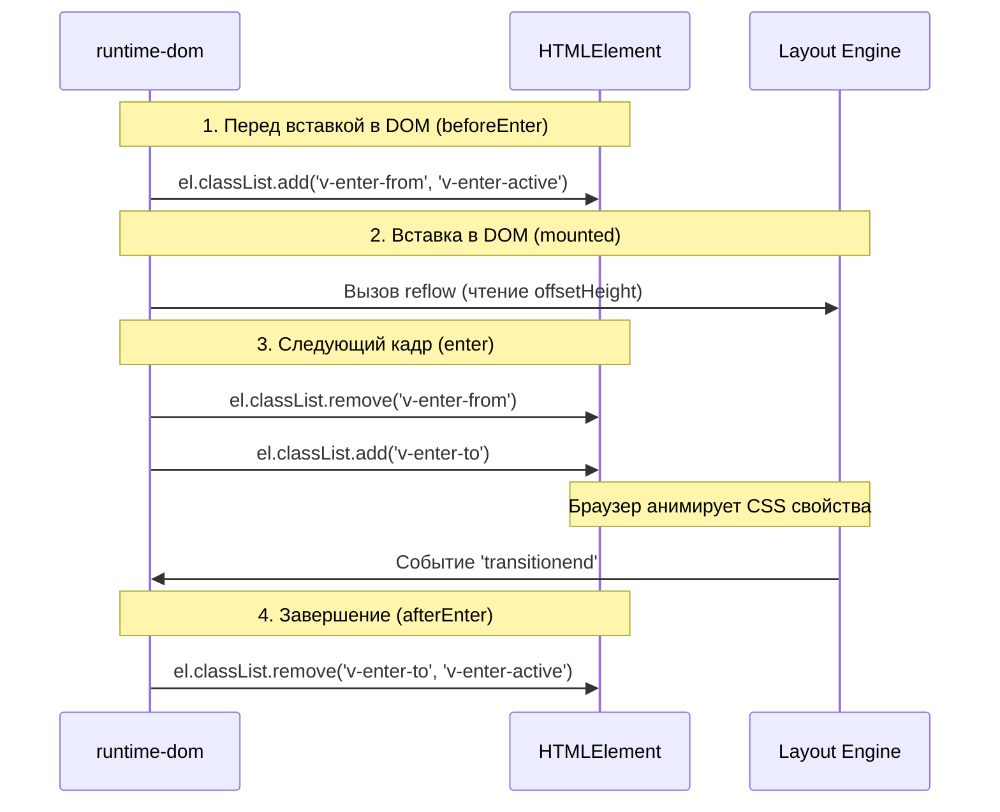

# 06. Транзиции и CSS-Анимации (Transition & CSS Animations)

## Концепция и Архитектура (Mental Model)
Компонент `<Transition>` (и `<TransitionGroup>`) — это встроенные компоненты Vue, которые предоставляют декларативный API для анимации элементов при их вставке (Enter) или удалении (Leave) из DOM.

На уровне `runtime-core` (ядро), `BaseTransition` управляет исключительно **стейт-машиной** жизненного цикла VNode (хуки beforeEnter, enter, leave, afterLeave) и не знает о CSS. 

На уровне `runtime-dom` (браузер) в `BaseTransition` "впрыскивается" (injects) логика для работы с CSS-классами (`v-enter-active`, `v-leave-to`) и прослушиванием нативных событий окончания анимации (`transitionend` и `animationend`). Это элегантный пример инверсии зависимостей.

## Визуализация (Mermaid)

Жизненный цикл CSS Transition (Enter Phase):


## Ссылки на исходный код
- Ядро (стейт-машина): `packages/runtime-core/src/components/BaseTransition.ts`
- DOM-реализация (CSS-классы, события): `packages/runtime-dom/src/components/Transition.ts`

## Разбор реализации (Code Deep Dive)

В `runtime-dom` экспортируется компонент `Transition`, который является оберткой над `BaseTransition` из ядра. Он предоставляет функции для каждого этапа анимации.

```typescript
// packages/runtime-dom/src/components/Transition.ts

// Точка входа в браузере
export const Transition = (props, { slots }) => {
  // Разрешение имен классов (e.g. name="fade" -> "fade-enter-active")
  const { name = 'v', type, css = true, ... } = props
  
  if (css) {
    // Внедряем DOM-специфичные хуки в базовый компонент
    return h(BaseTransition, {
      ...props,
      onBeforeEnter(el) {
        // Добавляем стартовые классы: 'v-enter-from' и 'v-enter-active'
        addTransitionClass(el, enterFromClass)
        addTransitionClass(el, enterActiveClass)
      },
      onEnter(el, done) {
        // Вызываем Reflow для гарантии старта анимации
        forceReflow()
        
        // В следующем кадре (nextFrame) убираем 'from' и добавляем 'to'
        nextFrame(() => {
          removeTransitionClass(el, enterFromClass)
          addTransitionClass(el, enterToClass)
          
          // Ждем завершения (прослушиваем transitionend/animationend)
          whenTransitionEnds(el, type, done)
        })
      },
      onLeave(el, done) {
        addTransitionClass(el, leaveFromClass)
        addTransitionClass(el, leaveActiveClass)
        forceReflow()
        nextFrame(() => {
          removeTransitionClass(el, leaveFromClass)
          addTransitionClass(el, leaveToClass)
          whenTransitionEnds(el, type, done)
        })
      }
    }, slots)
  }
}

// Принудительный пересчет Layout браузера
function forceReflow() {
  return document.body.offsetHeight
}

// Обертка для requestAnimationFrame
function nextFrame(cb: () => void) {
  requestAnimationFrame(() => {
    requestAnimationFrame(cb)
  })
}
```

## Оптимизации и Edge Cases (Подводные камни)

1. **Зачем нужен `forceReflow()`? (The Layout Thrashing Hack)**
   Когда мы добавляем стартовый класс (`v-enter-from` с `opacity: 0`), вставляем элемент в DOM, а затем сразу меняем класс на конечный (`v-enter-to` с `opacity: 1`), браузер может объединить эти операции в один шаг рендеринга (batching). Элемент появится мгновенно, без анимации. Чтение свойства `document.body.offsetHeight` — это классический хак. Он "заставляет" браузер синхронно пересчитать геометрию страницы (Reflow), что гарантирует применение стартовых классов *до* начала анимации.

2. **Двойной `requestAnimationFrame` (The nextFrame Trick)**:
   Почему в `nextFrame` вызов `cb` обернут в `requestAnimationFrame` дважды?
   Один вызов `requestAnimationFrame` выполняется *перед* следующим repaint (отрисовкой кадра). Браузер еще не успеет применить стили от добавления `v-enter-from`. Если мы добавим `v-enter-to` в этом же кадре, анимация не сработает. Двойной вызов гарантирует, что коллбэк выполнится строго *после* того, как первый кадр (с начальным состоянием) будет отрисован на экране.

3. **Как определяется конец анимации (`whenTransitionEnds`)?**
   Сложность заключается в том, что на элементе могут висеть и CSS Transitions (`transition:`), и CSS Animations (`animation:`), иногда с разной длительностью. Vue содержит сложную эвристику (функция `getTransitionInfo`): он парсит `window.getComputedStyle(el)`, извлекает строки `transitionDuration` и `animationDuration`, находит максимальное время и устанавливает `setTimeout` как фоллбэк (fallback) на случай, если нативное событие `transitionend` не сработает (что часто бывает в старых браузерах или если элемент внезапно скрыли через `display: none`).
