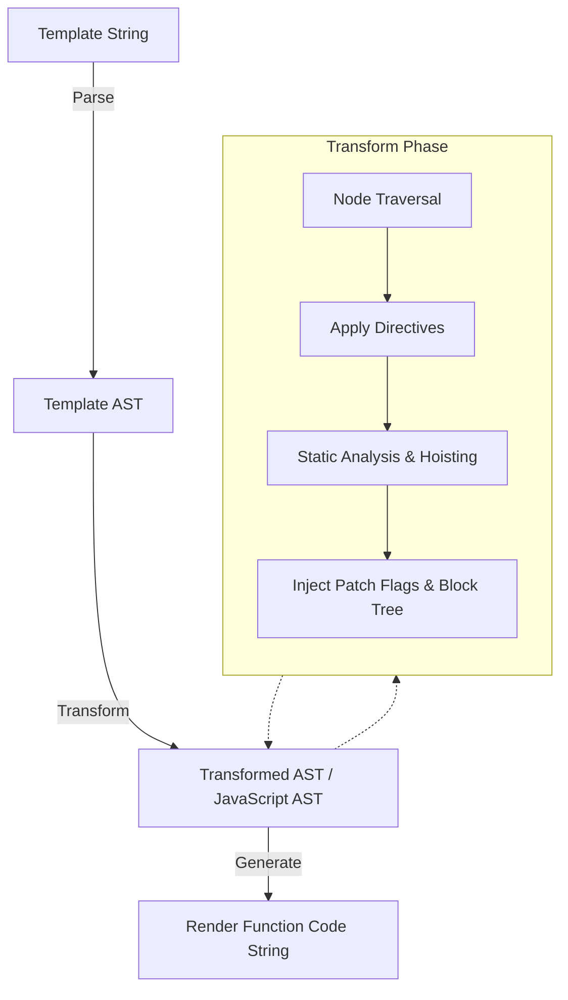

# Пайплайн Компилятора (Compiler Pipeline)

## Концепция и Архитектура (Mental Model)

Компилятор Vue — это AOT (Ahead-of-Time) и JIT (Just-in-Time) инструмент для преобразования декларативных Vue-шаблонов в высокооптимизированные JavaScript-рендер-функции. Его главная цель — вынести максимум работы из рантайма (runtime) на этап сборки (build time), чтобы минимизировать нагрузку на VDOM-диффинг.

В основе лежит трехэтапный конвейер (pipeline):
1. **Parse (Парсинг):** Шаблон читается посимвольно (tokenizer) и преобразуется в базовое абстрактное синтаксическое дерево (Template AST).
2. **Transform (Трансформация):** Template AST обходится (traverse) и мутируется. Здесь применяются директивы (`v-if`, `v-for`), вычисляется статика для хоистинга (static hoisting) и генерируются подсказки для рантайма (Patch Flags).
3. **Generate (Кодогенерация):** Обогащенное JavaScript AST (или трансформированное Template AST) конвертируется в финальную строку JavaScript-кода (render-функцию) вместе с Source Maps.

Такое разделение позволяет создавать специализированные компиляторы (например, `compiler-sfc`, `compiler-dom`, `compiler-ssr`) путем инжектирования специфичных плагинов (transforms) на этапе трансформации, не трогая базовый парсер.

## Визуализация (Mermaid)



## Ссылки на исходный код

- **Входная точка:** `packages/compiler-core/src/compile.ts`
- **Парсер:** `packages/compiler-core/src/parse.ts`
- **Трансформер:** `packages/compiler-core/src/transform.ts`
- **Кодогенератор:** `packages/compiler-core/src/codegen.ts`

## Разбор реализации (Code Deep Dive)

Пайплайн инкапсулирован в функцию `baseCompile`.

```typescript
// Упрощенная выдержка из compiler-core/src/compile.ts
export function baseCompile(
  template: string | RootNode,
  options: CompilerOptions = {}
): CodegenResult {
  // 1. Parse
  const ast = isString(template) ? baseParse(template, options) : template

  // 2. Transform
  const [nodeTransforms, directiveTransforms] =
    getBaseTransformPreset(options.prefixIdentifiers)
  
  transform(
    ast,
    extend({}, options, {
      prefixIdentifiers,
      nodeTransforms: [
        ...nodeTransforms,
        ...(options.nodeTransforms || []) // Инъекция платформозависимых плагинов
      ],
      directiveTransforms: extend(
        {},
        directiveTransforms,
        options.directiveTransforms || {}
      )
    })
  )

  // 3. Generate
  return generate(
    ast,
    extend({}, options, {
      prefixIdentifiers
    })
  )
}
```

**Ключевые моменты:**
- `baseCompile` — это ядро. Пакеты уровня выше (как `compiler-dom`) экспортируют свои обертки над `baseCompile`, прокидывая платформо-зависимые `nodeTransforms` (например, для обработки `<transition>` или специфичных HTML-атрибутов).
- Пайплайн работает мутабельно. `transform` модифицирует AST "на месте" (in-place) для экономии памяти и GC.

## Оптимизации и Edge Cases (Подводные камни)

1. **Мономорфные AST Узлы:** Объекты AST создаются с предсказуемой "формой" (shape). Используются фабричные функции (например, `createVNodeCall`), чтобы движки V8/SpiderMonkey могли эффективно оптимизировать доступ к свойствам классов через Hidden Classes.
2. **Память и GC:** Вместо создания множества промежуточных копий AST, фаза `transform` использует паттерн Visitor (визитор), мутируя существующие узлы. Это снижает давление на сборщик мусора (Garbage Collector) во время сборки больших проектов.
3. **Разделение среды:** Компилятор спроектирован так, чтобы работать в браузере (через `new Function`), в Node.js и даже в воркерах (например, Vite/Rollup плагины). Это накладывает ограничения: компилятор не должен зависеть от DOM API, поэтому `compiler-core` абстрактен и чист от платформенных зависимостей.
