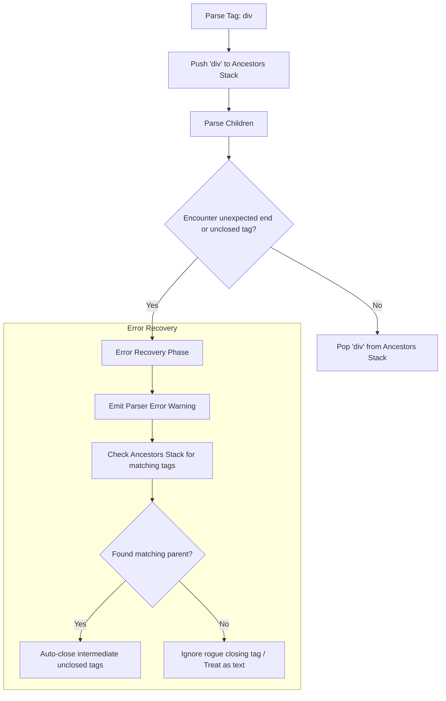

# Восстановление после ошибок (Error Recovery)

## Концепция и Архитектура (Mental Model)

Vue-компилятор спроектирован так, чтобы быть **отказоустойчивым** (resilient). Если разработчик допустил синтаксическую ошибку в шаблоне (например, забыл закрыть тег `<div>` или написал невалидный атрибут), компилятор не должен просто "падать" с `Fatal Error`. Вместо этого он должен:
1. Выдать понятное предупреждение (warning) с точным указанием строки и символа.
2. Попытаться **восстановить состояние** (error recovery) и продолжить парсинг оставшегося шаблона, чтобы выдать максимально полное AST.

Этот подход вдохновлен спецификацией HTML5, которая описывает строгие правила того, как браузеры должны проглатывать и исправлять некорректную разметку. В Vue парсер использует стек предков (ancestors stack), чтобы "догадываться", где разработчик забыл закрыть тег.

## Визуализация (Mermaid)



## Ссылки на исходный код

- **Логика проверки конца парсинга узла:** `packages/compiler-core/src/parse.ts` (функция `isEnd`)
- **Коды ошибок:** `packages/compiler-core/src/errors.ts` (например, `ErrorCodes.MISSING_END_TAG`)

## Разбор реализации (Code Deep Dive)

В процессе парсинга (в функции `parseChildren`) парсер передает массив `ancestors` (предков). Функция `isEnd` постоянно проверяет этот стек, чтобы понять, не нужно ли досрочно прекратить парсинг детей.

```typescript
// Упрощенная выдержка из compiler-core/src/parse.ts

function isEnd(
  context: ParserContext,
  mode: TextModes,
  ancestors: ElementNode[]
): boolean {
  const s = context.source

  switch (mode) {
    case TextModes.DATA:
      if (startsWith(s, '</')) {
        // Проверяем, соответствует ли закрывающий тег какому-либо предку в стеке
        for (let i = ancestors.length - 1; i >= 0; --i) {
          if (startsWithIgnoreAsciiCase(s, `</${ancestors[i].tag}`)) {
            return true // Нашли предка! Завершаем парсинг текущих детей.
          }
        }
      }
      break
    // ... другие режимы
  }
  return !s // Если строка пустая - конец
}
```

Если `isEnd` возвращает `true` из-за того, что найден родительский закрывающий тег *выше* по стеку, парсер прервет текущий цикл `while` в `parseChildren`. Текущий открытый тег останется без явного закрывающего тега, и компилятор сгенерирует событие ошибки `MISSING_END_TAG`. 

```typescript
// Там же, в parseElement после парсинга детей:
if (startsWithIgnoreAsciiCase(context.source, `</${element.tag}`)) {
  parseTag(context, TagType.End, parent)
} else {
  // Ошибка! Тег не был закрыт.
  emitError(context, ErrorCodes.X_MISSING_END_TAG, 0, element.loc.start)
}
```

## Оптимизации и Edge Cases (Подводные камни)

1. **Backwards Scan (Поиск с конца):** В функции `isEnd` поиск по массиву `ancestors` идет с конца (`i = ancestors.length - 1`). Это оптимизация под типичный сценарий: скорее всего, закрывающий тег, который мы встретили, относится к непосредственному родителю или "дедушке", а не к корневому элементу.
2. **Игнорирование регистра (Case Insensitivity):** HTML нечувствителен к регистру для имен тегов. Vue использует оптимизированную функцию `startsWithIgnoreAsciiCase` вместо приведения всей строки к `toLowerCase()` перед сравнением, что экономит память (не создаются новые строки).
3. **Восстановление "осиротевших" закрывающих тегов:** Если парсер встречает `</div>`, но в стеке `ancestors` нет `div`, он не падает. Он выбрасывает `ErrorCodes.X_INVALID_END_TAG` и просто пропускает (consume) эти символы, продолжая работу. Это гарантирует, что редактор кода или IDE, использующая этот компилятор под капотом (через Volar/Vue Language Server), все равно получит частично рабочее AST для автокомплита и подсветки.
