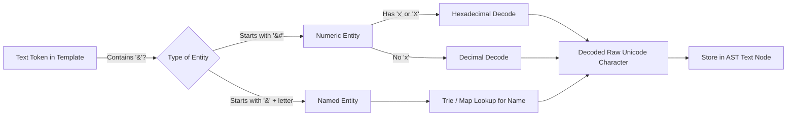

# Обработка HTML Сущностей (Handling HTML Entities)

## Концепция и Архитектура (Mental Model)

При написании HTML мы часто используем сущности (Entities): именованные (`&amp;`, `&lt;`), десятичные (`&#60;`) или шестнадцатеричные (`&#x3c;`). Когда Vue парсит шаблон в AST, он должен декодировать эти сущности в их реальные строковые значения. Если этого не сделать, в сгенерированной JS-функции рендера так и останется строка `"&lt;div&gt;"`, которая отрендерится в браузере буквально как `<div>` (как текст), а не как элемент (если она попадет в `v-html` или просто в текстовый узел).

Браузер делает это автоматически, когда парсит HTML. Но компилятор Vue часто работает вне браузера (в Node.js во время сборки). Чтобы полностью эмулировать поведение браузера (в соответствии со спецификацией HTML5), Vue включает в себя сложный, но оптимизированный декодер сущностей.

## Визуализация (Mermaid)



## Ссылки на исходный код

- **Декодер:** `packages/compiler-core/src/ast.ts` (функция `decodeHtml`)
- **Словарь сущностей (Map/Trie):** В Vue 3 словарь именованных сущностей вынесен в отдельный инструмент или генерируется как константа для экономии бандла.

## Разбор реализации (Code Deep Dive)

Внутри функции парсинга текста `parseText` компилятор проверяет наличие символа `&`. Если он есть, вызывается декодер.

```typescript
// Упрощенная логика декодирования
export function decodeHtml(rawText: string, asAttr: boolean): string {
  let offset = 0
  const end = rawText.length
  let decodedText = ''

  while (offset < end) {
    const head = /&(?:#x([0-9a-fA-F]+)|#([0-9]+)|([a-zA-Z0-9]+));?/g.exec(
      rawText.slice(offset)
    )

    if (!head) {
      decodedText += rawText.slice(offset)
      break
    }

    // Добавляем обычный текст до сущности
    decodedText += rawText.slice(offset, offset + head.index)
    
    if (head[1]) {
      // Шестнадцатеричная (Hex)
      decodedText += String.fromCodePoint(parseInt(head[1], 16))
    } else if (head[2]) {
      // Десятичная (Decimal)
      decodedText += String.fromCodePoint(parseInt(head[2], 10))
    } else if (head[3]) {
      // Именованная (Named) - например, &amp;
      decodedText += decodeNamedEntity(head[3], asAttr) 
    }

    offset += head.index + head[0].length
  }

  return decodedText
}
```

## Оптимизации и Edge Cases (Подводные камни)

1. **Разница в декодировании атрибутов и обычного текста (`asAttr`):** Спецификация HTML имеет странный edge-case. Именованная сущность без точки с запятой (например, `&amp`) внутри атрибута *не декодируется*, если сразу за ней идет знак `=` или алифанумерический символ (чтобы не сломать ссылки вида `href="?a=1&amp=2"`). Флаг `asAttr` передается в декодер, чтобы включить это поведение. Vue строго следует спеке HTML5 (WHATWG), чтобы SSR-рендер Node.js и клиентский гидратированный DOM 100% совпадали, иначе произойдет ошибка Hydration Mismatch.
2. **Словарь именованных сущностей:** Полный словарь HTML5-сущностей огромен. Включать его в рантайм-компилятор (который шипается в браузер) слишком "дорого" по размеру бандла. Vue включает только базовый набор самых частых сущностей в `compiler-dom`, а для остальных полагается на нативные API браузера, если компилятор запущен в браузере. В Node.js-среде (`compiler-sfc`) используется более полная версия.
3. **`String.fromCodePoint` вместо `String.fromCharCode`:** Исторически JS использовал `fromCharCode`, но он не умеет работать с символами за пределами базовой многоязычной плоскости (BMP) (например, эмодзи). Vue использует `fromCodePoint`, чтобы корректно декодировать суррогатные пары (surrogate pairs).
