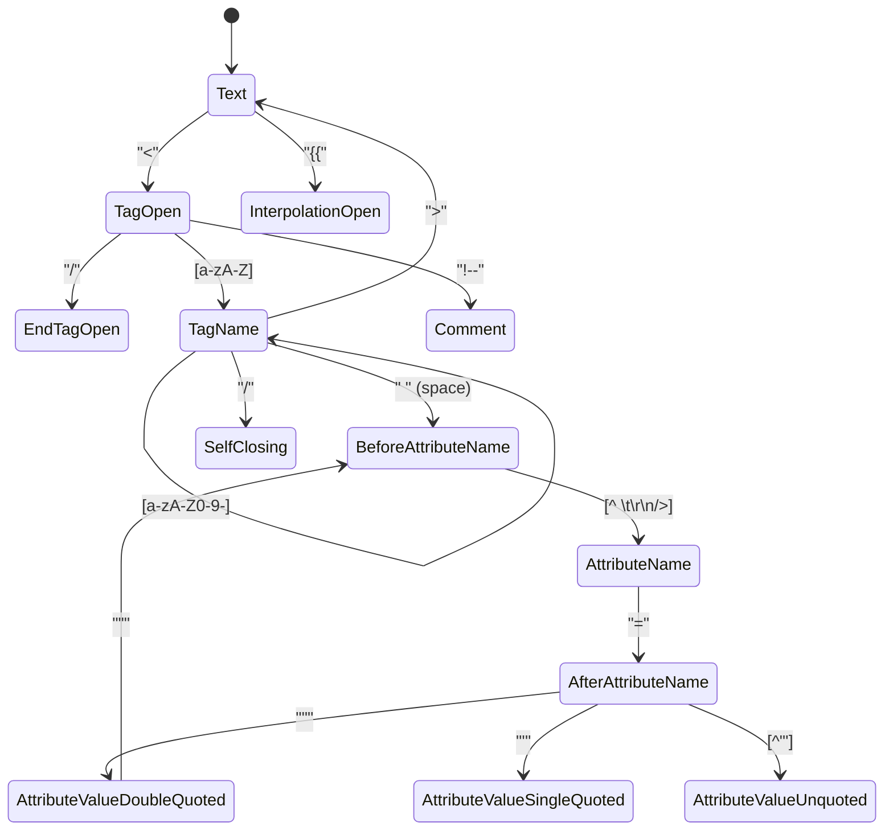

# State Machine Токенизатора (Tokenizer State Machine)

## Концепция и Архитектура (Mental Model)

Парсер Vue шаблонов не использует регулярные выражения (RegEx) для комплексного разбора HTML. Вместо этого применяется концепция **Конечного Автомата** (Finite State Machine, FSM), работающего по принципу рекурсивного спуска (recursive descent). 

Почему не RegEx? 
HTML не является регулярным языком. Обработка вложенности, атрибутов без кавычек, комментариев и интерполяций Vue (например, `<div :id="foo > bar ? 'a' : 'b'">`) с помощью регулярных выражений приводит к катастрофическим ошибкам (Zalgo text parsing) и падению производительности из-за backtracking'а (возврата). State Machine читает строку символ за символом (символьный курсор) ровно один раз $O(N)$, меняя свое "состояние" в зависимости от текущего символа.

## Визуализация (Mermaid)



## Ссылки на исходный код

- **Парсер:** `packages/compiler-core/src/parse.ts` (функции `parseChildren`, `parseElement`, `parseTag`, `parseAttributes`)
- Vue не выносит токенизатор в отдельную сущность (как в некоторых компиляторах, где есть явные фазы Lexing -> Parsing). В Vue лексический анализ (чтение символов) и парсинг (построение AST) происходят **одновременно** в одном проходе.

## Разбор реализации (Code Deep Dive)

В основе лежит объект `ParserContext`, который держит текущее состояние курсора: строку шаблона, текущую позицию, строку/колонку для `loc`.

```typescript
// Упрощенная выдержка из compiler-core/src/parse.ts
function parseChildren(
  context: ParserContext,
  mode: TextModes,
  ancestors: ElementNode[]
): TemplateChildNode[] {
  const nodes: TemplateChildNode[] = []

  while (!isEnd(context, mode, ancestors)) {
    const s = context.source
    let node: TemplateChildNode | undefined = undefined

    if (mode === TextModes.DATA || mode === TextModes.RCDATA) {
      if (!context.inVPre && startsWith(s, context.options.delimiters[0])) {
        // Парсинг интерполяции {{ ... }}
        node = parseInterpolation(context, mode)
      } else if (mode === TextModes.DATA && s[0] === '<') {
        if (s[1] === '!') {
          if (startsWith(s, '<!--')) {
            node = parseComment(context) // Парсинг комментария
          }
        } else if (s[1] === '/') {
          // Парсинг закрывающего тега
          parseTag(context, TagType.End, parent)
          continue
        } else if (/[a-z]/i.test(s[1])) {
          // Парсинг открывающего тега (смена состояния на TagOpen)
          node = parseElement(context, ancestors)
        }
      }
    }

    if (!node) {
      // Если ни одно из условий тега/интерполяции не сработало — это просто текст
      node = parseText(context, mode)
    }

    if (Array.isArray(node)) {
      for (let i = 0; i < node.length; i++) pushNode(nodes, node[i])
    } else {
      pushNode(nodes, node)
    }
  }

  return nodes
}
```

Функция `advanceBy(context, numberOfCharacters)` "съедает" символы из `context.source` и сдвигает позицию.

## Оптимизации и Edge Cases (Подводные камни)

1. **TextModes (Режимы текста):** Парсер поддерживает режимы HTML-спецификации: `DATA`, `RCDATA` (например, внутри `<textarea>`), `RAWTEXT` (`<style>`, `<script>`) и `CDATA`. В зависимости от `TextModes` меняется поведение конечного автомата (например, внутри `<script>` тег `<div` воспринимается просто как текст, а не как начало `TagOpen`).
2. **`v-pre` оптимизация:** Флаг `context.inVPre` отключает попытки парсера найти интерполяции `{{ }}` и Vue-директивы. Это моментально переводит State Machine в более "тупой" и быстрый режим, экономя такты CPU для больших статических блоков кода.
3. **Однопроходный парсинг (Single-pass parsing):** Объединение фаз токенизации и построения AST означает, что не создается огромный промежуточный массив токенов (как в архитектурах с явным Lexer-ом). Это значительно снижает объем выделяемой памяти (GC pressure), что критически важно при компиляции больших SFC в браузере (например, в Vite/Rollup).
