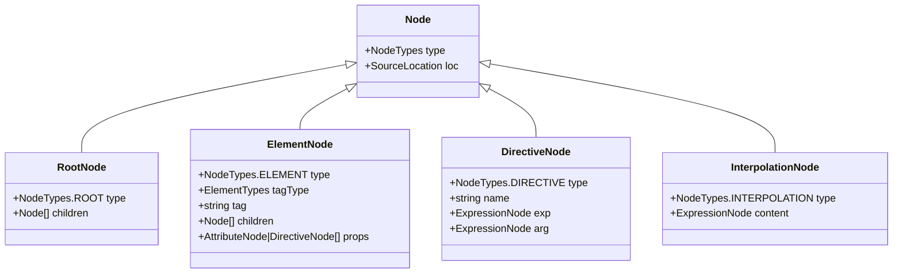

# Справочник типов AST-узлов (AST Node Types Reference)

## Концепция и Архитектура (Mental Model)

Абстрактное синтаксическое дерево (AST) компилятора Vue служит единым языком общения между фазами `Parse`, `Transform` и `Codegen`. В отличие от Babel или TypeScript AST, которые описывают чистый JavaScript, AST Vue содержит как HTML/Template семантику (теги, атрибуты, директивы), так и JS-семантику (выражения, JS-вызовы), которая инжектируется на этапе трансформации.

Каждый узел (Node) имеет свойство `type`, являющееся числовым перечислением (`enum`). Использование числового enum (`const enum`) вместо строк критически важно для производительности — движкам JS (V8) гораздо быстрее сравнивать числа (integer comparison), чем строки.

## Визуализация (Mermaid)



## Ссылки на исходный код

- **NodeTypes enum:** `packages/compiler-core/src/ast.ts`
- **Фабрики узлов:** `packages/compiler-core/src/ast.ts` (функции `createRoot`, `createVNodeCall` и др.)

## Разбор реализации (Code Deep Dive)

Ядро определяет `NodeTypes` как `const enum`. При сборке TypeScript компилятор заинлайнит (inline) эти значения как константы, что исключает накладные расходы на чтение свойств объекта.

```typescript
// Упрощенная выдержка из compiler-core/src/ast.ts
export const enum NodeTypes {
  ROOT,                // 0
  ELEMENT,             // 1
  TEXT,                // 2
  COMMENT,             // 3
  SIMPLE_EXPRESSION,   // 4 (например, внутри {{ count }} или v-if="ok")
  INTERPOLATION,       // 5
  ATTRIBUTE,           // 6
  DIRECTIVE,           // 7
  // ... дальше JS/Codegen специфичные типы
  COMPOUND_EXPRESSION, // 8 (склеивание строк и выражений)
  IF,                  // 9 (v-if)
  IF_BRANCH,           // 10
  FOR,                 // 11 (v-for)
  TEXT_CALL,           // 12
  VNODE_CALL,          // 13 (Генерация createVNode)
  JS_CALL_EXPRESSION   // 14
}

// Интерфейс базового узла
export interface Node {
  type: NodeTypes
  loc: SourceLocation
}

// Пример ElementNode
export interface ElementNode extends Node {
  type: NodeTypes.ELEMENT
  ns: Namespace // HTML, SVG, MATHML
  tag: string
  tagType: ElementTypes // ELEMENT, COMPONENT, SLOT, TEMPLATE
  props: Array<AttributeNode | DirectiveNode>
  children: TemplateChildNode[]
  codegenNode: VNodeCall | SimpleExpressionNode | CacheExpression | undefined // Заполняется на фазе Transform
}
```

**Ключевой момент:** Поле `codegenNode` — это мост между Template AST и JavaScript AST. На этапе парсинга оно пустое (или `undefined`). На этапе трансформации оно заполняется JS-узлом (например, `VNodeCall`), который описывает, *как именно* этот элемент должен быть отрендерен в JavaScript коде. Генератор (`Codegen`) читает только `codegenNode`.

## Оптимизации и Edge Cases (Подводные камни)

1. **`codegenNode` вместо двух разных деревьев:** Вместо того чтобы строить совершенно новое JS AST дерево на основе Template AST, Vue мутирует Template AST, добавляя к узлам свойство `codegenNode`. Это радикально экономит память и время на обход (traversal), так как нет необходимости держать два массивных дерева в памяти сборщика.
2. **`COMPOUND_EXPRESSION`:** Для оптимизации конкатенации строк и выражений в шаблоне (например, `id="foo-{{ id }}"`) используется тип `COMPOUND_EXPRESSION`. Он позволяет сгенерировать единую JS-строку с конкатенацией (`"foo-" + _ctx.id`), избегая создания лишних VNode для текста.
3. **Location Tracking (Трекинг позиций):** Поле `loc` есть у каждого узла. Оно хранит координаты `(start, end, source)` из оригинальной строки шаблона. Это критически важно для Source Maps и для отображения понятных сообщений об ошибках парсинга прямо в терминале с указанием строки и колонки (через функцию `generateCodeFrame`). В production сборках рантайм-компилятора `loc` часто опускается для экономии памяти.
