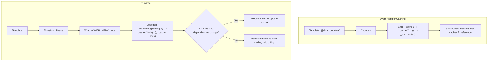

# Кеширование обработчиков и v-memo

## Концепция и Архитектура (Mental Model)

Помимо статического хоистинга элементов, компилятор Vue 3 применяет еще две важные оптимизации для динамических структур: **Кеширование обработчиков событий (Cache Event Handlers)** и директиву **`v-memo`**.

### Кеширование обработчиков
Когда мы пишем `@click="foo = true"`, Vue по умолчанию создает новую инлайн-функцию `() => foo = true` при каждом рендеринге компонента. Это ломает оптимизацию дочерних компонентов: если передать такую функцию как пропс в `<Child @custom="handler" />`, `Child` будет перерендериваться всегда, так как ссылка на функцию-пропс всегда новая. Кеширование оборачивает эту функцию и сохраняет её в специальный массив кеша `_cache` внутри инстанса компонента.

### Директива `v-memo` (Мемоизация поддеревьев)
`v-memo="[a, b]"` — это микро-оптимизация (аналог `React.useMemo` для DOM). Она позволяет закешировать целый кусок VDOM-дерева и пропускать его диффинг (и даже пересоздание VNodes), пока не изменятся зависимости (массив `[a, b]`). Это критически важно для огромных списков `v-for` (1000+ элементов), где изменение одного элемента не должно вызывать пересоздание VNodes для остальных 999.

## Визуализация (Mermaid)



## Ссылки на исходный код

- **Трансформация v-memo:** `packages/compiler-core/src/transforms/vMemo.ts`
- **Рантайм-хелпер withMemo:** `packages/runtime-core/src/helpers/withMemo.ts`
- **Трансформация v-on (кеширование):** `packages/compiler-core/src/transforms/vOn.ts`

## Разбор реализации (Code Deep Dive)

### Cache Event Handlers

В `transformOn` (плагин, обрабатывающий `v-on`) проверяется настройка `cacheHandlers`.

```typescript
// Упрощенная выдержка из compiler-core/src/transforms/vOn.ts
if (context.cacheHandlers && !isDynamicEvent) {
  // Выделяем уникальный индекс в массивом _cache для этого обработчика
  const cacheIndex = context.cached++
  
  // Создаем AST-узел для кеширующего выражения:
  // _cache[1] || (_cache[1] = $event => _ctx.count++)
  exp = createCacheExpression(
    cacheIndex,
    exp, // оригинальная функция
    exp.type === NodeTypes.SIMPLE_EXPRESSION && !isFunctionExpression(exp)
  )
}
```
**Важно:** Кешируются только статические имена событий (`@click`). Динамические (`@[event]`) кешировать нельзя, так как имя события может измениться.

### v-memo Трансформация

Директива `v-memo` превращает узел в вызов хелпера `withMemo`.
```typescript
// Упрощенная выдержка из compiler-core/src/transforms/vMemo.ts
export const transformMemo = createStructuralDirectiveTransform(
  'memo',
  (node, dir, context) => {
    // Выделяем слот в кеше компонента
    const cacheIndex = context.cached++

    return () => {
      // На фазе Exit оборачиваем сгенерированный codegenNode в вызов withMemo
      const codegenNode = node.codegenNode || context.currentNode.codegenNode
      
      node.codegenNode = createCallExpression(
        context.helper(WITH_MEMO), // импорт хелпера _withMemo
        [
          dir.exp!, // массив зависимостей [a, b]
          createFunctionExpression(undefined, codegenNode), // Ленивая функция создания VNode
          `_cache`,
          String(cacheIndex)
        ]
      )
    }
  }
)
```

В рантайме функция `withMemo` сверяет старый массив зависимостей с новым (через строгое равенство `===` каждого элемента). Если они равны, она просто возвращает `_cache[index]` и ставит флаг `patchFlag = HOISTED`, блокируя дальнейший diffing.

## Оптимизации и Edge Cases (Подводные камни)

1. **Многократный рендеринг без выделения памяти:** Главная выгода `v-memo` не в том, что мы пропускаем diffing (хотя это тоже хорошо). Выгода в том, что ленивая функция `() => createVNode(...)` **вообще не вызывается**, если зависимости не изменились. Это экономит сотни аллокаций памяти (создания JS-объектов) для больших списков.
2. **`v-memo="[]"` против `v-once`:** Запись `v-memo="[]"` (пустой массив) функционально идентична директиве `v-once`. Vue скомпилирует пустой массив и он никогда не изменится. Однако под капотом `v-once` использует статический хоистинг (Static Hoisting), который еще эффективнее (один объект VNode на весь *модуль*, а не на *экземпляр* компонента в `_cache`).
3. **Недостаток кеширования обработчиков:** Так как обработчик сохраняется в `_cache` экземпляра, он держит ссылку (closure) на те переменные, которые были в скоупе при первом рендере. Vue обходит это, генерируя код так, что функция обращается к `_ctx` (который всегда содержит актуальные данные), а не захватывает локальные `let`/`const` (за исключением переменных `v-for`).
