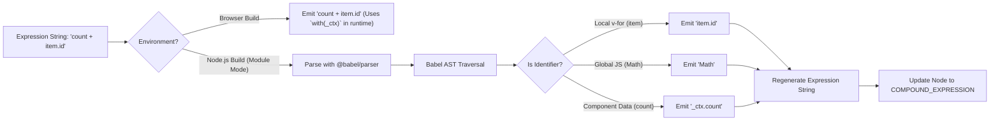

# Трансформация выражений (Expression Transformation)

## Концепция и Архитектура (Mental Model)

Все JS-выражения внутри Vue-шаблонов (например, `{{ count + 1 }}` или `v-bind:class="{ active: isActive }"`) изначально парсятся просто как строки (тип `SIMPLE_EXPRESSION`). 

На этапе трансформации компилятор должен решить важнейшую задачу: **префиксовать глобальные переменные**. В рантайме рендер-функция получает объект контекста (`_ctx` — это прокси к данным компонента). Если в шаблоне написано `count`, в сгенерированном JS-коде должно быть `_ctx.count`.

Однако мы не можем просто приставлять `_ctx.` к каждому слову.
- Что если это локальная переменная `v-for` (например, `item`)?
- Что если это глобальный объект JavaScript (например, `Math.PI` или `Date.now`)?
- Что если это ключ объекта (`{ active: true }`), который не нужно префиксовать?

Для решения этой задачи в Node.js (при сборке с помощью Vite/Rollup) Vue использует полноценный JavaScript-парсер (**Babel**), чтобы разобрать строку выражения в AST, найти идентификаторы (Identifiers) и безопасно добавить префикс `_ctx.`.

*Примечание:* В in-browser компиляторе Babel не используется ради экономии веса (Babel весит мегабайты). Вместо этого используется глобальная обертка `with(this) { return count + 1 }`, которая решает проблему динамического скоупинга, но ценой производительности и строгости (strict mode).

## Визуализация (Mermaid)



## Ссылки на исходный код

- **Главный трансформер:** `packages/compiler-core/src/transforms/transformExpression.ts`
- **Парсер выражений:** `packages/compiler-core/src/babelUtils.ts` (используется `@babel/parser` для `parseExpression`)

## Разбор реализации (Code Deep Dive)

В функции `processExpression` строка прогоняется через Babel.

```typescript
// Упрощенная выдержка из compiler-core/src/transforms/transformExpression.ts
import { parse } from '@babel/parser'
import { walk } from 'estree-walker'

export function processExpression(
  node: SimpleExpressionNode,
  context: TransformContext
): ExpressionNode {
  // 1. Парсим строку выражения с помощью Babel
  const babelAST = parse(`(${node.content})`, {
    plugins: ['bigInt', 'optionalChaining', 'nullishCoalescingOperator']
  }).program.body[0].expression

  // 2. Обходим Babel AST
  walk(babelAST, {
    enter(babelNode, parent) {
      if (babelNode.type === 'Identifier') {
        const id = babelNode.name

        // Является ли идентификатор свойством объекта? (например, 'foo' в `obj.foo` или `{foo: 1}`)
        if (isStaticProperty(parent) && parent.property === babelNode) {
          return // Не трогаем ключи
        }

        // Является ли это локальной переменной v-for/v-slot?
        if (context.identifiers[id]) {
          return // Не трогаем (уже в скоупе)
        }

        // Является ли это JS-глобалкой? (Math, Array, Date)
        if (isGloballyAllowed(id)) {
          return // Не трогаем
        }

        // ВАЖНО: Если мы дошли сюда, значит это реактивное свойство компонента!
        // Переписываем Babel AST узел, добавляя префикс '_ctx.'
        replaceWithBabelNode(babelNode, createMemberExpression('_ctx', id))
      }
    }
  })

  // 3. Собираем обратно в COMPOUND_EXPRESSION для Vue Codegen
  return generateVueASTFromBabel(babelAST)
}
```

## Оптимизации и Edge Cases (Подводные камни)

1. **Кеширование (Caching):** Парсинг через Babel стоит процессорного времени. Vue применяет кеширование результатов `processExpression` для часто повторяющихся простых выражений в рамках одной сборки (через механизм LRU кеша на уровне сборщика).
2. **Whitelist глобальных переменных (`isGloballyAllowed`):** В Vue жестко зашит список разрешенных JS-глобалок (около 40 штук: `Infinity`, `undefined`, `NaN`, `isFinite`, `isNaN`, `parseFloat`, `parseInt`, `decodeURI`, `Math`, `Date` и т.д.). Попытка использовать `window` или кастомный глобальный объект напрямую в шаблоне не сработает (сгенерируется `_ctx.window`), поэтому их нужно маппить в `setup()` или добавлять в `app.config.globalProperties`.
3. **`prefixIdentifiers: true`:** Вся эта сложная логика активируется флагом `prefixIdentifiers`. В режиме Node.js/Vite он всегда `true`. В браузере (CDN-билд) он `false`, так как втягивать Babel в браузер безумие. Там работает старый-добрый (и ругаемый) `with(this)`, который автоматически ищет переменные в объекте компонента на уровне JS-движка.
