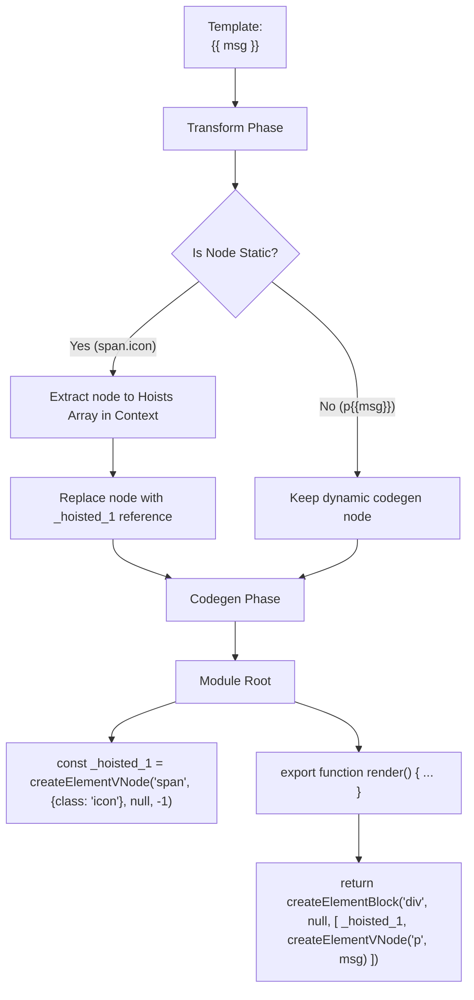

# Статический анализ и Хоистинг (Static Hoisting)

## Концепция и Архитектура (Mental Model)

Одной из самых мощных оптимизаций Vue 3 (по сравнению с Vue 2) является **Static Hoisting** (поднятие статики). 

Многие элементы в шаблонах (например, `<div>Hello</div>` или статические SVG-иконки) никогда не меняются. В традиционных VDOM-фреймворках (как React или Vue 2) эти элементы заново создаются и сравниваются (diffing) при *каждом* рендеринге компонента. Это пустая трата ресурсов и причина лишнего давления на Garbage Collector (GC).

Компилятор Vue 3 анализирует AST во время фазы Transform. Если он видит, что узел полностью статичен (не содержит привязок данных, директив или динамических выражений), он "поднимает" (hoists) создание VNode этого узла на уровень модуля, *за пределы* render-функции. 

Таким образом, VNode создается ровно один раз при загрузке JS-модуля. При каждом последующем рендеринге используется ссылка на один и тот же объект памяти. VDOM-диффер, видя старые и новые VNode ссылающиеся на один и тот же объект памяти, мгновенно пропускает этот узел (diff bailout).

## Визуализация (Mermaid)



## Ссылки на исходный код

- **Флаги статики:** `packages/compiler-core/src/ast.ts` (перечисление `ConstantTypes`)
- **Хоистинг:** `packages/compiler-core/src/transforms/hoistStatic.ts`

## Разбор реализации (Code Deep Dive)

Процесс двухэтапный: сначала каждому узлу присваивается уровень константности (ConstantType), затем происходит сам хоистинг.

Уровни константности (`ConstantTypes`):
1. `NOT_CONSTANT`: Динамический узел.
2. `CAN_SKIP_PATCH`: Может пропустить патчинг атрибутов, но сами дети динамические.
3. `CAN_HOIST`: Может быть полностью вынесен (hoisted).
4. `CAN_STRINGIFY`: Высший уровень. Можно превратить в сырую HTML строку (Static String Hoisting).

```typescript
// Упрощенная выдержка из compiler-core/src/transforms/hoistStatic.ts

export function hoistStatic(root: RootNode, context: TransformContext) {
  walk(
    root,
    context,
    // Эта функция рекурсивно проверяет дерево
    (node, context) => {
      if (node.type === NodeTypes.ELEMENT) {
        // Проверяем, статичен ли узел (нет v-bind, v-if, {{}} внутри)
        const constantType = getConstantType(node, context)
        
        if (constantType >= ConstantTypes.CAN_HOIST) {
          // 1. Генерируем VNode вызов для этого узла
          const codegenNode = context.hoist(node.codegenNode!)
          
          // 2. Заменяем оригинальный codegenNode ссылкой на поднятую переменную
          // Это генерирует JS-узел типа `_hoisted_N`
          node.codegenNode = codegenNode
          
          return false // Останавливаем обход внутрь (всё дерево уже статично)
        }
      }
      return true
    }
  )
}

// В TransformContext:
function hoist(exp: string | ExpressionNode) {
  context.hoists.push(exp)
  const identifier = createSimpleExpression(
    `_hoisted_${context.hoists.length}`
  )
  return identifier
}
```

**Патч-флаг `HOISTED`:**
Даже если узел закеширован, Vue добавляет ему `patchFlag: -1` (символизирующий `HOISTED`). Рантайм VDOM-алгоритм (в функции `patch`) видит этот флаг и вообще не пытается диффить (сравнивать) свойства или детей этого VNode.

## Оптимизации и Edge Cases (Подводные камни)

1. **Static Props Hoisting:** Даже если элемент динамический (например, `<div :id="id" class="foo">`), но часть его пропсов статична (`class="foo"`), Vue "поднимет" только объект пропсов: `const _hoisted_props = { class: "foo" }`. Это тоже экономит GC.
2. **Stringification (Ультра-оптимизация):** Если компилятор видит подряд 20 статических элементов, он не просто поднимает их как 20 VNodes. Он сжимает их в *одну* гигантскую HTML-строку и поднимает ее (`_createStaticVNode("<div...</div>")`). В рантайме это парсится браузером через `innerHTML` за одну микросекунду, обходя JS-интерпретатор. Это делает Vue 3 сравнимым по скорости с Vanilla JS на статичных кусках.
3. **Bailouts (Отказ от хоистинга):** Узлы с директивой `ref` не хоистятся, так как `ref` должен биндиться к контексту конкретного инстанса при рендере. Также элементы внутри `<template v-for>` хоистятся не глобально, а на уровень блока цикла (чтобы избежать шеринга одного VNode между разными итерациями цикла, что сломает DOM-дерево).
