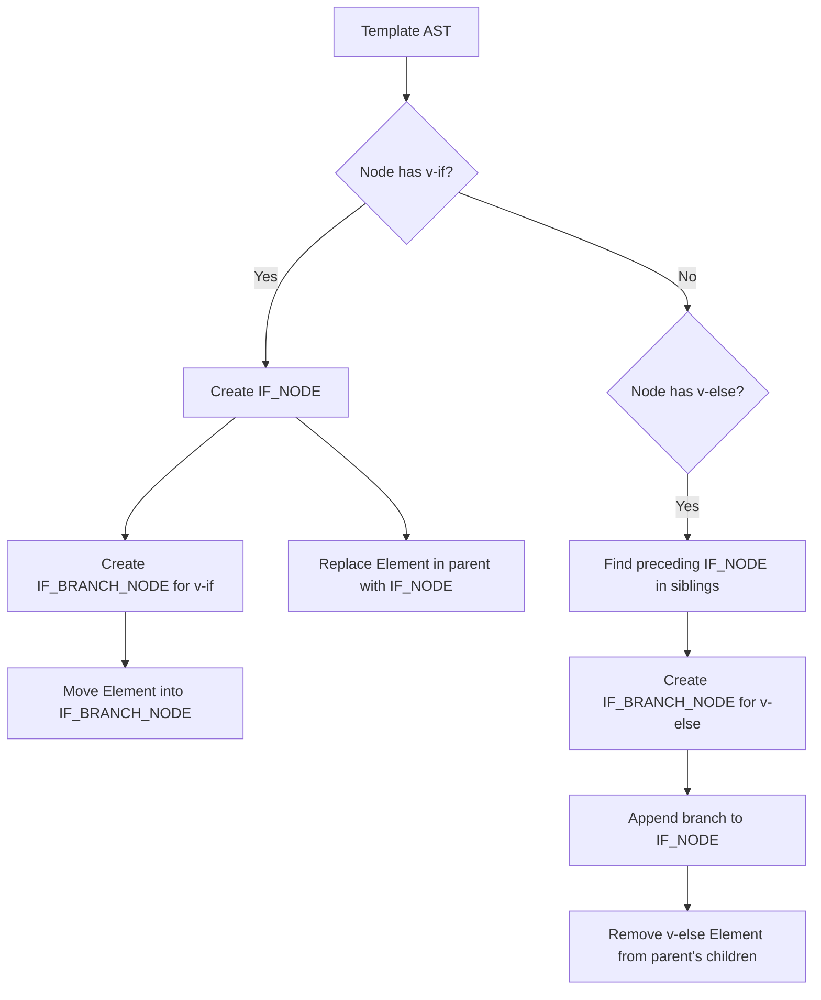

# Структурные директивы (v-if / v-for)

## Концепция и Архитектура (Mental Model)

Структурные директивы (`v-if`, `v-else-if`, `v-else`, `v-for`) концептуально отличаются от обычных атрибутивных директив (типа `v-bind` или кастомных директив). Они **управляют потоком выполнения** (control flow) и физически меняют структуру DOM.

В AST они не могут оставаться просто пропсами на элементе (как в оригинальном HTML-шаблоне). Компилятор должен "вырвать" элемент из его текущего места в дереве и обернуть его в специальный мета-узел (например, `IfNode` или `ForNode`). Это позволяет сгенерировать JS-код, который использует тернарные операторы (`condition ? a : b`) для `v-if` и вызовы `renderList()` для `v-for`.

Важнейшая задача фазы трансформации здесь — связать цепочки `<div v-if>` и `<div v-else>` в единую логическую конструкцию (IfNode с несколькими ветками - branches), даже если в Template AST это соседние независимые (sibling) узлы.

## Визуализация (Mermaid)



## Ссылки на исходный код

- **Трансформация v-if:** `packages/compiler-core/src/transforms/vIf.ts` (функции `transformIf`, `createIfBranch`, `createCodegenNodeForBranch`)
- **Трансформация v-for:** `packages/compiler-core/src/transforms/vFor.ts`

## Разбор реализации (Code Deep Dive)

В `transformIf` компилятор проверяет узлы на наличие директив `v-if`, `v-else-if` и `v-else`.

```typescript
// Упрощенная выдержка из compiler-core/src/transforms/vIf.ts
export const transformIf = createStructuralDirectiveTransform(
  /^(if|else|else-if)$/,
  (node, dir, context) => {
    // 1. Enter Phase (срабатывает, когда встречаем v-if)
    
    if (dir.name === 'if') {
      // Создаем новую ветку (branch)
      const branch = createIfBranch(node, dir)
      // Создаем корневой IfNode, который обернет ветку
      const ifNode = {
        type: NodeTypes.IF,
        branches: [branch],
        loc: node.loc
      }
      // ЗАМЕНЯЕМ текущий узел в родителе на ifNode
      context.replaceNode(ifNode)
    } else {
      // Для v-else-if и v-else
      // Находим предыдущего сиблинга, который должен быть IF_NODE
      const siblings = context.parent!.children
      let i = siblings.indexOf(node)
      while (i-- >= -1) {
        const sibling = siblings[i]
        if (sibling && sibling.type === NodeTypes.IF) {
          // Добавляем эту ветку в найденный IF_NODE
          sibling.branches.push(createIfBranch(node, dir))
          // УДАЛЯЕМ текущий узел (он теперь живет внутри ifNode)
          context.removeNode()
          break
        }
      }
    }

    // 2. Exit Phase
    return () => {
      // Здесь, когда все дети трансформированы, мы собираем codegenNode.
      // v-if/v-else компилируются во вложенные тернарные операторы:
      // condition1 ? renderBranch1() : (condition2 ? renderBranch2() : createCommentVNode())
    }
  }
)
```

**Особенности генерации кода (Codegen) для v-for:**

Для `v-for` генерируется вызов вспомогательной функции `renderList(source, iterator)`.
```typescript
// Шаблон: <div v-for="item in list" :key="item.id">{{ item }}</div>
// JS код сгенерированный Codegen (упрощенно):
(openBlock(true), createElementBlock(Fragment, null, renderList(_ctx.list, (item) => {
  return (openBlock(), createElementBlock("div", { key: item.id }, toDisplayString(item), 1 /* TEXT */))
}), 128 /* KEYED_FRAGMENT */))
```

## Оптимизации и Edge Cases (Подводные камни)

1. **Взаимодействие `v-if` и `v-for`:** В Vue 2 `v-for` имел больший приоритет, чем `v-if`, что приводило к неочевидным багам (скрытый цикл, если условие `v-if` ложно). Во Vue 3 **`v-if` имеет высший приоритет**. Если они на одном элементе, `v-if` оборачивает элемент *до* `v-for`, и поэтому `v-if` не имеет доступа к переменным `v-for` (возникнет ошибка компилятора). Для обхода используется `<template v-for>`.
2. **Фрагменты (Fragments):** Если `v-for` применяется к нескольким элементам (через `<template>`) или если используется `v-if` на корневом уровне, компилятор использует `Fragment` VNode. Это снимает ограничение Vue 2 на "только один корневой элемент". `v-for` всегда генерирует `KEYED_FRAGMENT` или `UNKEYED_FRAGMENT` патч-флаг, чтобы рантайм диффер понимал, как обходить список.
3. **Комментарии-заглушки (Comment VNodes):** Если у `v-if` нет парного `v-else` и условие ложно (false), компилятор генерирует вызов `createCommentVNode('v-if', true)`. В DOM вставляется `<!---->`. Это критически важно, чтобы рантайм имел "якорь" (anchor) в DOM-дереве, куда можно будет вставить настоящий элемент, когда `v-if` станет `true`.
