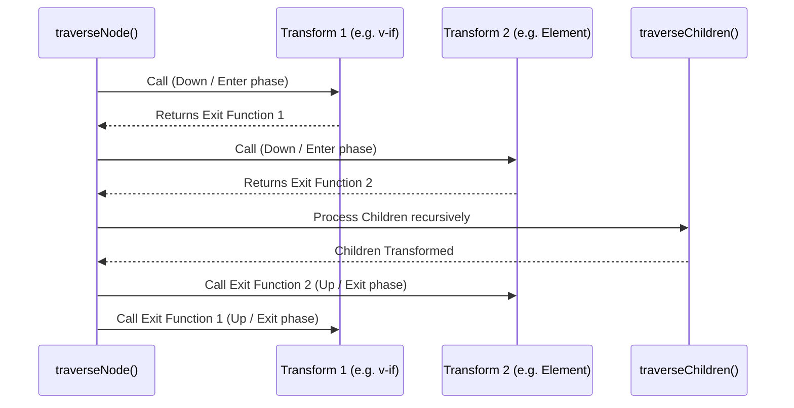

# Контекст Трансформации и Обход (Transform Context & Traversal)

## Концепция и Архитектура (Mental Model)

После того как парсер (`parse`) построил сырое Template AST, наступает фаза трансформации (`transform`). Ее задача — пройти по дереву, проанализировать узлы, применить директивы (v-if, v-for, v-bind) и инжектировать информацию о том, как генерировать код (`codegenNode`).

Архитектурно это реализовано через паттерн **Visitor (Визитор)** и **Трансформационный Контекст (TransformContext)**. 
- **TransformContext** — это глобальный объект состояния для текущей сессии трансформации. Он хранит информацию о текущем узле, родителе, области видимости (scope) идентификаторов, а также хелперы для замены/удаления узлов.
- **NodeTransforms** — это массив плагинов-функций, которые по очереди вызываются для каждого узла при обходе дерева.

Важнейшая особенность Vue-компилятора: обход идет **сверху вниз (down), а затем снизу вверх (up)**. Это позволяет родительскому плагину сначала "захватить" узел, позволить дочерним узлам трансформироваться, а затем обработать результат (Exit phase).

## Визуализация (Mermaid)



## Ссылки на исходный код

- **Ядро трансформации:** `packages/compiler-core/src/transform.ts` (функции `transform`, `traverseNode`)
- **Контекст:** `packages/compiler-core/src/transform.ts` (интерфейс `TransformContext` и функция `createTransformContext`)

## Разбор реализации (Code Deep Dive)

Ключевая функция — `traverseNode`. Она применяет все функции из `context.nodeTransforms` к текущему узлу.

```typescript
// Упрощенная выдержка из compiler-core/src/transform.ts
export function traverseNode(
  node: RootNode | TemplateChildNode,
  context: TransformContext
) {
  context.currentNode = node
  
  // 1. Enter Phase (сверху вниз)
  const { nodeTransforms } = context
  const exitFns = []
  for (let i = 0; i < nodeTransforms.length; i++) {
    // Плагин возвращает функцию (closure), которая будет вызвана на Exit Phase
    const onExit = nodeTransforms[i](node, context)
    if (onExit) {
      if (isArray(onExit)) {
        exitFns.push(...onExit)
      } else {
        exitFns.push(onExit)
      }
    }
    // Если плагин удалил текущий узел (например, v-if удалил ветку), прерываем обход
    if (!context.currentNode) {
      return
    } else {
      node = context.currentNode
    }
  }

  // 2. Обход детей
  switch (node.type) {
    case NodeTypes.ELEMENT:
    case NodeTypes.ROOT:
    case NodeTypes.FOR:
    case NodeTypes.IF_BRANCH:
      traverseChildren(node, context)
      break
  }

  // 3. Exit Phase (снизу вверх)
  // Выполняем сохраненные onExit функции в обратном порядке!
  context.currentNode = node
  let i = exitFns.length
  while (i--) {
    exitFns[i]()
  }
}
```

Пример простейшего `nodeTransform`, использующего обе фазы (Enter и Exit):

```typescript
const myTransform: NodeTransform = (node, context) => {
  // Enter: Делаем что-то ДО того, как дети трансформированы
  if (node.type === NodeTypes.ELEMENT) {
    console.log('Entering element:', node.tag)
  }
  
  return () => {
    // Exit: Делаем что-то ПОСЛЕ того, как дети (node.children) трансформированы
    // Здесь мы можем безопасно читать сгенерированные codegenNode у детей.
    if (node.type === NodeTypes.ELEMENT) {
      node.codegenNode = createVNodeCall(context, node.tag, /* props */, node.children)
    }
  }
}
```

## Оптимизации и Edge Cases (Подводные камни)

1. **Мутация вместо иммутабельности:** В отличие от Redux или функционального программирования, `TransformContext` активно мутирует AST-дерево. Плагины используют `context.replaceNode()` или `context.removeNode()`, которые физически меняют массив `children` родителя. Это сделано исключительно ради производительности (Memory Allocation), так как создание копий дерева для каждого плагина "убьет" скорость сборки.
2. **Reverse Execution (Обратное выполнение на Exit):** Важно, что `exitFns` выполняются через `while(i--)`. Функция-плагин, которая отработала первой на фазе *Enter*, отработает последней на фазе *Exit*. Это обеспечивает правильную вложенность (как матрешка).
3. **Lexical Scope Tracking (Отслеживание областей видимости):** `TransformContext` ведет учет локальных переменных (например, `item` в `v-for="item in list"`). При входе в ветку `v-for` контекст пушит идентификатор `item` во внутренний массив, а на фазе Exit (в `onExit` функции `transformFor`) — делает `pop`. Это позволяет компилятору точно знать, является ли переменная в выражении `{{ item.name }}` локальной (не требует префикса `_ctx.`) или глобальной компонента (`_ctx.someVar`).
