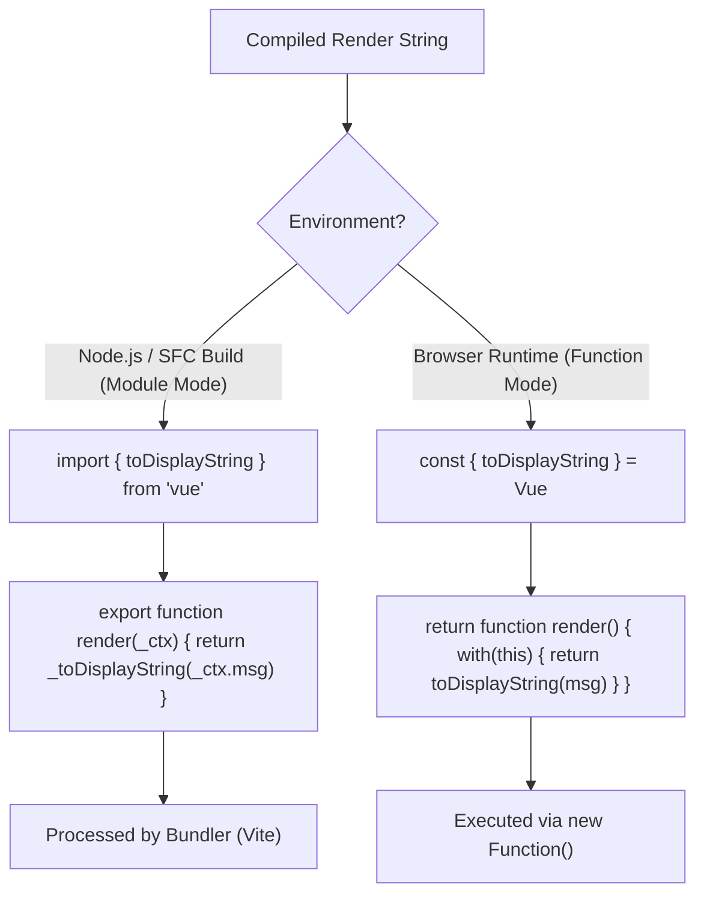

# Module Mode vs Function Mode

## Концепция и Архитектура (Mental Model)

Компилятор Vue используется в двух принципиально разных средах выполнения, и кодогенератор (Codegen) должен адаптироваться под обе:

1. **Module Mode (Среда сборки):** Компилятор работает в Node.js (или Deno/Bun) под управлением сборщика (Vite, Rollup, Webpack). Он генерирует полноценный ECMAScript модуль (`export function render() { ... }`). Этот код затем будет бандлиться, минифицироваться и отдаваться в браузер как статический файл.
2. **Function Mode (Рантайм среда браузера):** Компилятор встроен в клиентский JS-бандл (Vue "Global" build, используемый через CDN). Он компилирует строки шаблонов прямо в браузере (на лету). Он не может использовать `import` / `export` синтаксис (так как это динамическое выполнение строки). Вместо этого он использует `new Function('Vue', '...return function render() { ... }')`.

Разница между этими режимами критически влияет на то, как генерируется Преамбула (Preamble), как обрабатываются импорты хелперов и как резолвятся переменные (scope).

## Визуализация (Mermaid)



## Ссылки на исходный код

- **Опция mode:** `packages/compiler-core/src/options.ts` (Свойство `mode: 'module' | 'function'`)
- **Кодогенератор Preamble:** `packages/compiler-core/src/codegen.ts` (Разделение логики на `genModulePreamble` и `genFunctionPreamble`)

## Разбор реализации (Code Deep Dive)

В кодогенераторе есть явное разветвление логики на основе `options.mode`.

```typescript
// Упрощенная выдержка из compiler-core/src/codegen.ts
export function generate(
  ast: RootNode,
  options: CodegenOptions = {}
): CodegenResult {
  const context = createCodegenContext(ast, options)
  const { mode, push } = context

  // 1. Генерация Preamble
  if (mode === 'module') {
    genModulePreamble(ast, context, genScopeId)
    // Результат: import { createVNode as _createVNode } from "vue"
  } else {
    genFunctionPreamble(ast, context)
    // Результат: const _Vue = Vue; const { createVNode: _createVNode } = _Vue
  }

  // 2. Генерация функции рендера
  const functionName = `render`
  const args = ['_ctx', '_cache']
  
  if (mode === 'function') {
    // В Function mode добавляется глобальная обертка with(this)
    // И возвращается сама функция (чтобы new Function её вернула)
    push(`return function ${functionName}(${args.join(', ')}) {\n`)
    push(`  with (this) {\n  `) // <-- Магия динамического скоупа
  } else {
    // В Module mode это обычный экспорт
    push(`export function ${functionName}(${args.join(', ')}) {\n`)
  }

  // ... (генерация тела функции)
}
```

## Оптимизации и Edge Cases (Подводные камни)

1. **Проблема `with (this)`:** В `Function Mode` использование конструкции `with` отключает строгий режим JS (Strict Mode) и замедляет выполнение (движок V8 не может оптимизировать доступ к переменным, так как не знает, есть ли `msg` внутри `this` (компонента) или это глобальная переменная). Именно поэтому `Module Mode` (сборка через SFC) всегда предпочтительнее и быстрее.
2. **Глобальный объект Vue:** В `Function Mode` компилятор ожидает, что глобальный объект `Vue` доступен в `window` (через `<script src="...vue.global.js">`), чтобы извлечь из него хелперы (например `Vue.createVNode`). В `Module Mode` он рассчитывает на механизм резолва путей бандлером (Vite/Rollup), поэтому генерирует `from "vue"`.
3. **Content Security Policy (CSP):** `Function Mode` использует `new Function()`, что трактуется браузерами как `eval()`. Если на сайте настроены строгие заголовки CSP (`script-src 'self'`), `Function Mode` просто упадет с ошибкой безопасности. `Module Mode` полностью CSP-совместим, так как отдает заранее скомпилированный код без динамической генерации функций.
