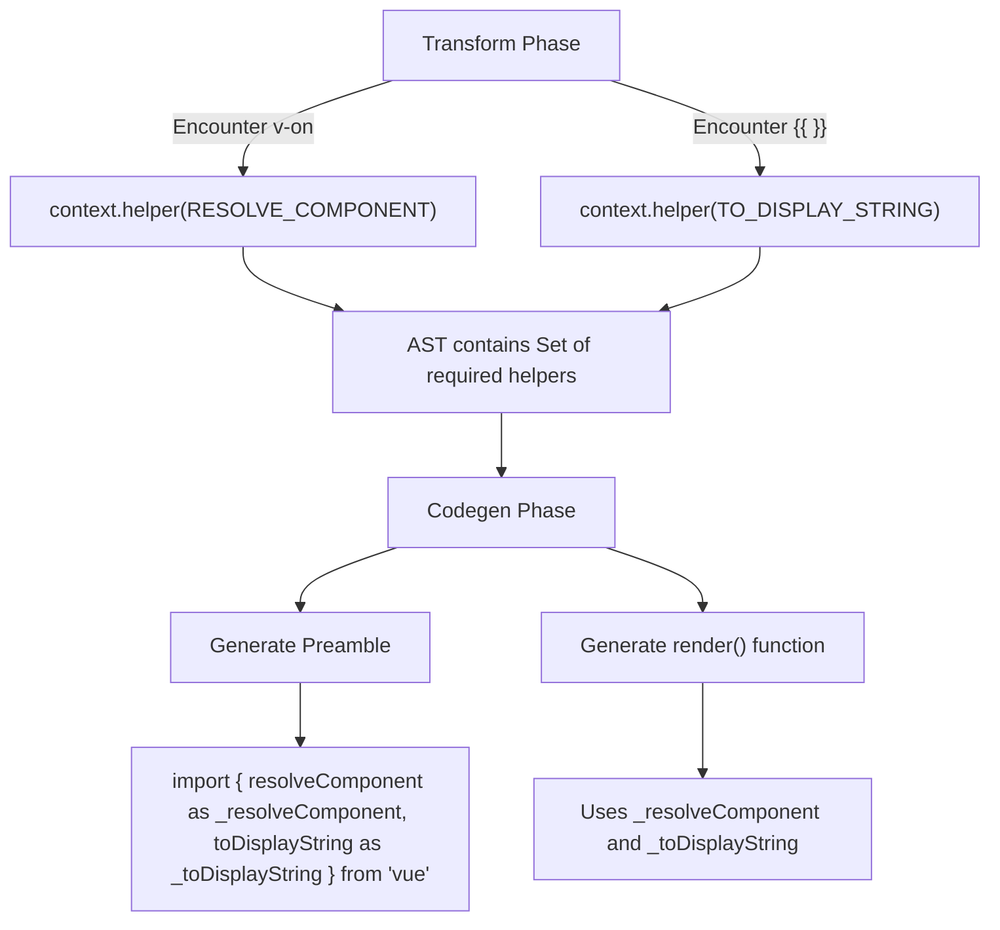

# Preamble и Хелперы (Preamble & Helpers)

## Концепция и Архитектура (Mental Model)

Финальная фаза компилятора — **Кодогенерация (Codegen)**. Ее цель — превратить трансформированное AST в валидный JavaScript код в виде строки (string).

Прежде чем генерировать саму функцию `render()`, компилятору нужно сгенерировать **Преамбулу (Preamble)**. Преамбула — это блок кода в самом начале сгенерированного файла, который импортирует (или деструктурирует) необходимые рантайм-хелперы (вспомогательные функции) из Vue.

Ключевая идея в том, что Vue не импортирует *все* возможные функции рендера. На этапе трансформации (Transform) компилятор отслеживает, какие именно фичи использовались в шаблоне (через `context.helper()`), и в кодогенераторе (Codegen) импортирует **только их**. Это фундаментальная основа Tree-Shaking'а во Vue 3: если вы не используете `v-model` в шаблоне, хелпер `vModelText` не попадет в бандл.

## Визуализация (Mermaid)



## Ссылки на исходный код

- **Кодогенератор:** `packages/compiler-core/src/codegen.ts` (функции `generate`, `genModulePreamble`, `genFunctionPreamble`)
- **Справочник хелперов:** `packages/compiler-core/src/runtimeHelpers.ts`

## Разбор реализации (Code Deep Dive)

В контексте трансформации есть набор (Set) `helpers`. При обходе AST плагины добавляют туда Symbol'ы.

```typescript
// Упрощенная выдержка из compiler-core/src/runtimeHelpers.ts
export const TO_DISPLAY_STRING = Symbol('toDisplayString')
export const CREATE_VNODE = Symbol('createVNode')
// ... и еще около 40 других

// Упрощенная выдержка из compiler-core/src/codegen.ts
function genModulePreamble(
  ast: RootNode,
  context: CodegenContext,
  genScopeId: boolean
) {
  const { push, helpers } = context
  
  if (helpers.size > 0) {
    // 1. Собираем имена импортов на основе Symbol'ов из ast.helpers
    const imports = Array.from(helpers).map(s => {
      const helperName = helperNameMap[s]
      // Создаем алиас: toDisplayString as _toDisplayString
      return `${helperName} as _${helperName}`
    })

    // 2. Генерируем строку импорта
    push(`import { ${imports.join(', ')} } from "vue"\n`)
  }

  // 3. Генерация статических хоистов (Static Hoists)
  genHoists(ast.hoists, context)
}
```

Все рантайм-хелперы в сгенерированном коде имеют префикс `_` (например, `_createVNode`). Это сделано для того, чтобы гарантированно избежать коллизий имен с переменными пользователя (вдруг у него в данных компонента есть переменная `createVNode`).

## Оптимизации и Edge Cases (Подводные камни)

1. **Tree-Shaking на уровне компилятора:** Именно благодаря этому механизму Vue 3 может поставляться как 16kb (min+gzip). Хелперы (такие как `vShow`, `withDirectives`, `renderList`, `Transition`) импортируются как ES-модули только при их фактическом наличии в AST. Сборщики (Webpack, Vite/Rollup) легко выкидывают неиспользуемый код.
2. **Алиасинг хелперов:** Почему импорты переименовываются через `as _...`? Помимо защиты от коллизий, это дает выигрыш в размере сжатого кода. Минификаторы (Terser/esbuild) могут безопасно сжимать имена локальных переменных (например, `_toDisplayString` превратится в `_a`).
3. **SSG / SSR особенности:** Если шаблон компилируется для серверного рендеринга (SSR), компилятор подменяет набор хелперов. Например, вместо `CREATE_VNODE` будет импортирован серверный `SSR_INTERPOLATE` из пакета `@vue/server-renderer`, который генерирует строковый HTML, а не VDOM объекты. Preamble гибко адаптируется под платформу.
