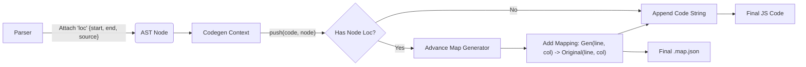

# Генерация Source Maps (Source Map Generation)

## Концепция и Архитектура (Mental Model)

Когда компилятор преобразует декларативный HTML-шаблон (Vue SFC) во вложенные вызовы JS-функций (типа `createVNode`), он кардинально меняет структуру кода. Если в рантайме в браузере (или при рендеринге компонента в тестах) произойдет ошибка, JS-движок выбросит стэк-трейс, указывающий на непонятную строку сгенерированного кода.

Чтобы разработчик мог отлаживать (debug) оригинальный `<template>` прямо в браузере (через Chrome DevTools), компилятор должен сгенерировать **Source Map**. Это карта-связка, которая маппит координаты (строка, колонка) сгенерированного JS-узла обратно к координатам оригинального узла в строке шаблона.

Vue-компилятор использует библиотеку `source-map-js` для формирования этой карты. Чтобы карта была точной, трекинг позиций (Location Tracking) начинается еще на этапе парсинга (`loc` объект в AST) и протаскивается через все этапы трансформации прямо в кодогенератор.

## Визуализация (Mermaid)



## Ссылки на исходный код

- **Контекст Codegen:** `packages/compiler-core/src/codegen.ts` (Интерфейс `CodegenContext` и свойство `map`)
- **Утилиты для позиций:** `packages/compiler-core/src/ast.ts` (Интерфейс `SourceLocation`)

## Разбор реализации (Code Deep Dive)

В `CodegenContext` есть функция `push`, которая отвечает за добавление строк в итоговый бандл.

```typescript
// Упрощенная выдержка из compiler-core/src/codegen.ts
import { SourceMapGenerator } from 'source-map-js'

export function createCodegenContext(
  ast: RootNode,
  { sourceMap, filename = 'template.vue.html' }: CodegenOptions
): CodegenContext {
  const context = {
    code: '',
    column: 1, // Текущая колонка сгенерированного кода
    line: 1,   // Текущая строка сгенерированного кода
    offset: 0,
    map: sourceMap ? new SourceMapGenerator() : undefined,
    
    push(code: string, node?: CodegenNode) {
      context.code += code
      
      if (context.map && node && node.loc && node.loc !== locStub) {
        // Добавляем маппинг, если у узла есть оригинальная локация
        context.map.addMapping({
          source: filename,
          original: {
            line: node.loc.start.line,
            column: node.loc.start.column - 1 // source-map-js ожидает 0-indexed колонки
          },
          generated: {
            line: context.line,
            column: context.column - 1
          }
        })
      }
      advancePositionWithMutation(context, code) // Сдвигаем счетчики line/column
    }
  }
  return context
}
```

Когда `codegen` обходит AST дерево (на этапе `genNode`), он постоянно вызывает `push(code, node)`. Это синхронно строит и JS-строку, и Source Map.

## Оптимизации и Edge Cases (Подводные камни)

1. **Overhead Source Maps:** Генерация карт замедляет сборку (в среднем на 10-20%) и потребляет много памяти, так как `SourceMapGenerator` держит огромный массив маппингов. В production-режиме (когда вы делаете `npm run build`), генерация Source Maps для шаблонов часто отключается (или не заливается на сервер) для ускорения CI/CD.
2. **Точность маппингов:** Для `SIMPLE_EXPRESSION` (например, выражений интерполяции `{{ a + b }}`) компилятор маппит позицию с точностью до символа. Для сложных узлов (например, компонента с `v-if` и `v-for`) маппинг может указывать только на открывающий тег, так как структура VNode-вызова в JS слишком отличается от HTML.
3. **Ложные позитивы (Blank spaces):** Если плагин трансформации создает виртуальный узел (которого не было в оригинальном шаблоне, например `Fragment` или `createCommentVNode`), ему не назначается `loc` (или назначается "пустая" локация). `push` проигнорирует такой узел, и отладчик Chrome не попытается "прыгнуть" на несуществующую строчку в шаблоне.
