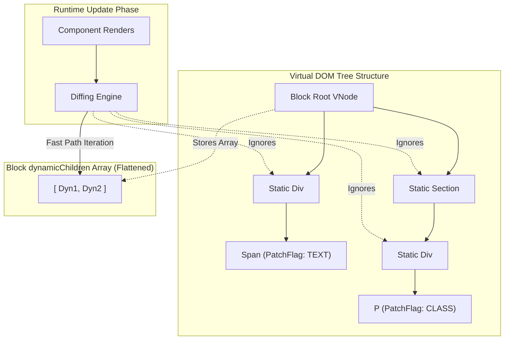

# Block Tracking & Block Tree (Блоки)

## Концепция и Архитектура (Mental Model)

Патч-флаги (Patch Flags) — это круто, но они решают проблему на уровне *одного* узла (VNode). А что если у нас глубокое дерево (глубиной 20 узлов), и динамический узел с патч-флагом находится на самом дне? Рантайму все равно придется рекурсивно пройти 19 статических родительских узлов, чтобы добраться до этого одного изменения.

Для решения проблемы "глубокого обхода" Vue 3 вводит концепцию **Blocks (Блоков)**. Блок — это специальный VNode (обычно корневой узел компонента, `v-if` ветка или `v-for` итерация), который хранит "плоский" массив всех своих динамических потомков (`dynamicChildren`).

На этапе компиляции, когда создается VNode с любым Patch Flag (кроме HOISTED), он "регистрирует" себя в текущем открытом Блоке. В рантайме, при обновлении компонента, алгоритм диффинга (Patch) просто итерируется по плоскому массиву `dynamicChildren` блока (цикл `for` по 10 элементам), **полностью игнорируя реальную иерархию (вложенность) VDOM-дерева**. Это дает скорость $O(\text{dynamic nodes})$ вместо $O(\text{total nodes})$.

## Визуализация (Mermaid)



## Ссылки на исходный код

- **Рантайм-трекинг:** `packages/runtime-core/src/vnode.ts` (функции `openBlock`, `createBlock`, `setupBlock`)
- **Компилятор генерация:** `packages/compiler-core/src/codegen.ts` (Инжектирование `openBlock()`)

## Разбор реализации (Code Deep Dive)

Блоки трекаются глобально в рантайме через стек (массив массивов).

```typescript
// Упрощенная выдержка из runtime-core/src/vnode.ts
export const blockStack: (VNode[] | null)[] = []
export let currentBlock: VNode[] | null = null

// Вызывается перед созданием корня компонента или v-if/v-for ветки
export function openBlock() {
  blockStack.push((currentBlock = []))
}

export function closeBlock() {
  blockStack.pop()
  currentBlock = blockStack[blockStack.length - 1] || null
}

// Любой createVNode вызывает это внутри:
if (
  currentBlock && 
  patchFlag > 0 && 
  patchFlag !== PatchFlags.HOISTED
) {
  // Динамический узел добавляет сам себя в плоский массив текущего блока!
  currentBlock.push(vnode)
}

// Создание самого Block узла (оборачивает обычный VNode)
export function createBlock(type, props, children, patchFlag, dynamicProps) {
  const vnode = createVNode(type, props, children, patchFlag, dynamicProps)
  // Сохраняем собранный плоский массив в свойство vnode
  vnode.dynamicChildren = currentBlock 
  closeBlock()
  return vnode
}
```

Сгенерированный компилятором код выглядит так:
```javascript
// openBlock(true) инициализирует сборку
// createElementBlock завершает и возвращает Блок с dynamicChildren
return (openBlock(), createElementBlock("div", null, [
  createElementVNode("div", null, [
    // Этот узел попадет в dynamicChildren корня!
    createElementVNode("span", null, _toDisplayString(msg), 1 /* TEXT */)
  ])
]))
```

## Оптимизации и Edge Cases (Подводные камни)

1. **Зачем нужна конструкция `(openBlock(), createBlock(...))`?** Это трюк (Comma Operator). `openBlock()` вызывается *до* вычисления аргументов `createBlock` (включая вложенные `createVNode`). Таким образом, стек блоков открывается, все дети рендерятся (и пушат себя в стек), а затем родитель закрывает блок.
2. **Проблема нестабильной структуры (`v-if` / `v-for`):** Блочный обход (`dynamicChildren`) работает только тогда, когда структурная форма дерева гарантированно не меняется. Если внутри дерева есть `v-if`, он может скрыть или показать часть узлов. Это ломает индексное сопоставление плоского массива. **Решение:** компилятор делает *любой* узел с `v-if` или `v-for` **Новым Блоком (New Block)**. Дерево блоков выстраивается иерархически (Блок внутри Блока). Алгоритм `patch` использует блочный диффинг для блоков и рекурсивно проваливается во вложенные структурные Блоки.
3. **Отключение Блоков (Bailout):** Если компонент использует рендер-функции вручную (без шаблона/JSX), он не генерирует `openBlock`. В таком случае VDOM откатывается к медленному (стандартному) рекурсивному `patch`. Это одна из причин, почему шаблоны в Vue 3 работают быстрее "чистого" JSX.
