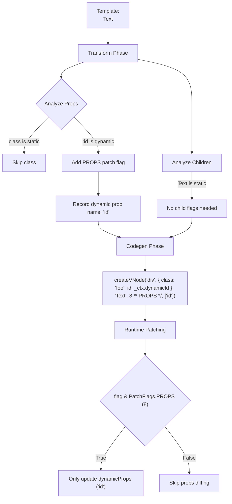

# Генерация Patch Flags (Патч-флаги)

## Концепция и Архитектура (Mental Model)

**Patch Flags** (патч-флаги) — это битовые маски (bitmasks), сгенерированные компилятором, которые служат "подсказками" (hints) для рантайм-диффера (VDOM). 

В традиционном Virtual DOM (как в Vue 2 или React), при обновлении компонента алгоритм диффинга должен сравнить *все* свойства узла (props, classes, styles, children), чтобы понять, что изменилось. Это медленно $O(N)$.

Компилятор Vue 3 знает, что именно динамично в узле, уже на этапе компиляции. Если класс статический, а атрибут `id` — динамический, компилятор добавляет к VNode флаг (число). В рантайме алгоритм `patch` использует быстрые побитовые операции (`&`), чтобы проверить этот флаг. Если флаг говорит "изменились только атрибуты `props`", диффер полностью пропустит проверку `class`, `style` и `children` (Fast Path $O(1)$).

## Визуализация (Mermaid)



## Ссылки на исходный код

- **Справочник флагов:** `packages/shared/src/patchFlags.ts` (Enum `PatchFlags`)
- **Анализ элементов:** `packages/compiler-core/src/transforms/transformElement.ts` (Сборка флагов)

## Разбор реализации (Code Deep Dive)

Патч-флаги определены как степени двойки (powers of 2), что позволяет комбинировать их побитовым ИЛИ (`|`) и проверять побитовым И (`&`).

```typescript
// Упрощенная выдержка из shared/src/patchFlags.ts
export const enum PatchFlags {
  TEXT = 1,               // 1 << 0 (Динамический текст)
  CLASS = 1 << 1,         // 2 (Динамический class)
  STYLE = 1 << 2,         // 4 (Динамический style)
  PROPS = 1 << 3,         // 8 (Динамические атрибуты/пропсы, кроме class/style)
  FULL_PROPS = 1 << 4,    // 16 (Наличие динамических ключей, например v-bind="obj")
  HYDRATE_EVENTS = 1 << 5,// 32 (Нужно привязать события при SSR Hydration)
  STABLE_FRAGMENT = 1 << 6, // 64 (Фрагмент, дети которого не меняют порядок)
  KEYED_FRAGMENT = 1 << 7,  // 128 (v-for с ключами)
  UNKEYED_FRAGMENT = 1 << 8,// 256 (v-for без ключей)
  NEED_PATCH = 1 << 9,      // 512 (Особый флаг для ref или кастомных директив)
  DYNAMIC_SLOTS = 1 << 10,  // 1024
  
  // Отрицательные флаги для BAILOUT (пропуск диффинга)
  HOISTED = -1,           // Статичный узел (создан 1 раз)
  BAIL = -2               // Выход из оптимизированного режима (например, слот отрендерен вручную)
}
```

Внутри `transformElement`, компилятор собирает маску:
```typescript
let patchFlag = 0
const dynamicPropNames: string[] = []

if (hasDynamicClass) patchFlag |= PatchFlags.CLASS
if (hasDynamicStyle) patchFlag |= PatchFlags.STYLE
if (hasDynamicProps) {
  patchFlag |= PatchFlags.PROPS
  dynamicPropNames.push(...dynamicProps)
}

// Позже в кодогенераторе (Codegen):
// Если patchFlag > 0, он передается 4-м аргументом в createVNode.
```

## Оптимизации и Edge Cases (Подводные камни)

1. **Разделение CLASS, STYLE и PROPS:** CSS-классы и инлайн-стили вынесены в отдельные флаги (`1` и `2`). Это сделано потому, что во Vue их обновление очень частотно, и они требуют сложного мержа (слияния объектов/массивов), в отличие от обычных HTML-атрибутов (`id`, `src`), которые просто сетятся (set).
2. **Массив динамических ключей (`dynamicPropNames`):** Для флага `PROPS (8)` компилятор передает 5-м аргументом массив имён свойств, которые могут меняться (например, `['id', 'disabled']`). Рантайм-диффер пройдется *только* по этому массиву (длиной 2), проигнорировав остальные 100 статических атрибутов элемента.
3. **De-optimization (Сброс оптимизации):** Использование синтаксиса `v-bind="object"` без спецификации ключей заставляет компилятор выдать флаг `FULL_PROPS (16)`. Это означает, что компилятор не знает, какие ключи внутри `object`, поэтому рантайму придется перебирать весь объект целиком (как во Vue 2). Это стоит учитывать при оптимизации критичных участков.
