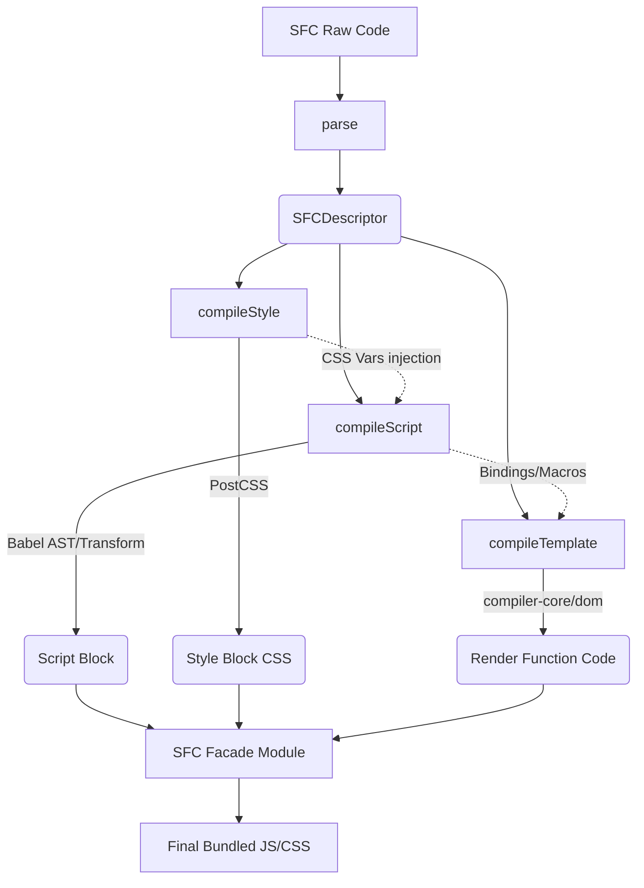

# SFC Compiler Architecture

## 1. Концепция и Архитектура (Mental Model)
Single-File Component (SFC) во Vue — это абстракция времени сборки. В рантайме браузер не знает о `.vue` файлах. Компилятор SFC (`@vue/compiler-sfc`) — это оркестратор, который берет сырой текст файла и разбивает его на независимые блоки (script, template, style), а затем пропускает их через цепочку специализированных подкомпиляторов.

Его главная цель — превратить монолитный `.vue` файл в один JavaScript-модуль. При этом решается проблема замыканий (scoping) и связывания блоков. Например, `compiler-sfc` гарантирует, что переменные из `<script setup>` будут доступны в `<template>`, а CSS-классы из `<style scoped>` получат уникальные хеши в шаблоне.

## 2. Визуализация (Mermaid)


## 3. Ссылки на исходный код (Source Code References)
- `packages/compiler-sfc/src/parse.ts` — парсер исходного `.vue` файла.
- `packages/compiler-sfc/src/compileScript.ts` — компиляция `<script setup>` и макросов.
- `packages/compiler-sfc/src/compileTemplate.ts` — обертка над `@vue/compiler-dom` для шаблонов.
- `packages/compiler-sfc/src/compileStyle.ts` — скоупинг и CSS Variables (PostCSS).

## 4. Разбор реализации (Code Deep Dive)
Процесс сборки начинается с функции `parse`.
Она возвращает `SFCDescriptor` — структуру данных, описывающую все блоки:

```typescript
export interface SFCDescriptor {
  filename: string
  source: string
  template: SFCTemplateBlock | null
  script: SFCScriptBlock | null
  scriptSetup: SFCScriptBlock | null
  styles: SFCStyleBlock[]
  customBlocks: SFCBlock[]
  cssVars: string[]
  slotted: boolean
  shouldForceReload: (prevImports: Record<string, ImportBinding>) => boolean
}
```

Далее бандлер (Vite/Webpack) вызывает `compileScript`, который парсит JavaScript/TypeScript с помощью Babel, извлекает биндинги (Bindings) — переменные и функции, объявленные на верхнем уровне `<script setup>`. Эти биндинги затем передаются в `compileTemplate`. Шаблон компилируется с учетом того, что переменные лежат в замыкании (в режиме `inline` рендера) или обращаются через `__props` / `__ctx`.

```typescript
// compileScript.ts (упрощенно)
export function compileScript(
  sfc: SFCDescriptor,
  options: SFCScriptCompileOptions
): SFCScriptBlock {
  const scriptAst = babelParse(sfc.scriptSetup.content);
  const bindings = analyzeBindings(scriptAst); // 'msg': SetupBinding
  
  // Трансформация макросов (defineProps, etc.)
  const content = transformMacros(scriptAst);

  return {
    ...sfc.scriptSetup,
    content,
    bindings // Передаются дальше в compileTemplate
  }
}
```

## 5. Оптимизации и Edge Cases (Подводные камни)
- **Inline Rendering (Vite/Rollup)**: В production-сборке `compileScript` и `compileTemplate` объединяются. Рендер-функция инлайнится прямо в scope `<script setup>`, что позволяет избегать накладных расходов на создание объекта `setup()` и использование `Proxy` для доступа к переменным. Компонент обращается к реактивным переменным напрямую через замыкание.
- **Кэширование AST**: Чтобы не парсить один и тот же файл много раз (например, при HMR), `compiler-sfc` кэширует AST блоков. Если изменился только `<template>`, скрипт не перекомпилируется.
- **Babel vs SWC/Esbuild**: Vue исторически использует `@babel/parser` для `<script setup>`, так как он написан на JS, легко интегрируется в браузер (для In-browser компиляции, например в REPL) и позволяет гибко манипулировать AST при обработке макросов вроде `defineProps`.
