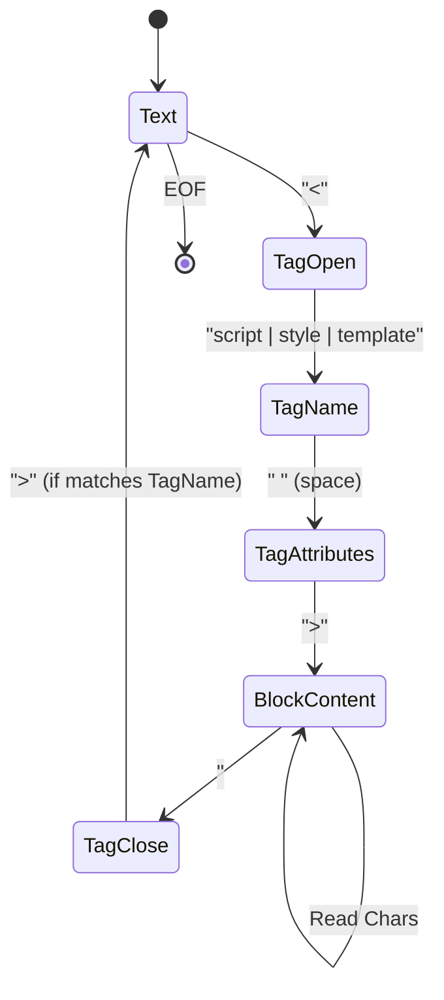

# Parsing SFC Blocks

## 1. Концепция и Архитектура (Mental Model)
Первый этап работы `compiler-sfc` — это лексический анализ (парсинг) исходного `.vue` файла. Файл разбивается на структурированное представление — `SFCDescriptor`. 
Сам по себе парсер SFC не является полноценным HTML-парсером. Он использует специализированный конечный автомат, основанный на регулярных выражениях и простом переборе символов, который умеет находить границы тегов верхнего уровня (`<template>`, `<script>`, `<style>`, `<docs>`). Внутри этих блоков контент считается просто строкой (raw text) до тех пор, пока не будет передан специализированному компилятору.

## 2. Визуализация (Mermaid)


## 3. Ссылки на исходный код (Source Code References)
- `packages/compiler-sfc/src/parse.ts` — главный модуль парсинга.
- `packages/compiler-core/src/parse.ts` — базовый HTML-парсер, из которого переиспользуются некоторые утилиты.

## 4. Разбор реализации (Code Deep Dive)
Функция `parse` создает `SFCDescriptor`. Парсинг происходит за один проход по строке (O(n) сложность).

```typescript
export function parse(
  source: string,
  options: SFCParseOptions = {}
): SFCParseResult {
  const { sourceMap, filename, sourceRoot, pad, compilerParseOptions } = options
  
  // Используется базовый компилятор Vue для парсинга тегов верхнего уровня
  const ast = compiler.parse(source, {
    ...compilerParseOptions,
    isNativeTag: () => true,
    isPreTag: () => true,
    getTextMode: ({ tag, attrs }) => {
      // Все содержимое блоков трактуется как RAW TEXT, мы не парсим внутренний HTML на этом этапе!
      return TextModes.RAWTEXT
    }
  })

  const descriptor: SFCDescriptor = {
    filename,
    source,
    template: null,
    script: null,
    scriptSetup: null,
    styles: [],
    customBlocks: [],
    // ...
  }

  // Распределение узлов AST по блокам дескриптора
  ast.children.forEach(node => {
    if (node.type === NodeTypes.ELEMENT) {
      switch (node.tag) {
        case 'template':
          descriptor.template = createBlock(node, source) as SFCTemplateBlock
          break
        case 'script':
          if (node.props.some(p => p.name === 'setup')) {
            descriptor.scriptSetup = createBlock(node, source) as SFCScriptBlock
          } else {
            descriptor.script = createBlock(node, source) as SFCScriptBlock
          }
          break
        case 'style':
          descriptor.styles.push(createBlock(node, source) as SFCStyleBlock)
          break
        default:
          descriptor.customBlocks.push(createBlock(node, source))
      }
    }
  })

  return { descriptor, errors: [] }
}
```

## 5. Оптимизации и Edge Cases (Подводные камни)
- **Source Maps**: Одна из самых сложных задач при парсинге блоков — корректная генерация Source Maps. При извлечении блоков парсер сохраняет начальные и конечные позиции (loc) в исходном файле. Если применяется паддинг (опция `pad: 'space' | 'line'`), пустые строки сохраняются, чтобы номера строк в скриптах совпадали с исходным `.vue` файлом, что ускоряет работу линтеров и сборщиков (без необходимости сложных преобразований Source Map).
- **TextMode.RAWTEXT**: Парсер намеренно игнорирует любой синтаксис внутри скриптов или стилей. Если внутри скрипта есть строка с символами `</script>`, парсер может сломаться. Vue использует эвристики и заставляет экранировать `<\/script>` в строках внутри `<script>`.
