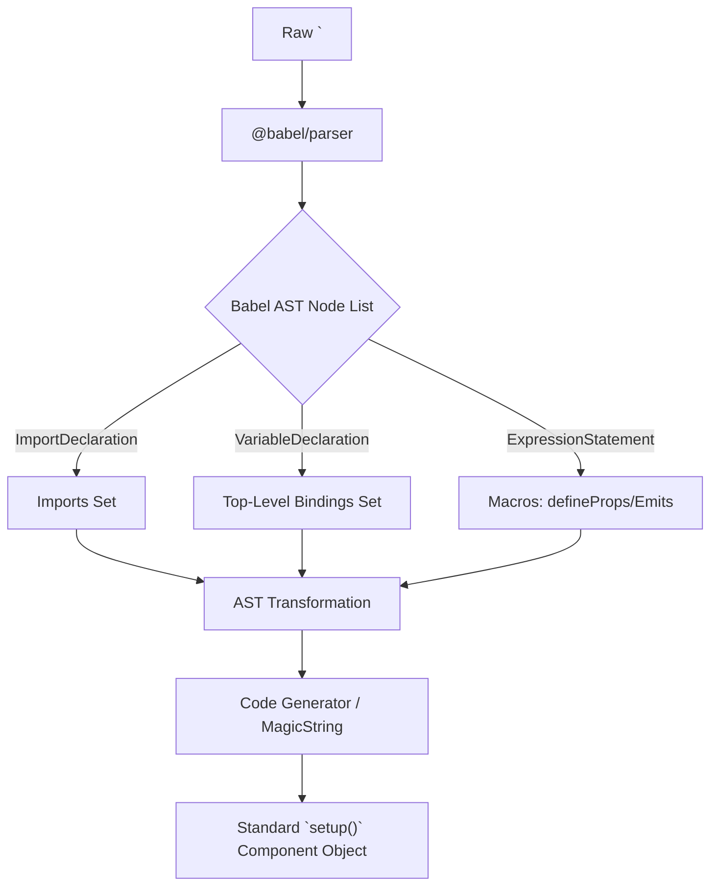

# Babel AST Integration in `<script setup>`

## 1. Концепция и Архитектура (Mental Model)
`<script setup>` — это синтаксический сахар, который во время компиляции преобразуется в стандартную функцию `setup()`. Чтобы сделать это безопасно и корректно извлечь "биндинги" (переменные, классы, функции, импорты), компилятору необходимо понимать семантику JavaScript/TypeScript кода. Для этого используется `@babel/parser`.
Babel AST позволяет компилятору находить все декларации на верхнем уровне (Top-Level Declarations) и понимать их тип (реактивная переменная, константа, пропс, импорт). Это критически важно для связывания (bindings) с шаблоном: в зависимости от типа биндинга, генератор кода шаблона знает, как к нему обращаться (`$setup.x`, `$props.x` или `unref(x)`).

## 2. Визуализация (Mermaid)


## 3. Ссылки на исходный код (Source Code References)
- `packages/compiler-sfc/src/compileScript.ts` — основная точка входа.
- `packages/compiler-sfc/src/script/analyzeScriptBindings.ts` — извлечение биндингов из AST.
- `packages/compiler-sfc/src/script/context.ts` — `ScriptCompileContext` обертка для манипуляций с AST и MagicString.

## 4. Разбор реализации (Code Deep Dive)
Внутри `compileScript` исходный код скармливается Бабелю. Мы используем плагины для TypeScript и JSX.

```typescript
// packages/compiler-sfc/src/compileScript.ts
import { parse as babelParse } from '@babel/parser'
import MagicString from 'magic-string'

const ast = babelParse(scriptSetupSource, {
  sourceType: 'module',
  plugins: [
    'typescript',
    'jsx',
    // ...
  ]
}).program.body

const s = new MagicString(scriptSetupSource)
const bindings: Record<string, BindingTypes> = {}

// Проходим по AST верхнего уровня (без глубокого обхода)
for (const node of ast) {
  if (node.type === 'VariableDeclaration') {
    for (const decl of node.declarations) {
      if (decl.id.type === 'Identifier') {
        const isLetOrConst = node.kind === 'let' || node.kind === 'const'
        // Регистрация биндинга
        bindings[decl.id.name] = isLetOrConst 
          ? BindingTypes.SETUP_LET 
          : BindingTypes.SETUP_CONST
      }
    }
  } else if (node.type === 'ImportDeclaration') {
    // Регистрация импортов
  }
}

// Генерация выходного кода с помощью MagicString
s.prepend(`export default {\n  setup(__props, { expose }) {\n`)
s.append(`\n  return { ...bindings }\n  }\n}`)
```
Типы биндингов (`BindingTypes`) передаются в `compileTemplate`. Если переменная является `SETUP_REF` (например, обернута в макрос `$()`), компилятор шаблона не будет добавлять `.value` автоматически, в отличие от обычного `ref`.

## 5. Оптимизации и Edge Cases (Подводные камни)
- **Top-Level Only**: Для ускорения компилятору не нужно обходить все дерево AST (полный AST Traversal). Ему достаточно проверить узлы только первого (верхнего) уровня `program.body`. Это делает компиляцию `<script setup>` невероятно быстрой по сравнению с полноценными сборщиками.
- **MagicString**: Вместо полной генерации кода из модифицированного AST (через `@babel/generator`), Vue использует `MagicString`. Инструмент позволяет делать срезы и склейки оригинальной строки (substring replacements) на основе `start` и `end` позиций узлов AST. Это сохраняет исходное форматирование пользователя и работает на порядки быстрее.
