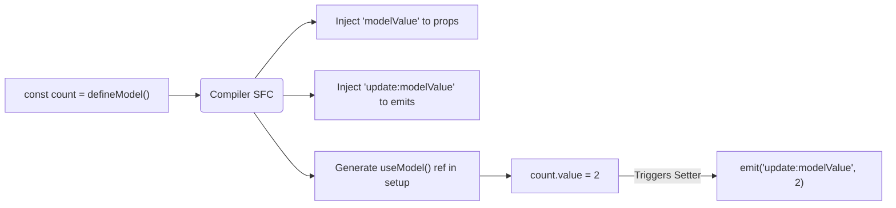

# `defineModel` Macro Internals

## 1. Концепция и Архитектура (Mental Model)
`defineModel` (появился в Vue 3.4) решает проблему "двойного связывания" (two-way binding) компонентов. Ранее разработчикам приходилось вручную объявлять `prop` (`modelValue`) и `emit` (`update:modelValue`), а затем создавать `computed` геттер/сеттер.
`defineModel` — это макрос компиляции, который возвращает реактивный `ref`. При его изменении автоматически генерируется событие `emit`. Под капотом компилятор разворачивает один этот макрос в объявление пропса, объявление эвента и создание `customRef` или `computed` для связи с родителем.

## 2. Визуализация (Mermaid)


## 3. Ссылки на исходный код (Source Code References)
- `packages/compiler-sfc/src/script/defineModel.ts` — логика развертывания макроса `defineModel`.
- `packages/runtime-core/src/helpers/useModel.ts` — рантайм хелпер `useModel`.

## 4. Разбор реализации (Code Deep Dive)
На уровне `compiler-sfc`, когда парсер встречает `defineModel`, он собирает информацию о типе и имени (по умолчанию `modelValue`).

```typescript
// Исходный код: const model = defineModel<string>('title', { default: 'vue' })

// compiler-sfc/src/script/defineModel.ts (упрощенно)
function processDefineModel(node, ctx) {
  const modelName = node.arguments[0] || '"modelValue"';
  const modelOptions = node.arguments[1] || '{}';
  
  // 1. Добавляем в пропсы компонента
  ctx.propsRuntimeDecl.push(`${modelName}: ${modelOptions}`);
  
  // 2. Добавляем в emits компонента
  ctx.emitsRuntimeDecl.push(`"update:${modelName}"`);
  
  // 3. Заменяем макрос в коде на вызов рантайм хелпера
  s.overwrite(node.start, node.end, `_useModel(__props, ${modelName})`);
}
```

В рантайме генерируется вызов `useModel(__props, 'title')`. 

```typescript
// runtime-core/src/helpers/useModel.ts
export function useModel(props, name) {
  const i = getCurrentInstance()
  
  return customRef((track, trigger) => {
    return {
      get() {
        track()
        return props[name]
      },
      set(value) {
        i.emit(`update:${name}`, value)
        // Локальное обновление немедленно, если не используется modifiers
      }
    }
  })
}
```

## 5. Оптимизации и Edge Cases (Подводные камни)
- **Деструктуризация**: `defineModel` возвращает `ref`. Если его деструктурировать (`const { value } = defineModel()`), реактивность потеряется, как и у обычного `ref`.
- **Локальная мутация массива/объекта**: Если `defineModel` хранит объект, изменение его внутреннего свойства (`model.value.prop = 1`) не триггерит setter и `emit`. Поэтому в Vue добавили специальные модификаторы, а компилятор генерирует глубокое отслеживание, если указан тип Object/Array, либо советует использовать иммутабельное обновление.
- **Modifiers**: Компилятор также парсит модификаторы (например, `v-model.trim`) и возвращает кортеж `[model, modifiers] = defineModel()`. Для этого AST-трансформер усложняется, возвращая массив из хелпера.
