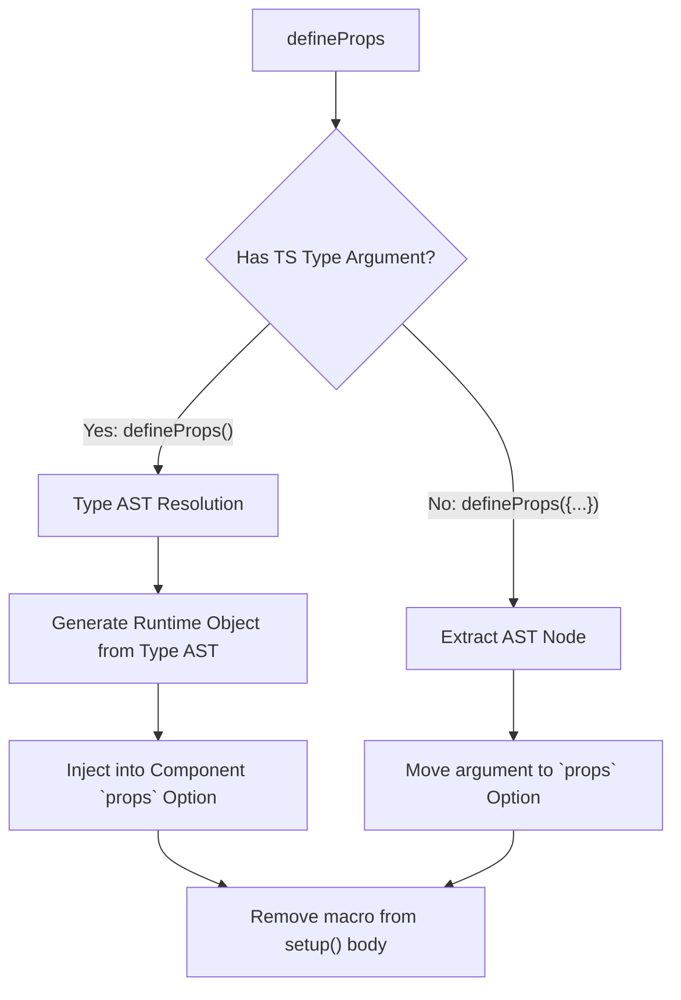

# `defineProps` and `defineEmits` Macros

## 1. Концепция и Архитектура (Mental Model)
`defineProps` и `defineEmits` — это **макросы компиляции**. Они не существуют в рантайме JavaScript. Их задача — предоставить разработчику удобный (и типизированный в TS) способ объявления интерфейса компонента внутри `<script setup>`, который затем компилятором вырезается и трансформируется в стандартные опции компонента (`props`, `emits`).
Особенность реализации во Vue заключается в том, что макросы могут принимать как рантайм-аргументы (объекты), так и TypeScript-типы (Type-only declarations). Компилятору приходится извлекать AST типов и генерировать из них рантайм-декларации объектов.

## 2. Визуализация (Mermaid)


## 3. Ссылки на исходный код (Source Code References)
- `packages/compiler-sfc/src/script/resolveType.ts` — движок вычисления TS-типов (Type Resolver).
- `packages/compiler-sfc/src/compileScript.ts` — обработка макросов.

## 4. Разбор реализации (Code Deep Dive)
При парсинге AST файла, компилятор ищет узлы `CallExpression` с идентификаторами `defineProps` или `defineEmits`.

```typescript
// script/context.ts
if (
  node.type === 'CallExpression' && 
  node.callee.type === 'Identifier' && 
  node.callee.name === 'defineProps'
) {
  // Нашли макрос!
  
  if (node.typeParameters) {
    // 1. Type-only декларация (TS)
    // defineProps<{ msg: string }>()
    const typeNode = node.typeParameters.params[0]
    const runtimeProps = resolveRuntimePropsFromType(typeNode)
    ctx.propsRuntimeDecl = runtimeProps // Сгенерированный код объекта: { msg: { type: String } }
  } else {
    // 2. Runtime декларация
    // defineProps({ msg: String })
    const argNode = node.arguments[0]
    ctx.propsRuntimeDecl = source.slice(argNode.start, argNode.end)
  }

  // Удаляем макрос из тела setup()
  s.remove(node.start, node.end)
}
```

После извлечения, данные подставляются в генерацию объекта компонента:

```javascript
// Результат компиляции
export default {
  props: /* injected props definition */,
  setup(__props) {
    // Тело скрипта без defineProps
  }
}
```

## 5. Оптимизации и Edge Cases (Подводные камни)
- **External Type Resolution**: Самая сложная часть — если `defineProps` ссылается на тип из другого файла (`import { Props } from './types'`). Компилятору `compiler-sfc` приходится лезть в файловую систему, читать другой файл, парсить его AST и разрешать тип (Type Inference/Resolution). Во Vue 3.3+ реализован легковесный AST-резолвер типов, который работает без полного сервера TypeScript (tsc), чтобы сохранить производительность.
- **Hoisting**: Объекты из `defineProps` не должны иметь доступ к локальным переменным `<script setup>`, потому что они поднимаются (hoisted) в область видимости определения компонента. Компилятор выдаст ошибку, если в `defineProps({ a: localVar })` использовать локальную переменную.
