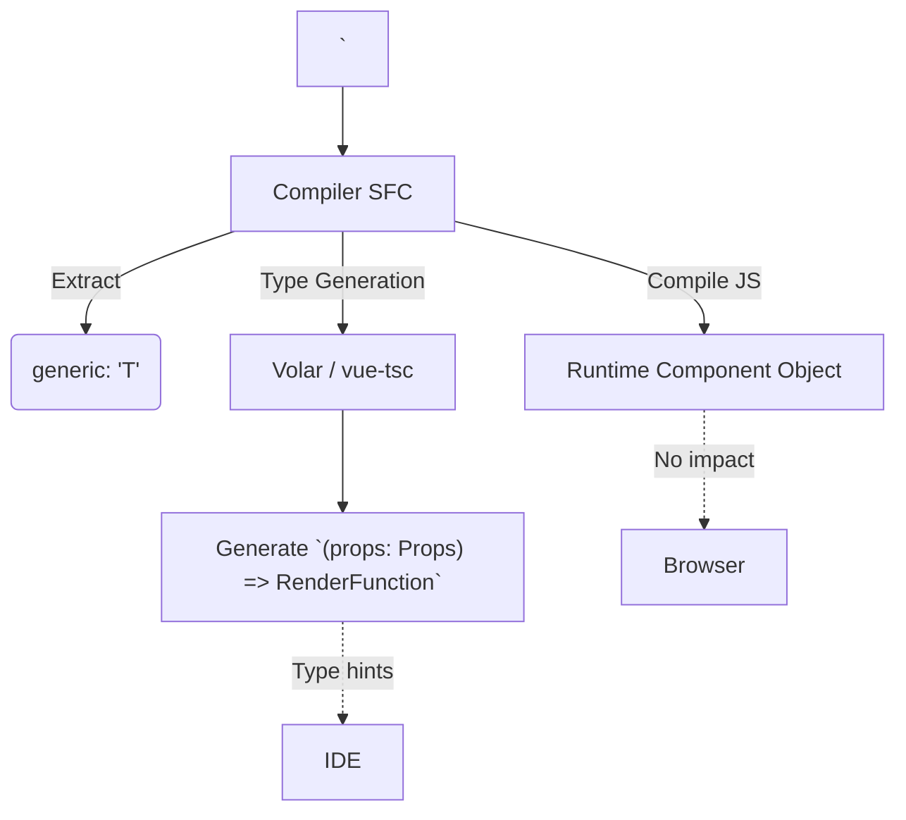

# Generic Components Types (`<script setup generic>`)

## 1. Концепция и Архитектура (Mental Model)
В TypeScript компоненты могут быть дженериками (Generic Components), принимая типы-аргументы, чтобы типизировать `props` и `emits` в зависимости от переданных данных (например, компонент табличного списка `List<T>`).
До появления атрибута `generic` в `<script setup>`, реализовать это было невозможно, так как `setup()` функция компилировалась как статичная. Добавление `generic="T extends Record<string, any>"` указывает компилятору `compiler-sfc`, что генерируемая обертка (signature) компонента должна оборачиваться в сигнатуру дженерик-функции TypeScript.
Это чистая Type-level трансформация: она влияет **только** на генерируемые `.d.ts` файлы и внутреннюю типизацию (через Volar/vue-tsc), и никак не влияет на JavaScript в рантайме.

## 2. Визуализация (Mermaid)


## 3. Ссылки на исходный код (Source Code References)
- `packages/compiler-sfc/src/parse.ts` — извлечение атрибута `generic`.
- Реализация типогенерации находится не в ядре Vue, а в **Vue Language Tools (Volar)** / **vue-tsc**.

## 4. Разбор реализации (Code Deep Dive)
Парсер извлекает строку `generic` из тега.

```typescript
// SFCDescriptor
export interface SFCScriptBlock {
  // ...
  attrs: Record<string, string | true>
  // ...
}

// В parse.ts
if (node.props.some(p => p.name === 'generic')) {
  // Сохраняется просто как строка "T extends Item"
}
```

Магия происходит в Volar/vue-tsc. Когда мы пишем `<script setup generic="T">`, Volar генерирует виртуальный `.ts` файл для проверки типов. Он оборачивает класс/функцию компонента в Generic сигнатуру:

```typescript
// То, как Volar видит компонент внутри (Virtual File)
export default <T>(
  __VLS_props: { items: T[] } & VLS_PublicProps,
  __VLS_ctx: SetupContext,
  __VLS_expose: (exposed: {}) => void
) => {
  // Тело script setup
  const items = __VLS_props.items;
  return {} as VLS_RenderFunctionReturn;
}
```

Благодаря этому, когда мы используем этот компонент в шаблоне родителя `<MyList :items="[{ id: 1 }]" />`, TypeScript (через плагин) выводит тип `T` как `{ id: number }` и проверяет остальные пропсы или слоты на основе этого вывода.

## 5. Оптимизации и Edge Cases (Подводные камни)
- **Разделение рантайма и типов**: Атрибут `generic` вообще не попадает в итоговый бандл. Это гениальное решение Vue: делегировать всю работу с дженериками языковому серверу (Volar), оставив `compiler-sfc` максимально быстрым. `compiler-sfc` просто сохраняет этот атрибут для сторонних тулзов.
- **Множественные дженерики**: Поддерживается перечисление нескольких типов через запятую `generic="T, U extends string"`. Парсить этот синтаксис внутри XML-подобного атрибута сложно (могут быть символы `<`, `>`), поэтому используется простой сырой строковый парсинг и передача строки "как есть" в компилятор TypeScript.
