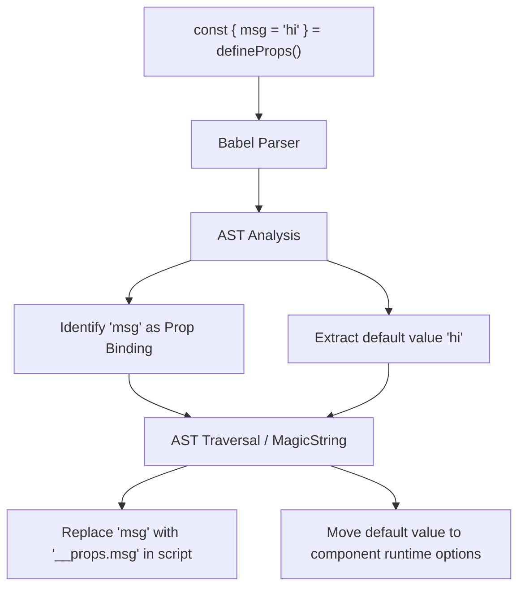

# Reactive Props Destructure 

## 1. Концепция и Архитектура (Mental Model)
В JavaScript деструктуризация объектов лишает их привязки к оригиналу (теряет геттеры/сеттеры объекта). Во Vue, если деструктурировать `props` (например, `const { msg } = defineProps()`), `msg` перестанет быть реактивным.
Чтобы исправить это, Vue внедрил "Reactive Props Destructure" (Reactivity Transform). Это механизм времени компиляции (Compile-time), который анализирует, какие переменные были получены путем деструктуризации `defineProps`, и во всем блоке `<script setup>` и `<template>` заменяет использование этих переменных на обращение к исходному объекту пропсов (`__props.msg`).

## 2. Визуализация (Mermaid)


## 3. Ссылки на исходный код (Source Code References)
- `packages/compiler-sfc/src/script/reactiveDestructure.ts` (исторически, также интеграция прямо в `compileScript.ts`).

## 4. Разбор реализации (Code Deep Dive)
При парсинге AST `compiler-sfc` находит узел `VariableDeclarator`, у которого `init` (правая часть) — это вызов `defineProps`.
Если левая часть (`id`) — это `ObjectPattern` (деструктуризация), компилятор начинает регистрацию алиасов.

```typescript
// Исходный код: const { foo, bar = 1 } = defineProps<{ foo: string, bar?: number }>()

// AST анализ (упрощенно)
const propsAliases = new Map<string, string>() // { 'foo': '__props.foo', 'bar': '__props.bar' }
const defaultValues = {} // { 'bar': 1 }

if (node.id.type === 'ObjectPattern') {
  for (const prop of node.id.properties) {
    const key = prop.key.name
    let localName = key
    
    // Обработка значений по умолчанию: { bar = 1 }
    if (prop.value.type === 'AssignmentPattern') {
      localName = prop.value.left.name
      defaultValues[key] = source.slice(prop.value.right.start, prop.value.right.end)
    }

    propsAliases.set(localName, key)
  }
  
  // Удаляем деструктуризацию из рантайм-кода
  s.remove(node.start, node.end)
}

// Замена всех использований 'foo' на '__props.foo' с помощью Walk (estree-walker)
walk(ast, {
  enter(node) {
    if (node.type === 'Identifier' && propsAliases.has(node.name)) {
      // Исключаем случаи, когда Identifier - это ключ объекта, а не значение
      if (!isObjectKey(node)) {
         s.overwrite(node.start, node.end, `__props.${propsAliases.get(node.name)}`)
      }
    }
  }
})
```

Значения по умолчанию (defaults) аккуратно выносятся и добавляются к декларации макроса или компилируются в отдельный рантайм-объект `withDefaults` / `props: { default: ... }`.

## 5. Оптимизации и Edge Cases (Подводные камни)
- **Lexical Scope Conflicts**: Если внутри функции создать локальную переменную с таким же именем (Shadowing), компилятор должен понять это и **не** заменять её на `__props`. Для этого используется легковесный трекер областей видимости (Scope Tracker) во время обхода AST (walk).
- **Function passing**: Если передать деструктурированную пропсу в функцию (`watch(msg, ...)`), передастся примитивное значение (строка), и `watch` не сработает. Компилятор знает об этом, поэтому при обращении в коллбеках реактивность сохраняется (заменяется на функцию `() => __props.msg`), но при передаче примитивов разработчику нужно использовать паттерн `watch(() => msg)`.
