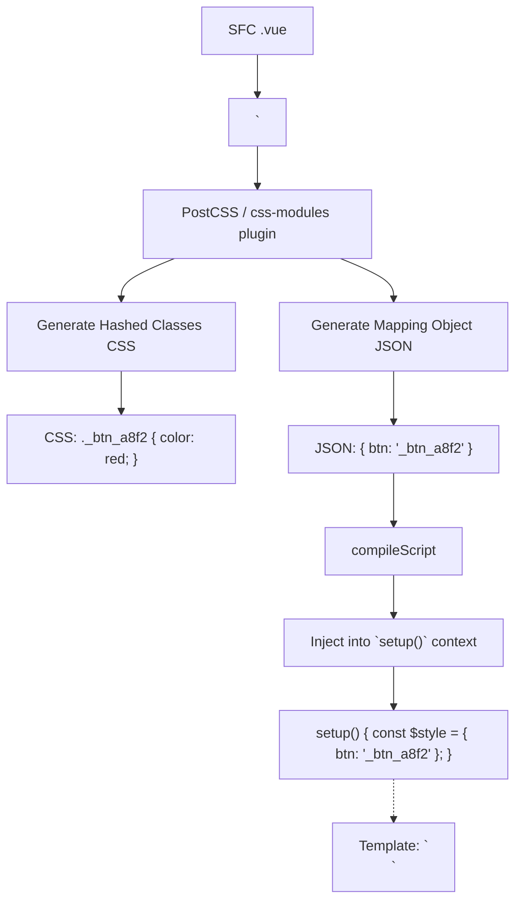

# CSS Modules (`<style module>`)

## 1. Концепция и Архитектура (Mental Model)
CSS Modules — это альтернативный подход к изоляции стилей, в отличие от Scoped CSS. Если Scoped CSS полагается на атрибуты (`data-v-xxx`), то CSS Modules физически переименовывают сами классы (например, `.btn` становится `._btn_12345`).
В SFC можно добавить блок `<style module>`. Компилятор обработает этот блок и создаст специальный объект маппинга (mapping object) — ключ-значение, где ключом будет исходное имя класса, а значением — сгенерированное хеш-имя. Этот объект инжектится в контекст компонента под переменной `$style` (по умолчанию) и может быть использован в шаблоне: `<div :class="$style.btn">`.

## 2. Визуализация (Mermaid)


## 3. Ссылки на исходный код (Source Code References)
- `packages/compiler-sfc/src/compileStyle.ts` — опция `modules` для парсинга и бандлинга.
- Vue использует сторонние PostCSS плагины для генерации CSS модулей (`postcss-modules`).

## 4. Разбор реализации (Code Deep Dive)
Функция `compileStyle` определяет, что блок является модулем, если присутствует атрибут `module`.

```typescript
// packages/compiler-sfc/src/compileStyle.ts
export function compileStyle(options: SFCStyleCompileOptions): SFCStyleCompileResults {
  // ...
  const isModule = options.isModule
  const moduleOptions = options.modulesOptions || {}

  let modulesExport = {} // Тот самый JSON объект
  
  if (isModule) {
    plugins.push(
      require('postcss-modules')({
        ...moduleOptions,
        // Перехват генерации JSON маппинга
        getJSON: (cssFileName, json, outputFileName) => {
          modulesExport = json
        }
      })
    )
  }
  
  // Прогон через PostCSS
  const result = postcss(plugins).process(source)
  
  return {
    code: result.css,
    map: result.map,
    modules: modulesExport // Возвращаем маппинг в сборщик (Vite/Webpack)
  }
}
```

Далее, на уровне Vite/Rollup плагина, этот возвращенный объект `modules` вставляется в сгенерированный JS код компонента:

```javascript
// Сгенерированный код модульного компонента
import { cssClasses } from './Component.vue?vue&type=style&module=true'

export default {
  setup() {
    const __ctx = getCurrentInstance()
    // Инъекция в контекст рендера
    __ctx.setupState.$style = cssClasses
  }
}
```

## 5. Оптимизации и Edge Cases (Подводные камни)
- **Именованные модули**: Атрибут `module` может принимать значение (например, `<style module="theme">`). В таком случае объект маппинга инжектится не как `$style`, а как `theme`. Компилятор SFC обрабатывает это, извлекая значение из AST узла `node.props` блока `style`.
- **TypeScript поддержка**: В отличие от Scoped CSS, типизация CSS Modules из коробки затруднительна. Разработчикам приходится настраивать сторонние плагины (типа `typescript-plugin-css-modules`), которые генерируют `.d.ts` файлы для каждого CSS блока, чтобы `__ctx.$style.btn` имел автокомплит в шаблоне. Vue Language Tools (Volar) умеет автоматически подтягивать ключи классов из `<style module>` и выводить их типы для шаблонов без сторонних плагинов, создавая бесшовный Developer Experience.
