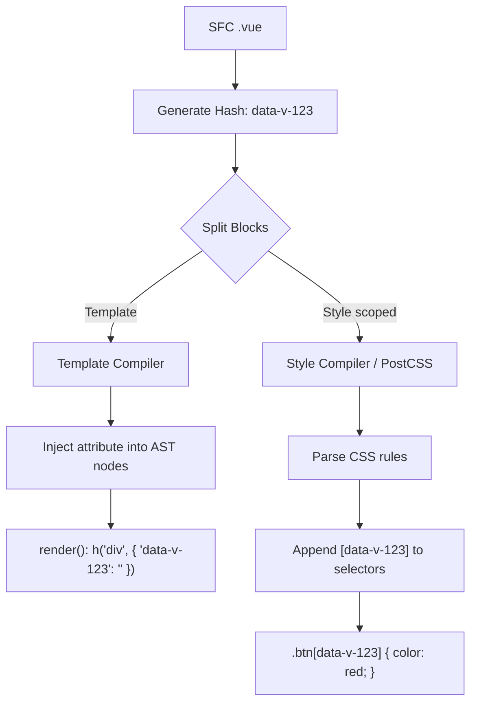

# Scoped CSS Rewrite

## 1. Концепция и Архитектура (Mental Model)
В вебе нет нативной изоляции стилей (кроме Shadow DOM, у которого есть свои недостатки с наследованием и производительностью). Vue реализует Scoped CSS (инкапсуляцию стилей на уровне компонента) с помощью атрибутов данных.
Каждому компоненту выдается уникальный хеш (например, `data-v-f3f3eg9`).
Компилятор `compiler-sfc` делает две вещи:
1. Шаблонный компилятор добавляет этот хеш-атрибут ко всем DOM-элементам компонента.
2. Стилевой компилятор (`compileStyle`) парсит CSS с помощью PostCSS и добавляет селектор атрибута (Attribute Selector) к каждому CSS-правилу.

Таким образом, классы `.btn` влияют только на элементы `<button class="btn" data-v-f3f3eg9>`, изолируя стили.

## 2. Визуализация (Mermaid)


## 3. Ссылки на исходный код (Source Code References)
- `packages/compiler-sfc/src/compileStyle.ts` — оркестратор компиляции стилей.
- `packages/compiler-sfc/src/stylePluginScoped.ts` — кастомный PostCSS плагин, который переписывает селекторы.

## 4. Разбор реализации (Code Deep Dive)
Ядром механизма является плагин `stylePluginScoped`, который работает в процессе обработки абстрактного синтаксического дерева CSS (CSS AST).

```typescript
// packages/compiler-sfc/src/stylePluginScoped.ts (упрощенно)
import postcss from 'postcss'
import selectorParser from 'postcss-selector-parser'

const plugin = postcss.plugin('add-id', (options) => {
  return (root) => {
    const id = options.id // например, 'data-v-123456'
    const keyframes = Object.create(null)

    root.each(function rewriteSelector(node) {
      if (node.type === 'rule') {
        // Парсим строку селектора (например, .btn .icon)
        node.selector = selectorParser(selectors => {
          selectors.each(selector => {
            let node = null
            
            // Ищем правильное место для вставки атрибута.
            // Нужно вставить его к последнему элементу селектора:
            // .btn .icon -> .btn .icon[data-v-123456]
            node = selector.last
            
            // Создаем и добавляем узел селектора атрибута
            selector.insertAfter(
              node,
              selectorParser.attribute({
                attribute: id
              })
            )
          })
        }).processSync(node.selector)
      }
    })
  }
})
```

## 5. Оптимизации и Edge Cases (Подводные камни)
- **Deep Selectors (`:deep()`)**: Иногда нужно, чтобы родительский компонент стилизовал внутренности дочернего. PostCSS плагин Vue знает про псевдокласс `:deep()`. Когда он встречает `.a :deep(.b)`, он вставляет хеш `data-v` к `.a`, а `.b` оставляет без хеша. В итоге получается `.a[data-v-123] .b`, что позволяет правилу пробивать инкапсуляцию вниз по дереву.
- **Global (`:global()`) и Slotted (`:slotted()`)**: Аналогично плагин обрабатывает слоты. Контент слота рендерится родителем (имеет хеш родителя), но физически находится внутри ребенка. `:slotted` добавляет специальный хеш (postfix `-s`) для нацеливания на этот контент.
- **Performance**: PostCSS достаточно медленный. Vue оптимизирует процесс, кэшируя обработку блоков стилей и применяя трансформацию только к блокам с атрибутом `scoped`.
