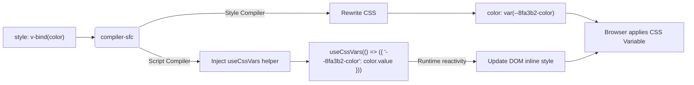

# `v-bind` in CSS Variables

## 1. Концепция и Архитектура (Mental Model)
`v-bind` в CSS (State-Driven Dynamic CSS) — это фича SFC, позволяющая использовать реактивные переменные из скрипта напрямую в блоке `<style>`.
Вместо того чтобы обновлять стили инлайном через JavaScript (что нагружает рендер), Vue компилирует `v-bind()` вызовы в нативные CSS Variables (`--var`).
На этапе компиляции:
1. CSS трансформируется: `color: v-bind(themeColor)` -> `color: var(--hash-themeColor)`.
2. Компонент в рантайме оборачивается в логику, которая инжектит `style="--hash-themeColor: <runtime-value>"` в корневой элемент DOM, реактивно обновляя его.

## 2. Визуализация (Mermaid)


## 3. Ссылки на исходный код (Source Code References)
- `packages/compiler-sfc/src/cssVars.ts` — парсер регулярных выражений для поиска `v-bind` в стилях.
- `packages/compiler-sfc/src/compileStyle.ts` — замена `v-bind` на `var()`.
- `packages/runtime-dom/src/helpers/useCssVars.ts` — рантайм механизм реактивного обновления переменных в DOM.

## 4. Разбор реализации (Code Deep Dive)
Первый шаг — извлечь все вызовы `v-bind` из секций `<style>`. Это делается простым RegExp'ом, так как это намного быстрее парсинга AST CSS.

```typescript
// packages/compiler-sfc/src/cssVars.ts
const cssVarRE = /\bv-bind\(\s*(?:'([^']+)'|"([^"]+)"|([^'"][^)]*))\s*\)/g

export function parseCssVars(sfc: SFCDescriptor): string[] {
  const vars: string[] = []
  sfc.styles.forEach(style => {
    let match
    while ((match = cssVarRE.exec(style.content))) {
      // Сохраняем имя переменной: match[1] || match[2] || match[3]
      vars.push(match[1] || match[2] || match[3])
    }
  })
  return vars
}
```

Далее в генерируемом JavaScript коде компонента (в `compileScript`) внедряется хук `useCssVars`:

```javascript
// Скомпилированный setup()
import { useCssVars } from 'vue'

export default {
  setup(__props) {
    // Хеш состоит из ID компонента и имени переменной
    useCssVars((_ctx) => ({
      "v-123456-color": (_ctx.color)
    }))
    // ...
  }
}
```

Рантайм хук `useCssVars` использует `watchEffect` для изменения `style` корневого узла дерева (vnode):

```typescript
// packages/runtime-dom/src/helpers/useCssVars.ts
export function useCssVars(getter) {
  const instance = getCurrentInstance()
  watchPostEffect(() => {
    const vars = getter(instance.proxy)
    const el = instance.subTree.el // Корневой элемент компонента
    if (el && el.nodeType === 1) {
      for (const key in vars) {
        el.style.setProperty(`--${key}`, vars[key])
      }
    }
  })
}
```

## 5. Оптимизации и Edge Cases (Подводные камни)
- **Hash Collisions**: Чтобы избежать конфликтов имен переменных между разными компонентами, имя CSS-переменной хешируется вместе с HMR ID компонента.
- **Teleport и Fragments**: Если у компонента несколько корневых узлов (Fragment) или используется `<Teleport>`, `useCssVars` не может применить инлайн-стиль к одному корневому элементу. В таких случаях Vue падает на резервный алгоритм и обходит (traverse) дерево DOM, чтобы применить стили к дочерним элементам, или требует обернуть шаблон в единый `<div>`.
- **CSS Cache**: Сами классы с `var()` компилируются и загружаются браузером один раз (статика), а меняются только значения переменных на корневом узле. Это в сотни раз производительнее CSS-in-JS решений, генерирующих новые классы при каждом рендере.
