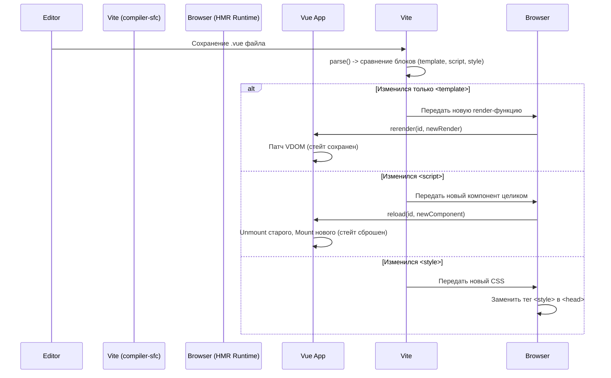

# SFC Dev Tooling & HMR (Hot Module Replacement)

## 1. Концепция и Архитектура (Mental Model)
Hot Module Replacement (HMR) во Vue позволяет обновлять компоненты без перезагрузки страницы, сохраняя локальное состояние приложения (state). `compiler-sfc` генерирует специальный HMR-код, который внедряется в скомпилированный модуль только в режиме разработки (`process.env.NODE_ENV !== 'production'`).
HMR во Vue основывается на уникальном идентификаторе (ID) каждого компонента. Когда файл изменяется, bundler (Vite) отправляет новый код на клиент. HMR-runtime (встроенный во `vue`) находит инстансы компонента по ID и принудительно вызывает перерендер (rerender) или полное пересоздание (reload).

## 2. Визуализация (Mermaid)


## 3. Ссылки на исходный код (Source Code References)
- `packages/compiler-sfc/src/compileTemplate.ts` — инъекция HMR ID.
- `packages/compiler-sfc/src/parse.ts` — вычисление `shouldForceReload`.
- `packages/runtime-core/src/hmr.ts` — HMR Runtime (клиентская часть).

## 4. Разбор реализации (Code Deep Dive)
Каждому компоненту присваивается хеш на основе пути к файлу: `const id = hash(filename)`.
Компилятор оборачивает экспорт компонента в HMR-логику:

```javascript
// Сгенерированный код (упрощенно)
import { render } from "./MyComp.vue?vue&type=template"
import script from "./MyComp.vue?vue&type=script"

const __exports__ = script
__exports__.render = render
__exports__.__hmrId = "123456" // ID для HMR

// HMR API (Vite/Webpack)
if (import.meta.hot) {
  __exports__.__hmrId = "123456"
  import.meta.hot.accept(mod => {
    if (!mod) return
    const { default: updated, render: updatedRender } = mod
    // Если изменился только шаблон
    if (updatedRender) {
      __VUE_HMR_RUNTIME__.rerender(updated.__hmrId, updatedRender)
    } else {
      // Если изменился скрипт
      __VUE_HMR_RUNTIME__.reload(updated.__hmrId, updated)
    }
  })
}
```
Клиентский рантайм `hmr.ts` держит глобальный Map активных инстансов: `map.set(id, Set<ComponentInternalInstance>)`. При вызове `rerender` он пробегается по Set'у и инвалидирует их `update` эффекты.

## 5. Оптимизации и Edge Cases (Подводные камни)
- **Точечная инвалидация (Granular HMR)**: Компилятор SFC сравнивает хеши блоков старого и нового `SFCDescriptor`. Это позволяет избежать потери стейта при редактировании шаблона или стилей. Стейт сбрасывается только при изменении логики в `<script>`.
- **HMR в Functional Components**: Функциональные компоненты не имеют инстанса, поэтому для них работает только `reload` (полная перезагрузка дерева начиная с родителя).
- **Setup Block HMR**: Редактирование `<script setup>` требует `reload`, так как меняются замыкания и структура реактивных графов, обновить которые на лету без утечек памяти и багов невозможно.
