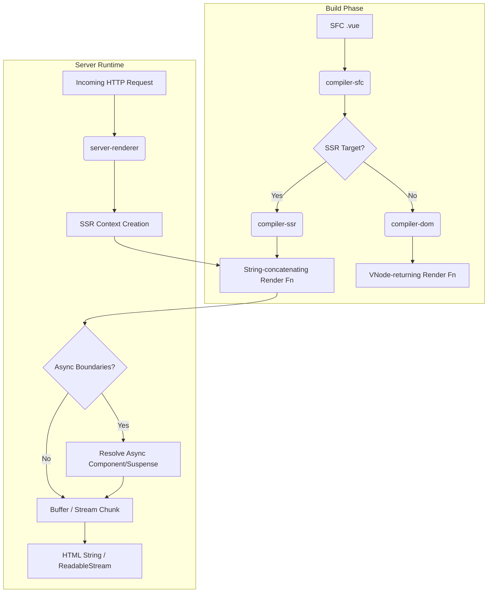

# Server-Side Rendering (SSR) Architecture

## Концепция и Архитектура (Mental Model)

Server-Side Rendering (SSR) во Vue решает проблему долгого "Time to Interactive" (TTI) и "First Contentful Paint" (FCP) для Single Page Applications (SPA), а также улучшает SEO. 
Вместо того чтобы отправлять пустой HTML и заставлять браузер строить DOM-дерево из JavaScript-кода (через VNodes), мы генерируем готовый HTML на сервере.

Главное отличие серверного рендеринга от клиентского во Vue 3 заключается в том, что на сервере **мы не строим полноценное VNode-дерево для статических частей**. Вместо тяжелых операций с объектами и обхода дерева, компилятор преобразует шаблоны в **функции конкатенации строк**. Это радикально снижает потребление памяти и CPU на сервере.

Архитектура разделена на два мира:
1.  **`@vue/compiler-ssr`**: AOT-компиляция шаблонов в функции генерации строк.
2.  **`@vue/server-renderer`**: Runtime-модуль, который выполняет эти функции, управляет контекстом запроса (SSR Context), резолвит асинхронные компоненты и собирает финальный HTML (в виде строки или стрима).

## Визуализация



## Списки исходного кода

- `packages/server-renderer/src/renderToString.ts`: Точка входа для строкового рендеринга.
- `packages/compiler-ssr/src/index.ts`: Компилятор SSR.
- `packages/runtime-core/src/apiCreateApp.ts`: Разделение `mount` и `hydrate`.

## Разбор реализации

Когда компонент рендерится на сервере, Vue вызывает не стандартную `render` функцию, а `ssrRender`.

```typescript
// packages/server-renderer/src/render.ts (упрощенно)
export function renderComponentVNode(
  vnode: VNode,
  parentComponent: ComponentInternalInstance | null,
  slotScopeId: string | null,
  push: (item: any) => void, // Функция записи чанков HTML
  parentSuspense: SuspenseBoundary | null
) {
  const instance = createComponentInstance(vnode, parentComponent, parentSuspense)
  setupComponent(instance)

  // Вызов специальной SSR-рендеринг функции компонента
  if (instance.ssrRender) {
    // ssrRender напрямую пушит строки в буфер `push`, минуя создание VNodes
    instance.ssrRender(
      instance.proxy,
      push,
      instance,
      /* ... */
    )
  } else {
    // Fallback: если ssrRender нет (например, render-функция написана руками),
    // рендерим VNode дерево и затем сериализуем его в строку
    const subTree = renderComponentRoot(instance)
    renderVNode(push, subTree, instance)
  }
}
```

**Разница в подходах:**
Если мы используем `ssrRender`, сгенерированный компилятором, мы просто складываем строки:
`push('<div>' + ssrInterpolate(msg) + '</div>')`
Если fallback (ручная render функция), мы создаем объект `VNode { type: 'div', children: msg }`, а затем рекурсивно обходим его для генерации строки. Первый вариант на порядки быстрее и требует меньше памяти.

## Оптимизации и Edge Cases

1.  **Escape HTML (XSS Protection):** Функции интерполяции (типа `ssrInterpolate`) используют высокооптимизированные механизмы экранирования строк. Вместо тяжелых RegExp часто применяются быстрые проверки по ASCII-кодам.
2.  **Управление памятью:** В Node.js конкатенация строк (`a + b`) хорошо оптимизирована движком V8 (через структуры ConsString). Vue использует массив чанков, которые джойнятся или стримятся, что предотвращает аллокацию гигантских монолитных строк до самого конца рендеринга.
3.  **Cross-Request State Pollution:** Это классический подводный камень SSR. Vue решает его строгой изоляцией стейта: реактивные хранилища (Pinia, Vuex) и инстансы `app` создаются **для каждого запроса заново** (через фабрику `createApp`), а не переиспользуются как синглтоны.
