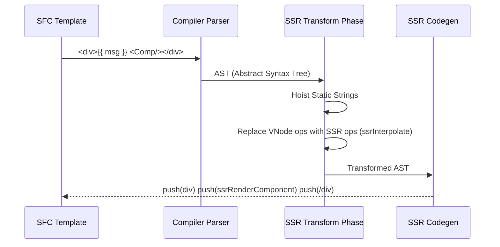

# Compiler SSR Transforms

## Концепция и Архитектура (Mental Model)

Когда компилятор Vue (`@vue/compiler-core` -> `@vue/compiler-ssr`) работает в режиме генерации кода для сервера (`ssr: true`), его главная цель — **максимально "сплющить" шаблон в набор статических строк**.

Если обычный компилятор преобразует `<div><p>Hello</p><p>{{ msg }}</p></div>` в дерево `createVNode('div', ...)`, то SSR-компилятор превращает это в вызовы `_push('<div data-v-xxx><p>Hello</p><p>' + _ssrInterpolate(msg) + '</p></div>')`.

Это устраняет оверхед на аллокацию VNode-объектов. Но самая сложная часть компиляции — это правильная обработка директив (`v-if`, `v-for`, `v-model`), компонентов и слотов в строковом контексте, так как мы не можем просто склеить строки, если внутри есть вложенный компонент со своим жизненным циклом.

## Визуализация



## Списки исходного кода

- `packages/compiler-ssr/src/index.ts`: Точка входа SSR компилятора.
- `packages/compiler-ssr/src/transforms/ssrTransformComponent.ts`: Трансформация вызовов компонентов.
- `packages/compiler-ssr/src/transforms/ssrTransformElement.ts`: Превращение обычных HTML-элементов в строковые литералы.

## Разбор реализации

Рассмотрим трансформацию обычного элемента с интерполяцией.

```typescript
// packages/compiler-ssr/src/transforms/ssrTransformElement.ts (упрощенно)

export function ssrTransformElement(node: PlainElementNode, context: TransformContext) {
  // На этапе трансформации мы собираем статические куски HTML (pre-strings)
  // и динамические вставки (динамические атрибуты, интерполяции).
  
  let templateString = `<${node.tag}`
  
  // Компиляция статических атрибутов
  for (const prop of node.props) {
    if (prop.type === NodeTypes.ATTRIBUTE) {
      templateString += ` ${prop.name}="${prop.value.content}"`
    }
  }
  templateString += `>`
  
  // Добавляем вызов `ssrRenderAttrs` для динамических биндингов (v-bind)
  // В Codegen это превратится в: _push('<div' + _ssrRenderAttrs(attrs) + '>')
  
  // ... обработка детей ...
  
  templateString += `</${node.tag}>`
  
  // node заменяется на специальный SSR_NODE, который генератор кода (Codegen)
  // преобразует в вызовы конкатенации строк.
  context.replaceNode(createSSRStringNode(templateString))
}
```

Для компонентов генерируется вызов `_ssrRenderComponent`:

```javascript
// Результат компиляции шаблона: <div><MyComp :foo="bar" /></div>
export function ssrRender(_ctx, _push, _parent, _attrs) {
  const _component_MyComp = resolveComponent("MyComp")

  _push(`<div${_ssrRenderAttrs(_attrs)}>`)
  
  _push(_ssrRenderComponent(_component_MyComp, { foo: _ctx.bar }, null, _parent))
  
  _push(`</div>`)
}
```

## Оптимизации и Edge Cases

1.  **Block Inlining (Схлопывание блоков):** Компилятор пытается объединить максимально длинные цепочки статического HTML. Вместо множества вызовов `_push('<div>'); _push('<span>');` генерируется один `_push('<div><span>')`.
2.  **Слоты как функции-генераторы:** В SSR слоты компонента передаются не как VNode-массивы, а как функции, которые принимают `_push` буфер. Когда дочерний компонент решает отрендерить слот, он вызывает эту функцию, передавая ей свой буфер записи. Это позволяет избежать создания "промежуточных" массивов и рендерить слот прямо в общий поток.
3.  **V-Model на сервере:** Директива `v-model` на обычных инпутах компилируется в жесткий биндинг атрибута `value` (или `checked` для чекбоксов), игнорируя слушатели событий (`@input`), так как события на сервере не работают.
