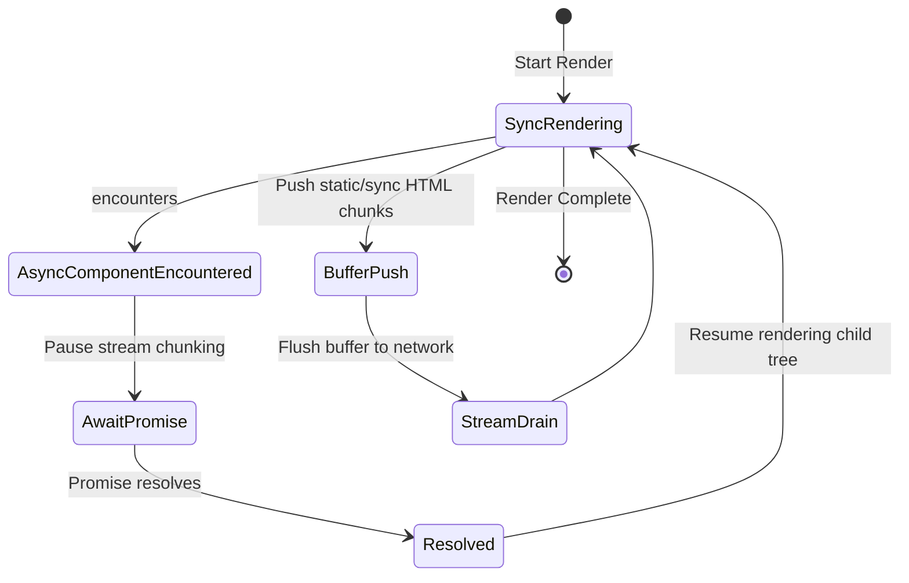

# Render to String / Stream

## Концепция и Архитектура (Mental Model)

После того как компилятор сгенерировал функции `ssrRender`, runtime-пакет `@vue/server-renderer` берет на себя задачу их выполнения.
Результат рендеринга может отдаваться клиенту двумя путями:
1.  **String (Буферизация целиком):** Приложение рендерится в памяти до победного конца (включая ожидание всех асинхронных операций), и сервер отдает готовую HTML строку.
2.  **Stream (Потоковая передача):** Node.js Streams или Web Streams. HTML отправляется клиенту чанками по мере готовности. Это значительно улучшает TTFB (Time to First Byte), так как браузер может начать парсить `<head>` и загружать CSS/JS еще до того, как сервер закончит рендерить сложное тело страницы.

Сердцевина стриминга во Vue — это рекурсивный асинхронный обход дерева компонентов с приостановкой (yield) на асинхронных компонентах (`Suspense` / `defineAsyncComponent`).

## Визуализация



## Списки исходного кода

- `packages/server-renderer/src/renderToString.ts`
- `packages/server-renderer/src/renderToStream.ts` (Поддержка Node.js Streams)
- `packages/server-renderer/src/renderToWebStream.ts` (Поддержка Web Streams API - Cloudflare Workers, Deno)

## Разбор реализации

Во Vue рендеринг абстрагирован через функцию `unrollBuffer`, которая обрабатывает асинхронные зависимости.

```typescript
// packages/server-renderer/src/render.ts (упрощенно)

export interface SSRBufferItem {
  (params?: any): void | Promise<any> // Асинхронные блоки
}
export type SSRBuffer = (string | SSRBufferItem | Promise<any>)[]

function createBuffer() {
  let appendable = false
  const buffer: SSRBuffer = []
  
  return {
    getBuffer(): SSRBuffer { return buffer },
    push(item: string | Promise<any>) {
      const isStringItem = typeof item === 'string'
      // Оптимизация: склеиваем подряд идущие строки в одну
      if (appendable && isStringItem) {
        buffer[buffer.length - 1] += item as string
      } else {
        buffer.push(item)
      }
      appendable = isStringItem
    }
  }
}
```

Когда рендерер встречает `Suspense` или `AsyncComponent`, он помещает `Promise` в буфер, вместо строки. 

Функция резолва (`unrollBuffer`) итерируется по массиву:
1. Если элемент строка -> отправляет в стрим (или итоговую строку).
2. Если элемент `Promise` -> ждет выполнения (`await`), после чего рекурсивно "разворачивает" отрендеренный результат этого компонента.

```typescript
// Упрощенный цикл unrollBuffer
async function unrollBuffer(buffer: SSRBuffer) {
  let html = ''
  for (let i = 0; i < buffer.length; i++) {
    let item = buffer[i]
    if (item instanceof Promise) {
      item = await item // Ожидание асинхронного куска (Suspense)
    }
    if (typeof item === 'string') {
      html += item
    } else if (Array.isArray(item)) {
      html += await unrollBuffer(item) // Рекурсия для вложенных буферов
    }
  }
  return html
}
```

## Оптимизации и Edge Cases

1.  **Out-of-Order Streaming (Подводный камень):** Базовый стриминг во Vue является *In-Order*. Это значит, что если медленный асинхронный компонент находится в самом начале дерева (например, в Header), весь остальной стрим блокируется, ожидая его, даже если футер уже отрендерен. Современные фреймворки (Nuxt) могут применять продвинутые техники (out-of-order) с использованием Suspense границ, отправляя fallback HTML и затем "досылая" скрипты, заменяющие куски DOM, но на уровне базового `server-renderer` стрим линеен.
2.  **Backpressure (Противодавление):** При потоковом рендеринге `renderToStream` правильно обрабатывает сигналы от Node.js `stream.write()`. Если буфер сети переполнен (клиент медленно качает), рендерер приостанавливает генерацию дерева (yield'ит выполнение), чтобы не забить оперативную память сервера (OOM).
3.  **Web Streams API:** В последних версиях Vue добавлена нативная поддержка `ReadableStream` (Web Streams), что сделало Vue SSR first-class citizen для Edge-окружений (Cloudflare Workers, Vercel Edge, Deno), где нет модуля `stream` из Node.js.
