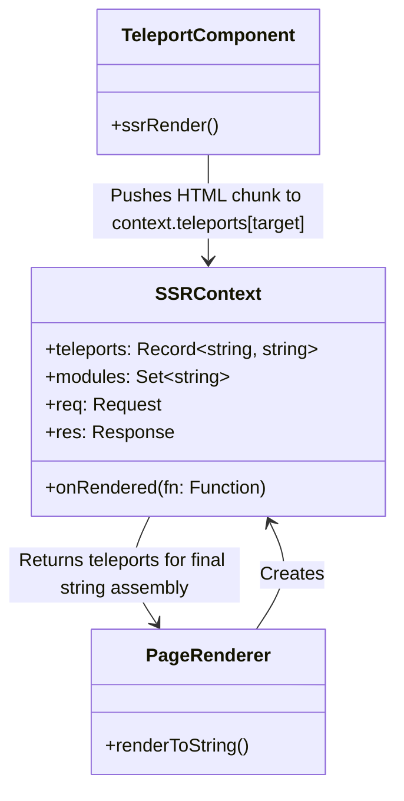

# SSR Context and Teleports

## Концепция и Архитектура (Mental Model)

SSR Context — это глобальный объект запроса, который передается сквозь всё дерево компонентов во время серверного рендеринга.
Зачем он нужен?
1.  **Сбор метаданных:** Компонентам (например, `<head>` менеджерам типа `@unhead/vue`) нужно прокидывать данные наверх (тайтлы, мета-теги), чтобы они отрендерились в `<head>` HTML-страницы.
2.  **CSS Collection:** Инжектирование критического CSS, используемого отрендеренными компонентами.
3.  **Teleports Handling:** Компонент `<Teleport>` перемещает DOM-узлы в другие части документа (например, в `<body>`). На сервере нет реального DOM, поэтому "перемещенный" HTML нужно аккуратно собрать в контексте и отдать пользователю (например, фреймворку Nuxt), чтобы тот вставил его в нужные плейсхолдеры в итоговом `index.html`.

## Визуализация



## Списки исходного кода

- `packages/server-renderer/src/render.ts` (Создание SSRContext)
- `packages/runtime-core/src/components/Teleport.ts` (SSR имплементация Телепорта)

## Разбор реализации

`SSRContext` инжектируется при вызове `renderToString(app, context)`.

```typescript
// Пример пользовательского использования
const ctx = { teleports: {} }
const html = await renderToString(app, ctx)

// ctx.teleports['#modal-root'] теперь содержит строку с HTML модалки
finalHtml = finalHtml.replace('<!--modal-root-->', ctx.teleports['#modal-root'])
```

Под капотом реализации `<Teleport>` для сервера:

```typescript
// packages/runtime-core/src/components/Teleport.ts (SSR ветка)
export const TeleportImpl = {
  __isTeleport: true,
  
  process(n1, n2, container, ...) { /* Клиентский рендеринг */ },
  
  ssrRender(
    vnode: VNode,
    push: (item: any) => void,
    parentComponent: ComponentInternalInstance,
    attrs: Data,
    parentSuspense: SuspenseBoundary | null
  ) {
    const target = vnode.props && vnode.props.to
    if (!target) {
      // Если target нет, рендерим инлайн
      renderChildren(vnode, push, parentComponent)
      return
    }

    // Достаем ssrContext
    const context = parentComponent.appContext.provides[ssrContextKey]
    const teleports = context.teleports || (context.teleports = {})

    // Создаем отдельный буфер для этого телепорта
    const teleportBuffer = createBuffer()
    
    // Рендерим дочерние элементы телепорта в ЕГО буфер, а не в основной push!
    renderChildren(vnode, teleportBuffer.push, parentComponent)

    // Сохраняем буфер в контекст по селектору
    teleports[target] = (teleports[target] || '') + unrollBuffer(teleportBuffer)
  }
}
```

## Оптимизации и Edge Cases

1.  **Multiple Teleports to Same Target:** Обратите внимание на `(teleports[target] || '') + ...`. Если несколько компонентов телепортируют контент в `#modals`, Vue конкатенирует их в порядке рендеринга дерева компонентов.
2.  **Disabled Teleports:** `<Teleport :disabled="true">`. В этом случае SSR должен отрендерить контент прямо в основной поток (буфер родителя), игнорируя SSR Context, чтобы HTML находился в правильном месте при клиентской гидратации.
3.  **Client Hydration Mismatch:** На клиенте при гидратации Teleport работает особым образом. Он ищет свой целевой контейнер (через `querySelector(target)`) и гидратирует элементы прямо внутри него. Если серверный фреймворк (например, Vite/Nuxt) забыл вставить `ctx.teleports` в итоговый HTML, клиентский Teleport не найдет DOM-узлы для гидратации и создаст их с нуля, что может вызвать мигание (FOUC).
