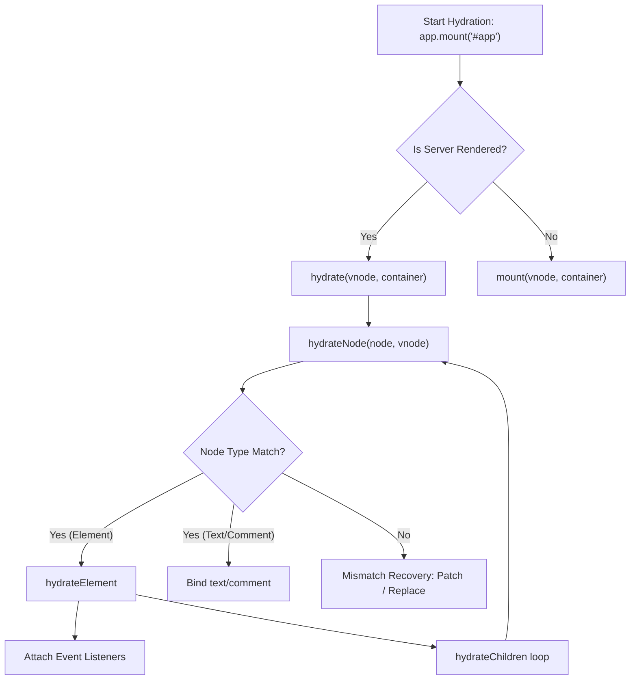

# Hydration: Node & Element Matching

## Концепция и Архитектура (Mental Model)

Hydration (Гидратация) — это процесс "оживления" статического HTML, пришедшего с сервера.
Вместо того чтобы выбрасывать существующий DOM и рендерить его заново (что медленно и вызывает мерцание), Vue берет клиентский JavaScript, генерирует виртуальное дерево (VNode) для текущего стейта и **сопоставляет (matches) каждый VNode с уже существующим реальным DOM-узлом**.

Если VNode и DOM-узел совпадают по типу (например, оба `<div>`), Vue:
1. Привязывает `vnode.el = domNode`.
2. Навешивает Event Listeners (события `@click`, `@input`), которые сервер не мог передать в HTML.
3. Переходит к следующему соседнему узлу (sibling) или дочернему (child).

Это процесс 1-to-1 маппинга VNode-дерева на реальное DOM-дерево.

## Визуализация



## Списки исходного кода

- `packages/runtime-core/src/hydration.ts`: Главный модуль гидратации.
- Функции: `hydrateNode`, `hydrateElement`, `hydrateChildren`.

## Разбор реализации

Гидратация реализована как рекурсивная функция обхода реального DOM, которая движется параллельно обходу VNode-дерева. Функция возвращает следующий DOM-узел (sibling), чтобы продолжить обход.

```typescript
// packages/runtime-core/src/hydration.ts (упрощенно)

function hydrateNode(
  node: Node, // Реальный DOM-узел из SSR HTML
  vnode: VNode, // Виртуальный узел из JS
  parentComponent: ComponentInternalInstance | null
): Node | null {
  // 1. Привязываем реальный DOM к VNode
  vnode.el = node

  const { type, shapeFlag } = vnode

  // 2. Делегируем гидратацию в зависимости от типа
  if (shapeFlag & ShapeFlags.ELEMENT) {
    return hydrateElement(node as Element, vnode, parentComponent)
  } else if (shapeFlag & ShapeFlags.COMPONENT) {
    // Для компонента гидратируем его subTree
    const instance = createComponentInstance(vnode, parentComponent)
    setupComponent(instance)
    return hydrateNode(node, instance.subTree, instance)
  } else if (shapeFlag & ShapeFlags.TEXT_CHILDREN) {
    // Текстовые узлы
    return node.nextSibling
  }
  
  return node.nextSibling
}

function hydrateElement(
  el: Element,
  vnode: VNode,
  parentComponent: ComponentInternalInstance | null
) {
  // Навешиваем слушатели событий (v-on)
  if (vnode.props) {
    for (const key in vnode.props) {
      if (isOn(key)) { // например onClick
        patchEvent(el, key, null, vnode.props[key], parentComponent)
      }
    }
  }

  // Рекурсивно гидратируем детей
  if (vnode.shapeFlag & ShapeFlags.ARRAY_CHILDREN) {
    let nextNode = el.firstChild
    for (let i = 0; i < vnode.children.length; i++) {
      // hydrateNode возвращает следующий узел
      nextNode = hydrateNode(nextNode, vnode.children[i], parentComponent)
    }
  }
  
  return el.nextSibling
}
```

## Оптимизации и Edge Cases

1.  **Пропуск статики (Static Hoisting):** Если компилятор пометил поддерево как статическое (`ShapeFlags.HOISTED`), гидрататор может смело пропустить глубокий обход этого куска DOM, так как там гарантированно нет биндингов и событий. Он просто проскакивает к следующему динамическому узлу.
2.  **Двусвязные списки:** Обход DOM идет с помощью `node.nextSibling` и `el.firstChild`. Это максимально быстрый способ итерации по DOM-дереву (быстрее, чем `childNodes[i]`), который не аллоцирует новые массивы.
3.  **Комментарии как маркеры:** Vue часто использует пустые HTML-комментарии `<!-- -->` как якоря (anchors) для условного рендеринга (`v-if="false"`), чтобы при гидратации знать, где именно в DOM находится "пустой" VNode.
