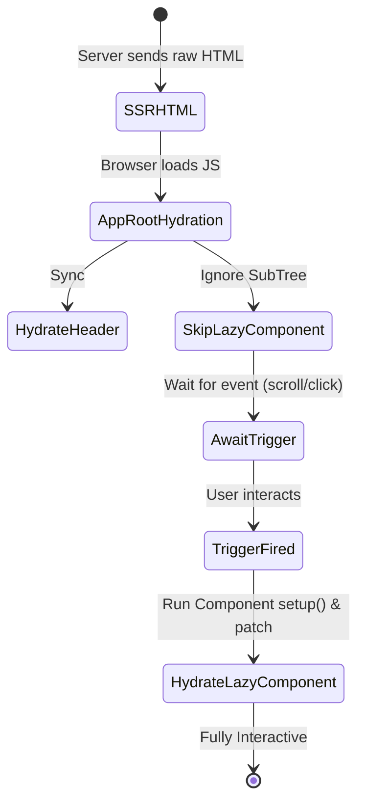

# Lazy Hydration 

## Концепция и Архитектура (Mental Model)

С ростом сложности SPA, даже со стримингом HTML (SSR), клиентский JavaScript может весить мегабайты. Стандартная гидратация синхронна: она должна обойти всё DOM-дерево от корня до листьев, навесить все обработчики и инициализировать стейт. Во время этого процесса Main Thread блокируется, что приводит к низкому показателю INP (Interaction to Next Paint) и TBT (Total Blocking Time).

**Lazy Hydration (Ленивая гидратация)** — это подход, при котором мы откладываем "оживление" неприоритетных частей страницы. Например, гидратировать футер только тогда, когда пользователь доскроллит до него (IntersectionObserver), или гидратировать тяжелый виджет только по наведению мыши (hover).

До Vue 3.5 это реализовывалось сторонними библиотеками (через создание оберток, которые рендерили `null` до наступления события) или возможностями `defineAsyncComponent` + `Suspense`. В 3.5+ и экосистеме (Nuxt 3) паттерны ленивой гидратации становятся более нативными.

## Визуализация



## Списки исходного кода

- `packages/runtime-core/src/apiAsyncComponent.ts` (Асинхронные компоненты)
- `packages/runtime-core/src/components/Suspense.ts` (Suspense Boundary)

## Разбор реализации (Через Async Components)

Во Vue ленивая гидратация тесно связана с `defineAsyncComponent`. Когда мы определяем асинхронный компонент, Vue по умолчанию **не гидратирует** его до тех пор, пока не загрузится его JS-чанк.

В продвинутых реализациях (включая экспериментальные фичи Nuxt `NuxtLazyHydrate`), гидратация поддерева намеренно останавливается на границе (Boundary) и заворачивается в Promise, который резолвится по событию.

```typescript
// Как это работает концептуально под капотом (runtime-core гидрататор)

function hydrateNode(node, vnode) {
  if (vnode.type.__isLazyHydrationBoundary) {
    // 1. Оставляем DOM как есть (статичный HTML)
    vnode.el = node
    
    // 2. Создаем триггер (например, IntersectionObserver)
    setupHydrationTrigger(node, vnode.type.trigger, () => {
       // 3. Когда триггер сработал - запускаем гидратацию поддерева
       hydrateElement(node, vnode, parentComponent)
    })
    
    // 4. Возвращаем nextSibling, пропуская детей!
    return getNextSiblingSkippingChildren(node)
  }
  // ... обычная гидратация
}
```

## Оптимизации и Edge Cases

1.  **State Mismatch:** Самая большая проблема ленивой гидратации. Если глобальный стейт (Pinia) изменился до того, как ленивый компонент гидратировался, то при гидратации VNode (основанный на новом стейте) не совпадет со старым HTML (основанным на старом стейте сервера). Это вызовет Mismatch Error и полную перерисовку.
2.  **Event Replaying:** Если пользователь кликнет на кнопку в негидратированном блоке, событие потеряется. Продвинутые фреймворки (типа Qwik) сериализуют слушатели в HTML, но во Vue обычно используется глобальный делегированный перехватчик (Qwik-like паттерны через Vapor Mode или внешние плагины), который записывает события и "проигрывает" (replay) их после завершения гидратации.
3.  **Vapor Mode:** В будущем (Vue Vapor) необходимость в тяжелой гидратации виртуального дерева отпадет, так как Vapor компилирует шаблоны в прямые мутации DOM. Там ленивое навешивание событий будет дешевле и гранулярнее на уровне отдельных элементов, а не компонентов.
