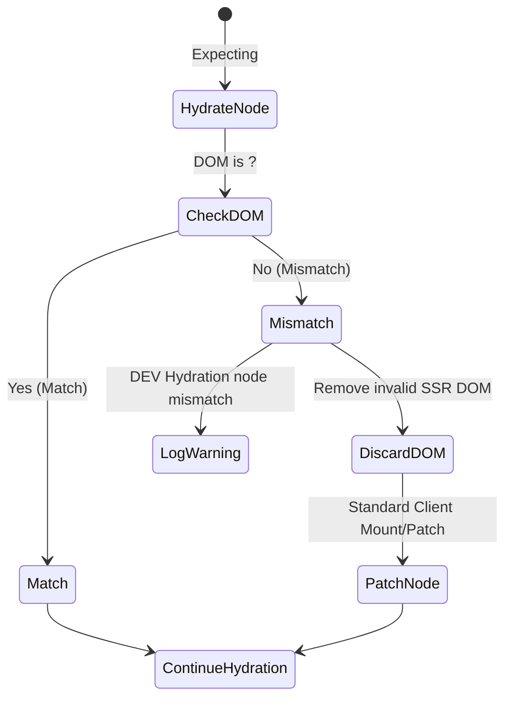

# Mismatch Recovery Strategy

## Концепция и Архитектура (Mental Model)

Идеальная гидратация предполагает, что VNode дерево, сгенерированное клиентом, на 100% совпадает с HTML структурой, присланной сервером.
Но что если это не так? Например:
- На сервере отрендерилась дата по UTC (`<span>12:00</span>`), а клиентский JS сгенерировал по локальному времени пользователя (`<span>15:00</span>`).
- Браузер сам исправил невалидный HTML (например, `<div>` внутри `<p>`), изменив структуру DOM до запуска JS.
- Использование `v-show` / `v-if`, зависящих от `window` (которого нет на сервере).

Это называется **Hydration Mismatch**. Когда Vue обнаруживает расхождение, он должен "восстановиться" (Recovery), чтобы приложение не сломалось. Стратегия Vue: **Клиент всегда прав**. При несовпадении Vue выбрасывает предупреждение в консоль (в DEV режиме), отбрасывает серверный DOM в месте ошибки и рендерит (patch) правильный VNode с нуля.

## Визуализация



## Списки исходного кода

- `packages/runtime-core/src/hydration.ts` (Функция `handleMismatch`)
- `packages/runtime-core/src/vnode.ts`

## Разбор реализации

Ошибки маппинга отлавливаются прямо в цикле `hydrateNode` и `hydrateChildren`.

```typescript
// packages/runtime-core/src/hydration.ts (упрощенно)

function hydrateNode(node: Node, vnode: VNode) {
  // Проверка на совпадение
  const isMatch = checkNodeMatch(node, vnode)
  
  if (!isMatch) {
    return handleMismatch(node, vnode)
  }
  
  // ... успешная гидратация
}

function handleMismatch(node: Node, vnode: VNode) {
  if (__DEV__) {
    console.warn(`Hydration node mismatch:
      - Client vnode: ${vnode.type}
      - Server rendered DOM: ${node.nodeName}
    `)
  }

  // 1. Помечаем VNode, чтобы он отрендерился с нуля
  vnode.shapeFlag |= ShapeFlags.MISMATCHED
  
  // 2. Инициируем стандартный клиентский патчинг (mount) прямо поверх DOM
  // Vue заменит node на свежесозданный элемент из vnode
  patch(null, vnode, node.parentNode, node)

  // 3. Возвращаем следующий узел, чтобы продолжить процесс
  return node.nextSibling
}
```

## Оптимизации и Edge Cases

1.  **Текстовые узлы:** Текстовые мисматчи (дата/время) — самые частые. Если Vue видит, что ожидался текст `15:00`, а в DOM `12:00`, он не пересоздает весь элемент. Он просто делает `node.nodeValue = vnode.children` (patch текста) и идет дальше. Предупреждение в DEV все равно выводится.
2.  **Подавление Mismatch (v-data-allow-mismatch):** В Vue 3.4+ добавили механизм намеренного подавления предупреждений. Если вы *знаете*, что дата будет отличаться, вы можете добавить на элемент атрибут `data-allow-mismatch`. Компилятор сгенерирует флаг, и гидрататор молча исправит текст без вывода консольного warn'а.
3.  **Client-Only Components:** Лучшая стратегия "восстановления" — это избегать мисматчей. Использование компонентов-оберток `<ClientOnly>`, которые на сервере рендерят пустой `div` (или fallback), а на клиенте монтируют содержимое только после фазы mounted, полностью исключает эту проблему для браузерно-специфичного кода.
