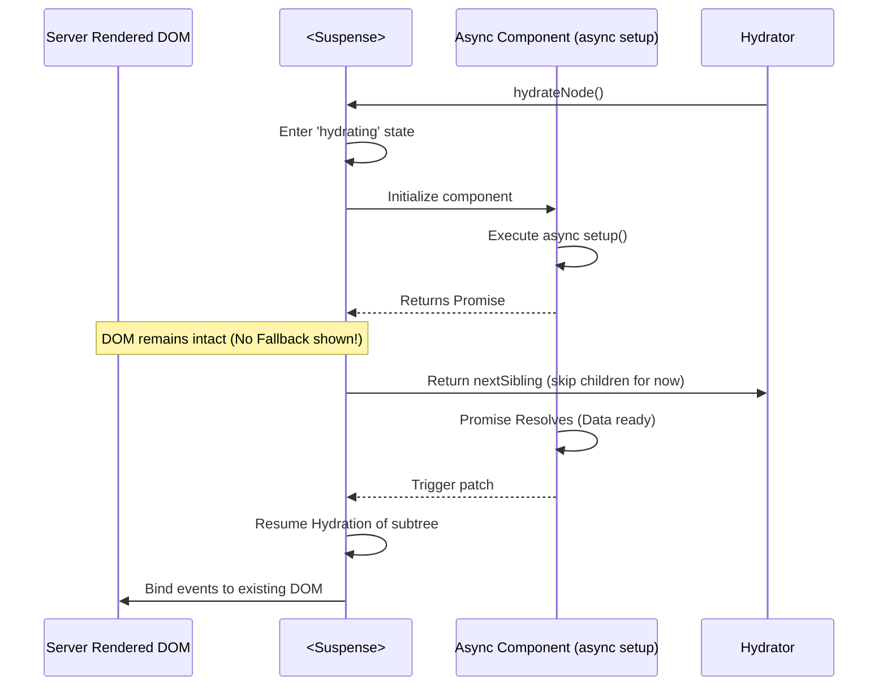

# Suspense Hydration

## Концепция и Архитектура (Mental Model)

Компонент `<Suspense>` во Vue обрабатывает асинхронные зависимости (резолв асинхронных компонентов или `async setup()`). 
В контексте SSR и гидратации `Suspense` играет критическую роль **Boundary (Границы)**.

Когда сервер рендерит Suspense, он может дождаться выполнения данных и отдать готовый HTML (Default content). Но во время клиентской гидратации этому контенту (внутри Suspense) снова нужны те же данные, чтобы JS отработал `setup()` и построил VNode.
Проблема: Если клиент начнет повторно фетчить данные во время гидратации, Suspense перейдет в состояние `pending`, выбросит отрендеренный сервером HTML и покажет `fallback` (например, спиннер). Произойдет ужасное мерцание: Готовый HTML -> Спиннер -> Готовый HTML.

**Suspense Hydration** решает это: он позволяет клиенту "заморозить" гидратацию внутри Suspense, дождаться резолва асинхронного `setup()` (часто с использованием закешированных данных от сервера), и только потом "оживить" существующий DOM, не уничтожая его.

## Визуализация



## Списки исходного кода

- `packages/runtime-core/src/components/Suspense.ts` (SSR и гидратация логика)
- `packages/runtime-core/src/hydration.ts`

## Разбор реализации

Suspense содержит специальный флаг состояния гидратации.

```typescript
// packages/runtime-core/src/components/Suspense.ts (упрощенно)

export const SuspenseImpl = {
  hydrate(vnode, domNode, context) {
    const suspense = vnode.suspense = createSuspenseBoundary(vnode)
    
    // Помечаем, что Suspense находится в процессе гидратации.
    // Это предотвращает показ fallback контента.
    suspense.isHydrating = true

    // Запускаем рендеринг default слота (где лежат async компоненты)
    const defaultSubTree = renderDefaultSlot()

    if (suspense.pendingBranch) {
      // Async setup вернул Promise.
      // Мы НЕ удаляем DOM сервера. Мы ждем.
      suspense.deps.then(() => {
        // Когда данные загружены, возобновляем гидратацию именно этого поддерева
        hydrateNode(domNode, defaultSubTree, context)
        suspense.isHydrating = false
      })
    } else {
      // Все синхронно, гидратируем сразу
      hydrateNode(domNode, defaultSubTree, context)
    }
  }
}
```

## Оптимизации и Edge Cases

1.  **State Transfer (Nuxt / Vue SSR):** Чтобы `async setup()` резолвился мгновенно на клиенте и не делал повторный HTTP-запрос к API, сервер сериализует результат запроса в `window.__INITIAL_STATE__`. Клиентский код при вызове `fetch` проверяет этот кэш. Таким образом, Promise внутри Suspense резолвится в том же тике (microtask), и гидратация проходит гладко.
2.  **Hydration Mismatch внутри Suspense:** Если во время отложенной гидратации происходит mismatch, Vue выбрасывает ошибку, откатывает Suspense до чистого состояния, удаляет серверный DOM и рендерит fallback, а затем заново отрисовывает default контент.
3.  **Вложенные Suspense:** Vue поддерживает оркестрацию нескольких Suspense. Родительский Suspense будет ждать резолва всех дочерних Suspense границ, координируя процесс гидратации сверху вниз, чтобы избежать промежуточных перерисовок интерфейса.
