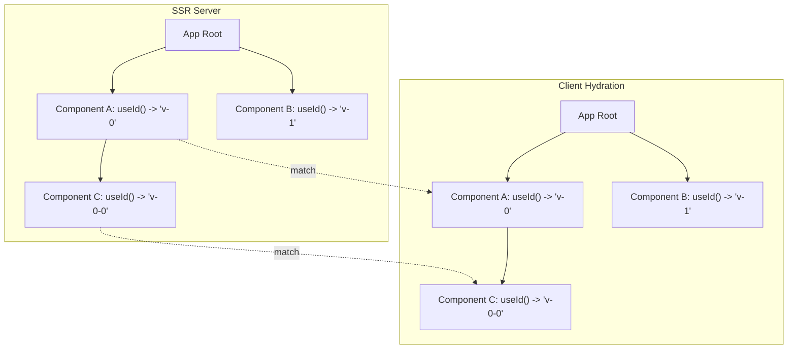

# useId() & SSR Stable IDs

## Концепция и Архитектура (Mental Model)

Генерация уникальных ID (например, для связывания `<label for="id">` и `<input id="id">`) — известная боль в SSR-приложениях. 
Если использовать `Math.random()` или простой инкрементальный счетчик без синхронизации, сервер сгенерирует один ID (например, `id="input-1"`), а клиент при гидратации — другой (`id="input-42"`). Это приводит к **Hydration Mismatch** — фреймворк видит, что отрендеренный DOM не совпадает с тем, что ожидается клиентом, выбрасывает ошибку и перерисовывает дерево, убивая весь профит SSR.

В Vue 3.5+ был введен хук `useId()`, который решает эту проблему элегантно: он генерирует **детерминированные, стабильные между сервером и клиентом идентификаторы**, опираясь на структуру графа компонентов, а не на глобальный счетчик.

## Визуализация



## Списки исходного кода

- `packages/runtime-core/src/helpers/useId.ts` (Сам хук)
- `packages/runtime-core/src/component.ts` (Связывание счетчика с инстансом компонента)
- `packages/server-renderer/src/render.ts` (SSR имплементация генерации префикса)

## Разбор реализации

ID формируется на основе "пути" (положения) компонента в дереве и локального счетчика внутри самого компонента.

```typescript
// packages/runtime-core/src/helpers/useId.ts (упрощенная суть)

export function useId(): string {
  const i = getCurrentInstance()
  if (!i) return ''
  
  // Каждый инстанс компонента имеет локальный счетчик (ids), 
  // который увеличивается при каждом вызове useId() внутри него.
  // Это позволяет вызывать useId() несколько раз в одном компоненте.
  const localId = i.ids[0]++ 
  
  // app.config.idPrefix - опциональный префикс для изоляции микрофронтендов
  const prefix = i.appContext.config.idPrefix || 'v'

  // На сервере и клиенте структура дерева (порядок создания компонентов)
  // должна быть строго идентичной. i.uid - это уникальный id компонента,
  // но в SSR используется специальный tree-based id генератор, чтобы 
  // uid компонента зависел от его предков.
  return `${prefix}-${i.uid}-${localId}`
}
```

Чтобы `i.uid` совпадал на сервере и клиенте, Vue использует детерминированный счетчик, привязанный к VNode дереву, а не глобальный `let uid = 0;`. 
Во время SSR, родитель передает дочерним компонентам префикс, основанный на своем индексе.

```typescript
// В процессе рендеринга потомков (очень упрощенно):
function renderChild(vnode, index, parentId) {
   const childId = `${parentId}-${index}` // v-0-1, v-0-2 и т.д.
   vnode.component.uid = childId
}
```

## Оптимизации и Edge Cases

1.  **Асинхронные компоненты / Suspense:** Детерминированность ломается, если часть дерева грузится асинхронно или лениво, так как порядок разрешения промисов непредсказуем. Vue решает это, "бронируя" ID для `Suspense` границ, чтобы внутренности Suspense имели свой собственный изолированный неймспейс, не аффектя глобальный счетчик сиблингов (соседних компонентов).
2.  **Микрофронтенды:** Если на одной странице отрендерено несколько Vue-приложений, их ID могут пересекаться (у обоих будет `v-0-0`). Для этого предусмотрена конфигурация: `app.config.idPrefix = 'app1'`.
