# 00 Vapor Architecture: Mental Model & Overview

## Концепция и Архитектура (Mental Model)

Vapor Mode — это альтернативная, опциональная (opt-in) стратегия компиляции и рантайма для Vue 3, вдохновленная Solid.js. Исторически Vue полагается на Virtual DOM (VDOM) для абстрагирования DOM-операций, что дает гибкость, но имеет свой overhead: создание VNode-деревьев на каждый рендер и фаза diffing (даже с учетом Compiler-Informed VDOM оптимизаций Vue 3).

Vapor Mode полностью отказывается от Virtual DOM. Вместо этого компилятор преобразует шаблон компонента напрямую в императивные вызовы DOM API (`document.createElement`, `insert`, `setText`) и точечные реактивные эффекты (`renderEffect`). 

**Зачем это нужно ядру?**
- **Минимизация памяти:** Нет нужды аллоцировать VNodes. Меньше нагрузка на Garbage Collector (GC).
- **Производительность (Speed):** Мелкогранулярная (fine-grained) реактивность обновляет только те узлы DOM, которые зависят от изменившегося состояния, без обхода графа VNodes.
- **Размер бандла:** Vapor-компонентам не нужен рантайм `runtime-core` (VDOM-патчер), что позволяет создавать сверхлегкие приложения.

## Визуализация (Mermaid)

```mermaid
flowchart TD
    subgraph Vue Standard [Standard VDOM Vue]
        A1[Template] -->|Compiler| B1[Render Function returning VNodes]
        B1 -->|Runtime| C1[VDOM Patching / Diffing]
        C1 -->|DOM Ops| D[Browser DOM]
    end

    subgraph Vapor Mode [Vapor Mode Vue]
        A2[Template] -->|Vapor Compiler| B2[IR - Intermediate Representation]
        B2 -->|Codegen| C2[Imperative DOM Ops + renderEffect bindings]
        C2 -->|Direct Exec| D
    end
    
    style Vapor Mode fill:#1a3b2b,stroke:#42b883,stroke-width:2px
```



## Списки исходного кода (Source Code References)

- `packages/compiler-vapor/src/compile.ts` — Точка входа компилятора Vapor.
- `packages/runtime-vapor/src/render.ts` — Рантайм для Vapor компонентов.
- `packages/runtime-vapor/src/renderWatch.ts` — Реализация эффектов для обновления DOM.

## Разбор реализации (Code Deep Dive)

В классическом Vue `setup()` возвращает данные или рендер-функцию, а компилятор генерирует `_createElementVNode`.
В Vapor Mode компилятор генерирует код, который создает статические узлы через `template.cloneNode(true)` и навешивает реактивность.

Пример шаблона:
```html
<div id="app">
  <h1>{{ count }}</h1>
</div>
```

Скомпилированный Vapor-код (упрощенно):
```typescript
import { template, children, renderEffect, setText } from 'vue/vapor'

// Статический HTML выносится на уровень модуля
const t0 = template('<div id="app"><h1></h1></div>')

export function render(_ctx) {
  // 1. Клонирование статического поддерева (очень быстрая операция браузера)
  const n0 = t0()
  
  // 2. Получение ссылок на динамические узлы (через обход children)
  const n1 = children(n0, 0) // <h1>
  
  // 3. Создание мелкогранулярного эффекта
  renderEffect(() => {
    setText(n1, _ctx.count)
  })
  
  return n0
}
```

Здесь `template()` создает `<template>` элемент под капотом и использует `.cloneNode(true)`. Это значительно быстрее, чем множественные `document.createElement`.

## Оптимизации и Edge Cases (Подводные камни)

1. **Клонирование шаблонов vs CreateElement:** В отличие от React, Vapor парсит статические части шаблона один раз в элемент `<template>`, а затем вызывает `cloneNode(true)`. Браузеры оптимизируют клонирование глубоких узлов на уровне C++, что дает огромный буст при создании компонентов.
2. **Память и Замыкания:** Поскольку обновления точечные, мы плодим много функций для `renderEffect`. В больших списках (например, `v-for` на 1000 элементов) это может означать 1000 замыканий. Рантайм Vapor жестко оптимизирует структуру этих эффектов, избегая лишних абстракций, чтобы минимизировать аллокации.
3. **Отсутствие VDOM:** Мы теряем возможность легко писать кастомные рендер-функции с JSX (т.к. JSX обычно возвращает VNodes). Vapor — это в первую очередь результат компиляции `.vue` (SFC) файлов.
