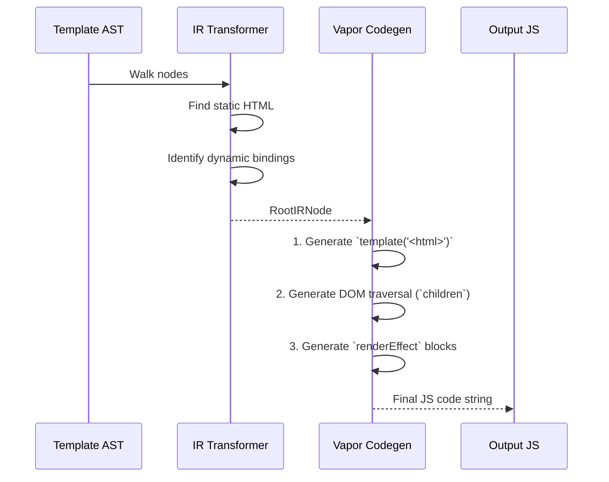

# 01 Compiler Vapor: Compile Template to DOM Ops

## Концепция и Архитектура (Mental Model)

Когда Intermediate Representation (IR) построен, фаза Codegen в Vapor Mode преобразует его в исполняемый JavaScript-код. В отличие от стандартного компилятора, который собирает VNode-деревья, кодогенератор Vapor генерирует императивные "DOM-операции" (DOM Ops). 

Суть подхода: минимизировать вес генерируемого кода и перенести максимум логики на низкоуровневые, максимально заинлайненные (inlined) функции рантайма (`insert`, `prepend`, `setText`). Мы не описываем *что* должно быть на экране (декларативно, как VDOM), мы описываем *как* собрать экран (императивно).

## Визуализация (Mermaid)



## Списки исходного кода (Source Code References)

- `packages/compiler-vapor/src/generate.ts` — Главный оркестратор кодогенерации Vapor.
- `packages/compiler-vapor/src/generators/template.ts` — Генерация статических HTML шаблонов.
- `packages/compiler-vapor/src/generators/text.ts` — Генерация операций обновления текста.

## Разбор реализации (Code Deep Dive)

В кодогенерации мы берем `RootIRNode` и проходим по его секциям: `template`, `operation`, `effect`.

```typescript
// packages/compiler-vapor/src/generate.ts (псевдокод)

export function generate(ir: RootIRNode, options: CodegenOptions) {
  const context = createCodegenContext(options)
  const { push } = context
  
  // 1. Генерация статических шаблонов на уровне модуля (Hoisting)
  for (const tmpl of ir.template) {
    push(`const t${tmpl.id} = _template(${JSON.stringify(tmpl.html)})\n`)
  }

  push(`export function render(_ctx) {\n`)
  
  // 2. Инициализация ссылок на узлы (клонирование)
  push(`  const n0 = t0()\n`)
  
  // 3. Навигация к динамическим узлам
  for (const dynamic of ir.dynamic) {
    // Генерирует: const n1 = _children(n0, 0, 2)
    push(`  const n${dynamic.id} = _children(n0, ${dynamic.path.join(', ')})\n`)
  }
  
  // 4. Генерация эффектов (реактивность)
  for (const effect of ir.effect) {
    push(`  _renderEffect(() => {\n`)
    // Вызов специфичного генератора в зависимости от типа операции (setText, setAttr и т.д.)
    generateEffectOperation(effect, context) 
    push(`  })\n`)
  }
  
  push(`  return n0\n`)
  push(`}`)
  
  return context.code
}
```

Код получается максимально "плоским". Все зависимости от внешних переменных (`_ctx.someRef`) оказываются захвачены внутри коллбэков `_renderEffect`.

## Оптимизации и Edge Cases (Подводные камни)

1. **Block Scoping для v-if / v-for:** В случае структурных директив (как `v-if` или `v-for`), кодогенератор не может просто использовать один плоский `renderEffect`. Он генерирует вызовы `createIf` и `createFor`, которые создают вложенные скоупы реактивности и управляют монтированием/размонтированием фрагментов DOM, опираясь на якоря (comment nodes `<!--v-if-->`).
2. **Дедупликация путей:** Если у нас есть динамические элементы `div > span` и `div > p`, компилятор выстраивает навигацию так, чтобы переиспользовать уже найденные узлы, избегая избыточного обхода DOM с корня.
3. **Размер кода:** Несмотря на то, что императивный код длиннее декларативного VDOM, отсутствие VDOM-рантайма с лихвой окупает этот объем для большинства приложений. Для гигантских шаблонов применяются техники компрессии путей (навигация массивами `[0, 1, 0]`).
