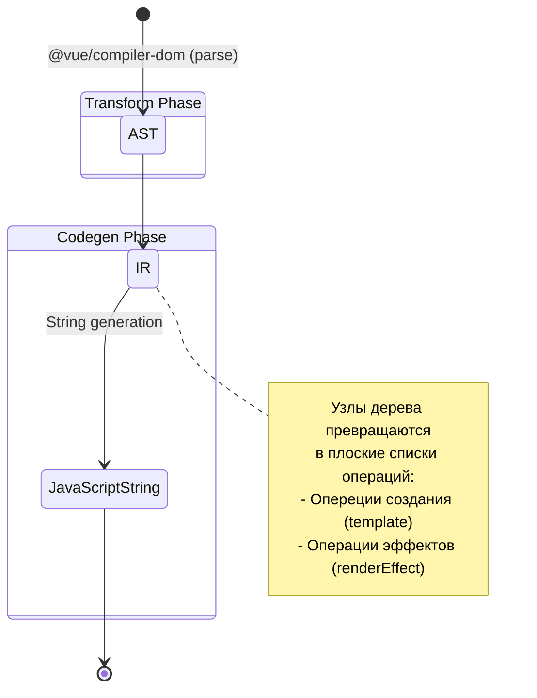

# 01 Compiler Vapor: Intermediate Representation (IR)

## Концепция и Архитектура (Mental Model)

При компиляции шаблонов во Vue исторически использовался простой пайплайн: AST -> Transform -> Codegen. 
В Vapor Mode компилятор делает шаг в сторону более классической теории компиляторов и вводит Intermediate Representation (IR) — промежуточное представление. 

**Зачем нужен IR?**
В VDOM-мире структура сгенерированного кода (вложенные вызовы `h()`) примерно повторяет структуру AST (вложенные узлы). 
В Vapor Mode структура сгенерированного кода *плоская*: сначала мы получаем ссылки на DOM-элементы (инструкции навигации), а затем применяем эффекты (инструкции реактивности). Преобразовать AST (дерево) в плоский список инструкций "на лету" крайне сложно. IR выступает прослойкой: мы сначала "перевариваем" AST в плоский набор абстрактных инструкций, оптимизируем их, и только потом генерируем JS-строки.

## Визуализация (Mermaid)



## Списки исходного кода (Source Code References)

- `packages/compiler-vapor/src/ir/index.ts` — Определения типов (RootIRNode, TemplateIRNode, VaporDirectiveNode и т.д.).
- `packages/compiler-vapor/src/transform.ts` — Генерация IR из AST.

## Разбор реализации (Code Deep Dive)

Вместо генерации кода напрямую, трансформеры Vapor Mode собирают массивы объектов `OperationNode`.

```typescript
// packages/compiler-vapor/src/ir/index.ts (упрощенно)
export interface RootIRNode {
  type: IRNodeTypes.ROOT
  template: string[] // Статические куски HTML
  dynamic: DynamicInfo // Инфа о динамических узлах
  effect: IREffect[] // Эффекты (v-bind, text interpolation)
  operation: IROperation[] // Операции (insert, prepend)
}

export interface SetTextIRNode extends IRNode {
  type: IRNodeTypes.SET_TEXT
  element: number // ID узла в IR
  value: SimpleExpressionNode // Выражение (например, `ctx.count`)
}
```

При обходе AST компилятор не пишет `setText(n1, count)`. Он добавляет в `effect` массив объект:
`{ type: IRNodeTypes.SET_TEXT, element: 1, value: ... }`.

Почему так? Потому что на этапе кодогенерации компилятор может:
1. Сгруппировать эффекты для одного узла.
2. Дедуплицировать статические строки шаблонов.
3. Оптимизировать пути навигации (`children(n0, 0, 1)`).

## Оптимизации и Edge Cases (Подводные камни)

1. **Мемоизация путей:** Поиск элемента в DOM имеет стоимость. В IR Vapor хранит массив `DynamicInfo`, который описывает путь к динамическому узлу (индексы детей). При генерации кода это превращается в вызов `children(n0, 1, 2)`. Это позволяет обойти DOM единожды и сохранить ссылку (`n1`), вместо того чтобы в каждом эффекте искать элемент заново.
2. **Сепарация статики и динамики:** IR жестко разделяет `template` (что можно клонировать) и `effect` (что нужно оборачивать в реактивность). Это позволяет компилятору собрать весь статический HTML в одну строку на уровне RootIRNode, даже если он был разбросан по разным веткам AST.
