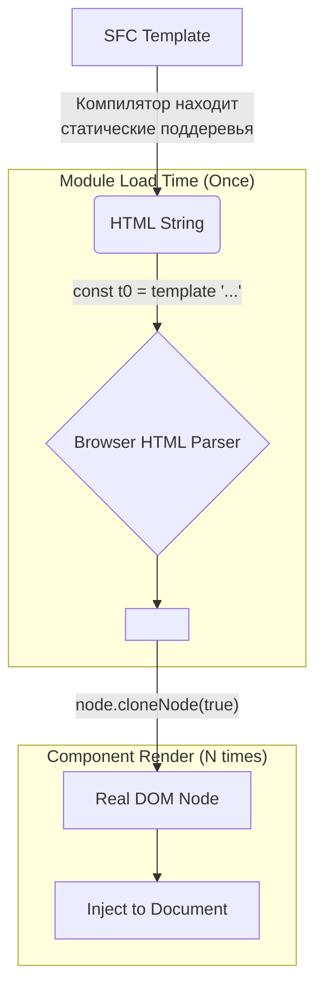

# 01 Compiler Vapor: Static HTML Hoisting

## Концепция и Архитектура (Mental Model)

Static HTML Hoisting в Vapor Mode — это радикальная оптимизация создания DOM-элементов. Если в обычном Vue 3 статические VNodes поднимаются (hoisted) из рендер-функции в константы для переиспользования при патчинге, то Vapor Mode идет еще дальше.

Поскольку VDOM нет, Vapor извлекает все статические куски шаблона в виде **чистых HTML-строк**. Эти строки передаются в специальную утилиту рантайма `template()`, которая единожды создает реальный `HTMLTemplateElement`, парсит строку браузерным парсером (что невероятно быстро на уровне C++ браузера), а затем для каждого экземпляра компонента просто вызывает `cloneNode(true)`.

**Проблема:** Создание DOM через последовательные вызовы `document.createElement`, `element.setAttribute`, `element.appendChild` работает медленно в JS-движках из-за накладных расходов на вызовы C++ binding'ов из JS (crossing the JS/C++ boundary).
**Решение Vapor:** Схлопнуть это в одну HTML-строку и один вызов `cloneNode(true)`.

## Визуализация (Mermaid)



## Списки исходного кода (Source Code References)

- `packages/compiler-vapor/src/transforms/transformElement.ts` — Определение статических элементов при обходе AST.
- `packages/compiler-vapor/src/generators/template.ts` — Генерация вызова `_template()`.
- `packages/runtime-vapor/src/dom/template.ts` — Реализация функции `template()` в рантайме.

## Разбор реализации (Code Deep Dive)

На этапе компиляции, если элемент не содержит динамических биндингов, он склеивается в строку:

```typescript
// Компилятор сгенерирует в JS модуле:
import { template as _template } from 'vue/vapor'

// Это выполнится один раз при парсинге JS файла (Hoisting на уровень модуля)
const t0 = _template('<div class="wrapper"><span class="static">Hello</span></div>')
```

В рантайме функция `_template` реализована с максимальным упором на производительность:

```typescript
// packages/runtime-vapor/src/dom/template.ts (упрощенно)
export function template(html: string): () => ChildNode[] {
  let node: DocumentFragment | null = null;
  
  const create = () => {
    // Ленивая инициализация (Lazy init)
    if (!node) {
      const t = document.createElement('template')
      t.innerHTML = html
      node = t.content
    }
    // Клонирование на уровне нативного кода (глубокое, true)
    return node.cloneNode(true).childNodes
  }
  
  return create
}
```

## Оптимизации и Edge Cases (Подводные камни)

1. **Отсутствие SVG в innerHTML:** При использовании `innerHTML` для парсинга, браузер интерпретирует теги в контексте HTML. Если мы парсим строку `<circle cx="50" .../>`, браузер может не понять, что это SVG namespace, если корневой тег не `<svg>`. Поэтому Vapor компилятор использует специальную версию функции `_template` (например, `_templateSvg`), которая учитывает namespace.
2. **Ограничения клонирования:** Свойства, установленные через JS-объект (например, кастомные property на DOM-узле, которых нет в атрибутах), не клонируются через `cloneNode`. В Vapor это не проблема, так как статический хоистинг применяется только к чистым HTML-структурам. Все динамические prop/attr устанавливаются через `renderEffect` уже после клонирования.
3. **Lazy Initialization:** Заметьте, что `innerHTML` парсится только при **первом вызове** функции, возвращаемой `_template()`. Это спасает Time To Interactive (TTI) приложения: если компонент зарегистрирован, но еще не отрендерен (например, скрыт за `v-if`), браузер не тратит время на парсинг его статических шаблонов.
