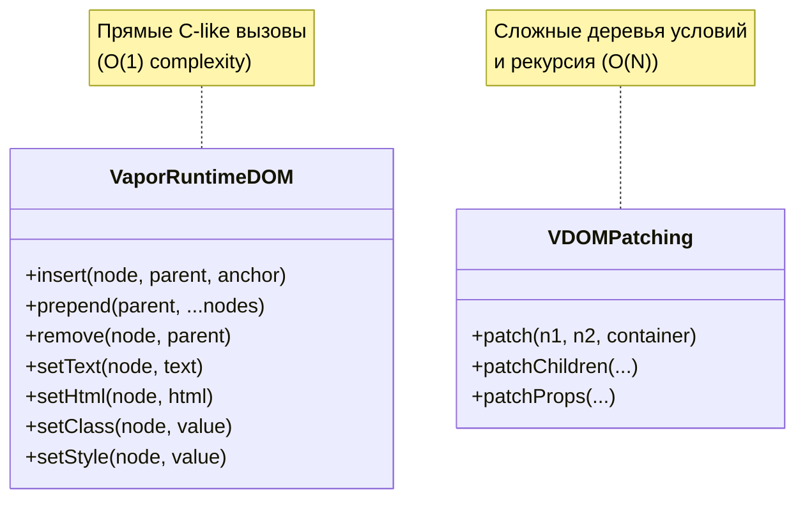

# 02 Runtime Vapor: Direct DOM Operations

## Концепция и Архитектура (Mental Model)

Поскольку Vapor Mode не использует Virtual DOM, ему нужен свой набор утилит для прямого взаимодействия с нативным Browser DOM. Эти утилиты (DOM Ops) формируют низкоуровневый API, который вызывает скомпилированный код. 

Главная архитектурная цель этих операций — быть максимально **инлайнируемыми (inlineable)** и мономорфными для JS-движка (V8, JavaScriptCore). Они не должны содержать сложной логики (как функция `patch` в VDOM, которая проверяет десятки условий). Это простые, быстрые C-подобные функции: `setText`, `insert`, `prepend`, `remove`.

## Визуализация (Mermaid)



## Списки исходного кода (Source Code References)

- `packages/runtime-vapor/src/dom/element.ts` — Вставка и удаление узлов (`insert`, `remove`).
- `packages/runtime-vapor/src/dom/prop.ts` — Работа со свойствами.
- `packages/runtime-vapor/src/dom/style.ts` — Работа со стилями (inline styles).

## Разбор реализации (Code Deep Dive)

Рассмотрим, как реализована простейшая операция — обновление текста:

```typescript
// packages/runtime-vapor/src/dom/element.ts (упрощенно)

export function setText(node: Node, text: unknown) {
  // Нормализация значения: null/undefined становятся пустой строкой
  const value = text == null ? '' : String(text)
  
  // Прямое мутирование DOM
  if (node.textContent !== value) {
    node.textContent = value
  }
}

export function insert(node: Node, parent: Node, anchor: Node | null = null) {
  parent.insertBefore(node, anchor)
}
```

Казалось бы, зачем нужна функция `setText`, если можно просто написать `node.textContent = value` в скомпилированном коде?
Причины две:
1. **Нормализация и приведение типов:** Шаблоны Vue допускают передачу `null`, массивов, объектов. Функция гарантирует безопасное приведение к строке, не раздувая скомпилированный код.
2. **Diffing на уровне значения:** Проверка `if (node.textContent !== value)` предотвращает ненужные вызовы C++ API браузера. Изменение свойства DOM-узла (даже на такое же значение) может триггерить внутренние пересчеты стилей (Style Recalculation) в движке браузера.

## Оптимизации и Edge Cases (Подводные камни)

1. **Работа с Классами (`setClass`):** Во Vue классы могут быть массивами, объектами или строками. `setClass` в Vapor инкапсулирует логику нормализации и напрямую работает с `element.className` (что быстрее, чем `classList.add/remove` в массовых операциях, так как перезаписывает строку целиком).
2. **Фрагменты (Fragments):** Вставка множества элементов. Если узел — это массив (результат `template()` с несколькими корневыми элементами), `insert` рекурсивно или через цикл вставит их все.
3. **Мономорфизм:** Функции спроектированы так, чтобы принимать аргументы одного и того же типа. Это позволяет JIT-компилятору браузера (например, TurboFan в V8) оптимизировать эти функции до нативного машинного кода без проверок типов на лету.
