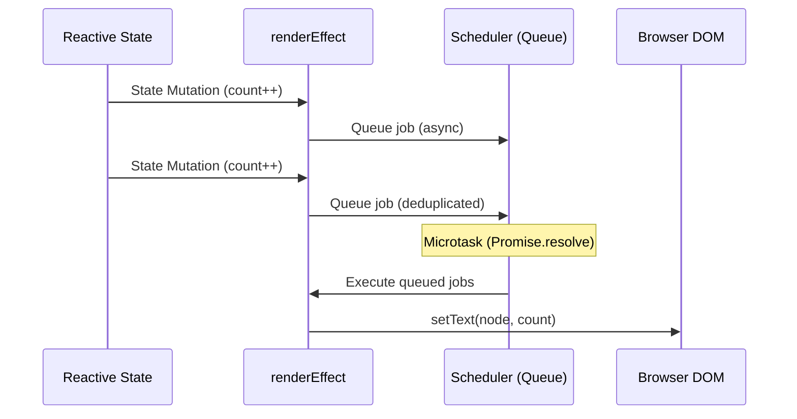

# 02 Runtime Vapor: effect vs renderEffect

## Концепция и Архитектура (Mental Model)

В основе реактивности Vue лежит `effect` (из пакета `@vue/reactivity`). Это абстрактная функция, которая запускает коллбэк, отслеживает прочитанные внутри него зависимости (tracking) и перезапускает коллбэк при их изменении (triggering). 

Однако для обновления DOM использовать сырой `effect` нельзя. Нужна специальная обертка — `renderEffect`. 

**Зачем нужен `renderEffect`?**
1. **Планирование (Scheduling):** Обновления DOM не должны быть синхронными. Если переменная меняется 5 раз подряд, мы не хотим перерисовывать DOM 5 раз. `renderEffect` делегирует запуск планировщику (scheduler), который батчит обновления и выполняет их в микротаске (nextTick).
2. **Жизненный цикл (Lifecycles):** Эффекты рендеринга должны знать о хуках `onBeforeUpdate` и `onUpdated`.
3. **Контекст компонента:** В отличие от сырого `effect`, `renderEffect` привязан к конкретному экземпляру компонента (Component Instance), чтобы очищаться при размонтировании компонента.

## Визуализация (Mermaid)



## Списки исходного кода (Source Code References)

- `packages/reactivity/src/effect.ts` — Базовый класс `ReactiveEffect`.
- `packages/runtime-vapor/src/renderWatch.ts` — Реализация `renderEffect` в Vapor.
- `packages/runtime-core/src/scheduler.ts` — Очередь микротасков (используется совместно).

## Разбор реализации (Code Deep Dive)

В Vapor Mode функция `renderEffect` является надстройкой над `watchEffect` из `runtime-core`.

```typescript
// packages/runtime-vapor/src/renderWatch.ts (упрощенно)

import { effect, ReactiveEffect } from '@vue/reactivity'
import { queuePostRenderEffect } from './scheduler'

export function renderEffect(fn: () => void) {
  // Получаем текущий Vapor компонент
  const instance = currentInstance 
  
  // Создаем эффект с кастомным планировщиком
  const _effect = new ReactiveEffect(
    fn, 
    () => {
      // Это scheduler коллбэк. Он сработает при trigger()
      // Вместо немедленного выполнения fn(), мы кладем задачу в очередь
      queueJob(job)
    }
  )
  
  const job = () => {
    // 1. Вызов onBeforeUpdate хуков
    // 2. Выполнение самого эффекта (обновление DOM)
    _effect.run()
    // 3. Вызов onUpdated хуков
  }
  
  // Инициализационный запуск
  _effect.run()
  
  // Привязка к жизненному циклу компонента для сборки мусора
  if (instance) {
    instance.effects.push(_effect)
  }
}
```

## Оптимизации и Edge Cases (Подводные камни)

1. **Pre vs Post Flush:** Эффекты рендеринга во Vue обычно выполняются "pre-flush" (до того, как пользовательские `watch` эффекты отработают). Это гарантирует, что к моменту работы пользовательского кода DOM уже обновлен и консистентен.
2. **Память (Memory Leaks):** Если бы `renderEffect` не привязывался к массиву `instance.effects`, он бы жил вечно в памяти (так как держал бы ссылку на реактивное состояние). При `unmount` компонента Vapor проходит по массиву `effects` и вызывает `effect.stop()`, отписывая их от всех зависимостей.
3. **Error Handling:** Внутри `job` функции обернуты в `callWithErrorHandling` (глобальный перехватчик ошибок Vue), чтобы ошибка в одном элементе (например, вызов несуществующего метода при рендеринге) не "валила" весь цикл обновления всего приложения.
