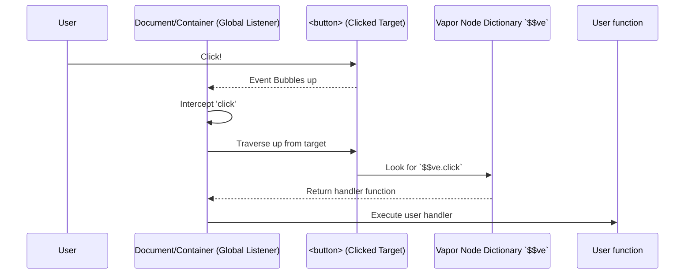

# 02 Runtime Vapor: Event Delegation

## Концепция и Архитектура (Mental Model)

В стандартном Vue (VDOM) события (`@click="handler"`) навешиваются на каждый узел индивидуально через `addEventListener`. Если у вас есть список из 1000 элементов с `@click`, будет создано 1000 обработчиков событий в памяти браузера. 

Vapor Mode адаптирует паттерн **Event Delegation** (Делегирование событий), популярный в React и Solid.js. Вместо навешивания обработчика на конкретный узел, Vapor вешает **один глобальный обработчик** на корень документа (или контейнера) для каждого типа события (например, один глобальный слушатель для 'click'). 

Когда клик происходит, глобальный обработчик перехватывает его на этапе всплытия (bubbling), находит исходный `event.target` и поднимается вверх по дереву DOM, вызывая функции-обработчики, которые Vapor предварительно сохранил в специальном словаре, привязанном к самому DOM-узлу.

**Зачем это нужно?**
- Радикальное сокращение потребления памяти.
- Ускорение монтирования компонентов (не нужно вызывать C++ API `addEventListener` на каждый узел).

## Визуализация (Mermaid)



## Списки исходного кода (Source Code References)

- `packages/runtime-vapor/src/dom/event.ts` — Делегирование и диспетчеризация событий.

## Разбор реализации (Code Deep Dive)

На уровне компилятора, `v-on:click="doSomething"` генерирует вызов функции `delegate`:

```typescript
import { delegate } from 'vue/vapor'

// В скомпилированном коде
delegate(n1, 'click', () => _ctx.doSomething())
```

В рантайме функция `delegate` не вызывает `addEventListener` для `n1`:

```typescript
// packages/runtime-vapor/src/dom/event.ts (упрощенно)

// Глобальный набор уже навешанных типов событий
const delegatedEvents = new Set<string>()

export function delegate(node: Element, event: string, handler: Function) {
  // 1. Сохраняем обработчик прямо на объекте DOM-узла (hack)
  const handlers = (node as any).$$ve || ((node as any).$$ve = {})
  handlers[event] = handler

  // 2. Если слушатель на документ еще не добавлен - добавляем
  if (!delegatedEvents.has(event)) {
    delegatedEvents.add(event)
    document.addEventListener(event, dispatchDelegatedEvent)
  }
}

// Глобальный диспетчер
function dispatchDelegatedEvent(e: Event) {
  let target = e.target as Element | null
  const type = e.type
  
  // Симуляция всплытия (поднимаемся вверх)
  while (target) {
    const handlers = (target as any).$$ve
    if (handlers && handlers[type]) {
      // Вызов обработчика
      handlers[type](e)
    }
    // Если propagation остановлен - выходим
    if ((e as any)._vaporStop) break
    target = target.parentElement
  }
}
```

## Оптимизации и Edge Cases (Подводные камни)

1. **Не всплывающие события (Non-bubbling):** Некоторые события в браузере не всплывают (например, `scroll`, `focus`, `blur`, `load`). Vapor знает об этом (держит словарь спецификации) и для таких событий fallback'ится на стандартный `addEventListener` прямо на узел. Делегирование работает только для пузырьковых (bubbling) событий (`click`, `input`, `keydown` и т.д.).
2. **Символ `$$ve`:** Сохранение данных напрямую в DOM-узел (`node.$$ve`) — это классический грязный хак, который позволяет избежать использования `WeakMap` (что работало бы медленнее). JS-движки отлично оптимизируют добавление кастомных свойств к объектам (даже DOM-узлам), если они добавляются консистентно.
3. **`stopPropagation`:** Поскольку нативное событие `click` на самом деле всегда доходит до документа (ведь слушатель висит там), вызов `e.stopPropagation()` внутри юзер-кода не остановит нативное всплытие (оно уже произошло). Вместо этого Vapor патчит объект события (Monkey-patching), переопределяя метод `stopPropagation`, чтобы установить флажок `e._vaporStop = true`, и цикл `while(target)` в диспетчере прекращает работу.
