# 02 Runtime Vapor: Reactivity Bindings (No VDOM)

## Концепция и Архитектура (Mental Model)

В стандартном Vue 3 реактивность работает в тандеме с Virtual DOM: изменение реактивного состояния (`ref` или `reactive`) инвалидирует весь компонент, заставляя его рендер-функцию выполниться заново, вернуть новое дерево VNode, которое затем сравнивается (diff) со старым, чтобы обновить DOM.

В Vapor Mode нет "рендер-функции компонента", которая перезапускается целиком. Вместо этого реактивность привязана **напрямую к конкретным DOM-узлам**. Это называется "Fine-Grained Reactivity" (мелкогранулярная реактивность). Если изменилась переменная `count`, выполнится только та маленькая функция, которая делает `node.textContent = count`, без затрагивания остального дерева.

**Зачем это нужно?**
- Исключение фазы diffing'а. Мы точно знаем, **какой** узел должен обновиться и **как**, потому что связь устанавливается на этапе компиляции (или инициализации компонента).
- Прямое мутирование DOM обходится дешевле, чем генерация мусора (garbage) в виде VNodes.

## Визуализация (Mermaid)

```mermaid
graph TD
    subgraph VDOM Vue
        RefA[Ref: count] -->|Trigger| RenderFn[Component Render Fn]
        RenderFn -->|Generate| NewVNode[New VNode Tree]
        NewVNode -->|Patch/Diff| DOM1[Browser DOM]
    end

    subgraph Vapor Mode Vue
        RefB[Ref: count] -->|Trigger| VaporEffect[renderEffect: setText]
        VaporEffect -->|Direct Mutation| DOM2[Browser DOM Node]
    end
    
    style Vapor Mode Vue fill:#1a3b2b,stroke:#42b883,stroke-width:2px
```



## Списки исходного кода (Source Code References)

- `packages/runtime-vapor/src/renderWatch.ts` — Создание эффектов для привязок.
- `packages/runtime-vapor/src/dom/prop.ts` — Биндинги свойств/атрибутов (v-bind).
- `packages/reactivity/src/effect.ts` — Базовая система реактивности (используется под капотом).

## Разбор реализации (Code Deep Dive)

В коде Vapor Mode связывание состояния и DOM выглядит так:

```typescript
import { renderEffect, setText, setDynamicProp } from 'vue/vapor'

// Внутри setup функции Vapor компонента:
export function render(_ctx) {
  const n1 = ... // ссылка на элемент <div>
  
  // Привязка текста
  renderEffect(() => {
    setText(n1, _ctx.message)
  })

  // Привязка атрибутов (v-bind:id="dynamicId")
  renderEffect(() => {
    setDynamicProp(n1, 'id', _ctx.dynamicId)
  })
}
```

Что делает `renderEffect`? По сути, это обертка над стандартным `effect` из пакета `@vue/reactivity`. Когда `_ctx.message` читается внутри функции, `effect` отслеживает эту зависимость (track). Когда `_ctx.message` меняется, эффект перезапускается (trigger). 

## Оптимизации и Edge Cases (Подводные камни)

1. **Группировка эффектов:** Создавать отдельный эффект на каждый атрибут дорого. Vapor Compiler умеет группировать несколько биндингов в один `renderEffect`, если они обновляются вместе (зависят от одного выражения).
2. **Batching:** Обновления в Vapor Mode, как и в VDOM Vue, батчатся (собираются в пакет). Если мы изменим `message` 10 раз синхронно, `renderEffect` сработает только один раз в следующем микротаске (nextTick), чтобы не перерисовывать DOM впустую.
3. **Property vs Attribute:** Разница между `element.value = ...` и `element.setAttribute('value', ...)` критична. Утилита `setDynamicProp` содержит сложную логику определения (check), как именно мутировать элемент, опираясь на спецификацию HTML и тип элемента (например, `input.value` должно ставиться как свойство (property), а кастомные атрибуты — через `setAttribute`). Это "тяжелое наследие" веба инкапсулировано в `runtime-vapor`.
