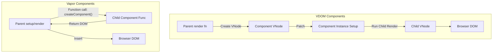

# 03 Vapor Components & Props

## Концепция и Архитектура (Mental Model)

Компоненты во Vue — это фундамент переиспользования логики и UI. В VDOM Vue компоненты создают отдельный инстанс, который хранит состояние, пропсы, слоты и собственную рендер-функцию. Вызов `<Child foo="bar"/>` создает VNode-компонента, который потом распаковывается рантаймом.

В Vapor Mode компонент — это просто **вызов функции**. 
Когда родительский Vapor компонент рендерит дочерний Vapor компонент, он не создает абстрактных VNodes. Он инициализирует компонент напрямую, передает ему пропсы в виде реактивных геттеров и получает обратно кусок DOM, который тут же вставляет (insert) в свой шаблон. 

Это устраняет огромный пласт логики (component resolution, vnode patching), делая компоненты невероятно дешевыми (cheap abstractions).

## Визуализация (Mermaid)



## Списки исходного кода (Source Code References)

- `packages/runtime-vapor/src/component.ts` — Создание экземпляра и монтирование.
- `packages/runtime-vapor/src/componentProps.ts` — Инициализация и обновление пропсов.

## Разбор реализации (Code Deep Dive)

Когда компилятор видит `<Child :count="count" />`, он генерирует:

```typescript
import { createComponent, insert } from 'vue/vapor'
import Child from './Child.vue'

export function render(_ctx) {
  // ...
  const childInstance = createComponent(Child, [
    // Props передаются как функции-геттеры!
    { count: () => _ctx.count }
  ])
  
  // Компонент возвращает фрагмент DOM, который мы вставляем в дерево
  insert(childInstance.block, parentNode)
}
```

Внутри `Child.vue` пропсы компилируются так, чтобы читать из этих геттеров:

```typescript
// Child.vue (упрощенный setup)
export function setup(props) {
  // props.count под капотом вызывает переданный геттер () => parent.count
  // Поэтому пропсы остаются реактивными без надобности создавать Proxy-объекты для всего объекта props!
}
```

## Оптимизации и Edge Cases (Подводные камни)

1. **Реактивные Геттеры вместо Proxy:** В VDOM Vue объект `props` оборачивается в глубокий `reactive()` / `Proxy`, чтобы перехватывать изменения. Это дорого. В Vapor Mode пропсы передаются как массив словарей геттеров `() => ctx.value`. Это значит, что доступ к `props.count` — это просто вызов функции. Эффект родителя перехватывается эффектом ребенка (если ребенок использует пропс в своем `renderEffect`).
2. **Слоты как функции:** Слоты (`<slot>`) в Vapor — это тоже функции, возвращающие клонированные куски DOM. Родитель передает эти функции ребенку. Ребенок вызывает их там, где находится `<!--slot-->` anchor, и вставляет результат. Нет VNode-деревьев слотов.
3. **`emits` и События:** События компонентов не всплывают через нативный DOM, как обычные события. Вызов `emit('foo')` в ребенке напрямую вызывает функцию, которую родитель передал в конфигурации пропсов при `createComponent`. Это синхронный, прямой вызов JS-функции.
