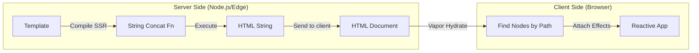

# 04 Vapor SSR & Hydration

## Концепция и Архитектура (Mental Model)

Server-Side Rendering (SSR) в традиционном Vue подразумевает выполнение компонентов на сервере для создания VNode-дерева, которое затем сериализуется (превращается) в HTML-строку. На клиенте происходит Hydration: скачивается JS, запускаются компоненты, строятся VNodes и "пришиваются" к уже существующему HTML.

Vapor Mode предлагает совершенно иной подход к SSR. Поскольку Vapor-компилятор **уже** генерирует императивный код, работающий со строками (при Static Hoisting), SSR для Vapor компонентов — это просто конкатенация строк без создания промежуточных объектов!

Для Hydration Vapor использует парадигму **Non-destructive Hydration**: мы находим элементы в DOM по заранее известным путям (как при обычном монтировании) и просто навешиваем `renderEffect`, **не устанавливая начальные значения** (потому что сервер уже отрендерил их правильно).

## Визуализация (Mermaid)



## Списки исходного кода (Source Code References)

- `packages/compiler-vapor/src/generate.ts` — (Будущая поддержка SSR-генератора для Vapor).
- `packages/runtime-vapor/src/ssr/hydration.ts` — (Спецификация гидратации Vapor).

*(Примечание: На момент написания, SSR для Vapor находится в активной стадии R&D и архитектурного проектирования, но основные принципы уже заложены командой ядра).*

## Разбор реализации (Code Deep Dive)

В SSR Vapor компилятор генерирует код, который возвращает строку:

```typescript
// Сгенерированный код для SSR (псевдокод)
export function ssrRender(_ctx, _push) {
  _push(`<div id="app"><h1>`)
  _push(_ctx.count) // Прямая вставка значения в буфер
  _push(`</h1></div>`)
}
```

Никаких оберток над элементами, никаких VNode. Это работает так же быстро, как шаблонизаторы вроде EJS или Pug.

**А что насчет Hydration на клиенте?**

Код, который компилируется для клиента (Client-side), уже имеет навигацию по `children`:
```typescript
const n0 = t0() // На клиенте обычно клонирует
const n1 = children(n0, 0) // H1
```

При гидратации мы не вызываем `t0()`. Мы берем `document.getElementById('app')` (как `n0`) и используем ту же самую логику навигации `children(n0, 0)`, чтобы получить `n1`.
Затем мы просто запускаем `renderEffect`:

```typescript
renderEffect(() => {
  // На первом запуске мы пропускаем setText, если мы в режиме гидратации
  setText(n1, _ctx.count) 
})
```

## Оптимизации и Edge Cases (Подводные камни)

1. **Hydration Mismatch:** Если данные на клиенте (initial state) не совпадают с данными сервера, Vapor может просто перезаписать текст (или атрибут). Так как нет VDOM-дерева, которое нужно скрупулезно сравнивать с DOM, гидратация в Vapor более толерантна к мелким расхождениям (хотя предупреждения все равно будут выводиться в dev-режиме).
2. **Нулевой оверхед на разметку (Zero markup overhead):** В отличие от React, который вставляет `<!--$-->` и другие маркеры, Vapor минимизирует количество комментариев-якорей, полагаясь на стабильные пути (indices) детей `[0, 1]`. Комментарии нужны только для структурных директив вроде `v-if`/`v-for`.
3. **Partial Hydration (Острова):** Архитектура Vapor делает Vue идеальным кандидатом для архитектуры Islands (как в Astro или Nuxt). Так как каждый компонент независим и навешивает эффекты точечно, можно гидратировать только конкретные интерактивные куски страницы, оставляя остальное мертвым статичным HTML.
