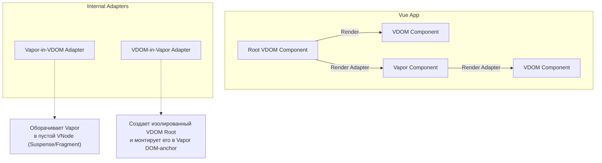

# 05 Interop: VDOM and Vapor

## Концепция и Архитектура (Mental Model)

Одной из главных причин, почему Vue не бросил VDOM и не переписал весь фреймворк на Vapor с нуля (как это сделал Angular со своими Signals, или Svelte с Svelte 5), является **Обратная совместимость (Backwards Compatibility)** и **Бесшовная интеграция (Seamless Interop)**.

Экосистема Vue огромна. Тысячи библиотек (Vuetify, Element Plus) написаны с использованием VDOM (рендер-функции, JSX). Если бы Vapor не поддерживал VDOM, эти библиотеки сломались бы.

Архитектурное решение: **Компоненты могут вкладываться друг в друга в любой комбинации.**
- VDOM-компонент может рендерить Vapor-компонент.
- Vapor-компонент может рендерить VDOM-компонент.

Для разработчика это выглядит прозрачно: вы просто импортируете `.vue` файл и используете его. Ядро Vue само понимает, какого типа этот компонент, и использует нужный адаптер (Adapter).

## Визуализация (Mermaid)



## Списки исходного кода (Source Code References)

- `packages/runtime-core/src/apiSetupHelpers.ts` — Макросы и хелперы.
- `packages/runtime-vapor/src/apiRender.ts` — Монтирование Vapor приложения.
- `packages/runtime-core/src/vnode.ts` — Флаги VNode (определяющие Vapor-компоненты).

## Разбор реализации (Code Deep Dive)

Внутри ядра компонент определяется по специальному флагу. Компилятор Vapor добавляет к объекту компонента поле `__vapor: true`.

**Случай 1: Vapor внутри VDOM**
VDOM патчер (`runtime-core`), встречая компонент с `__vapor: true`, не пытается вызвать у него `render()` функцию, чтобы получить VNodes. Вместо этого он:
1. Создает пустой DOM-узел якорь (Anchor).
2. Вызывает `createVaporComponent()`.
3. Говорит Vapor-рантайму: "Вот тебе якорь, смонтируй свой императивный DOM туда, а я буду управлять жизненным циклом этого якоря".
Пропсы реактивно проксируются из VDOM в Vapor.

**Случай 2: VDOM внутри Vapor**
Когда Vapor-кодогенератор видит импорт компонента без флага `__vapor`, он понимает, что это классический компонент.
Он:
1. Создает DOM-anchor.
2. Создает мини-экземпляр VDOM приложения (Sub-tree app) специально для этого компонента.
3. Вызывает стандартный VDOM `patch` для отрисовки этого компонента внутри якоря.

```typescript
// Псевдокод рантайма при рендере ребенка
function mountChild(childComponent, props, container) {
  if (childComponent.__vapor) {
    // Чистый Vapor путь (максимально быстро)
    mountVapor(childComponent, props, container)
  } else {
    // Interop путь (чуть медленнее, требует загрузки runtime-core)
    import('@vue/runtime-core').then(({ render, createVNode }) => {
      const vnode = createVNode(childComponent, props)
      render(vnode, container)
    })
  }
}
```

## Оптимизации и Edge Cases (Подводные камни)

1. **Размер Бандла:** Если вы используете Interop (смешиваете VDOM и Vapor), вы "платите" за оба рантайма. Весь `runtime-core` (VDOM) и `runtime-vapor` будут включены в бандл. Настоящий выигрыш в размере бандла от Vapor Mode достигается только тогда, когда **всё** дерево компонентов (от корня до листьев) написано на Vapor.
2. **Context Sharing (Provide/Inject):** Чтобы `provide` в VDOM-родителе был доступен через `inject` в Vapor-ребенке, Vue передает внутренний контекст (`AppContext`) через границы адаптеров. Это одна из самых сложных частей реализации Interop'а, требующая синхронизации состояний двух разных подсистем.
3. **Слоты (Slots Interop):** Передача слотов между мирами — самая ресурсоемкая операция. VDOM ожидает функции, возвращающие массивы VNodes. Vapor ожидает функции, возвращающие массивы DOM-узлов. Адаптеры вынуждены на лету рендерить VNodes в DOM (при передаче из VDOM в Vapor) или оборачивать DOM в специальные VNodes (при передаче из Vapor в VDOM). Рекомендуется избегать сложного проброса слотов на стыке двух архитектур.
