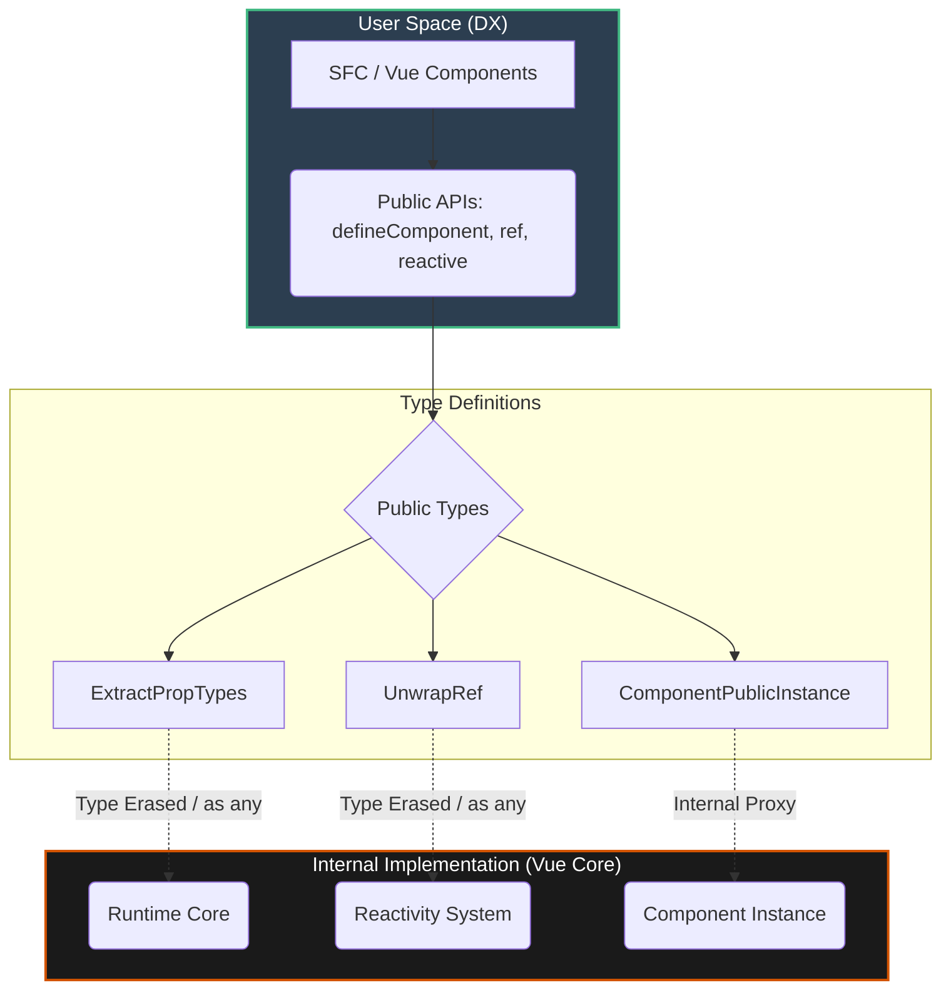

# Type System Architecture

## 1. Концепция и Архитектура (Mental Model)

Переход Vue с Flow (в Vue 2) на TypeScript в Vue 3 стал поворотным моментом, который определил архитектуру ядра. Система типов во Vue выполняет двоякую роль:
1. **Гарантии для разработчиков ядра:** строгая типизация внутренней логики (реактивности, виртуального DOM, компилятора).
2. **Developer Experience (DX) для пользователей:** сложные выводы типов (inferences), которые делают работу с Options API, Composition API и `<script setup>` "магически" безопасной без явного аннотирования типов.

**Главный компромисс (Trade-off):** Пользовательские типы (те, что видит разработчик в IDE) часто отделены от внутренних типов (те, что используются для компиляции ядра). Внутренний код Vue пестрит `any` и `as any`, потому что точное соблюдение пользовательских типов внутри сложных паттернов (например, глубокого развертывания рефов в реактивной системе) приводит к деградации производительности TypeScript-компилятора и ошибкам "Type instantiation is excessively deep".

## 2. Визуализация (Mermaid)



## 3. Ссылки на исходный код (Source Code References)

- `packages/runtime-core/src/apiDefineComponent.ts` — Публичные API для определения компонентов.
- `packages/reactivity/src/ref.ts` — Сложные типы развертывания (`UnwrapRef`).
- `packages/runtime-core/src/componentPublicInstance.ts` — Типы для `this` в компонентах.

## 4. Разбор реализации (Code Deep Dive)

Внутри Vue часто применяется паттерн "публичный интерфейс (сложный TS) + внутренняя реализация (упрощенный TS / `any`)".

```typescript
// Пример из пакета reactivity. Публичный тип Ref сложен:
export interface Ref<T = any> {
  value: T
  /**
   * Маркер типа, не существует в рантайме.
   * Нужен для того, чтобы TS отличал Ref от обычного объекта.
   */
  [RefSymbol]: true
}

// Внутренняя реализация класса Ref:
class RefImpl<T> {
  private _value: T
  private _rawValue: T

  public dep?: Dep = undefined
  public readonly __v_isRef = true // Рантайм-флаг, а не TS-символ

  constructor(value: T, public readonly __v_isShallow: boolean) {
    this._rawValue = __v_isShallow ? value : toRaw(value)
    // Внутри используется toReactive, который возвращает тот же тип, но под капотом Proxy
    this._value = __v_isShallow ? value : toReactive(value)
  }

  get value() {
    trackRefValue(this)
    return this._value
  }

  set value(newVal) {
    // ... логика обновления и triggerRefValue
  }
}
```

Разница между `[RefSymbol]: true` (в интерфейсе для юзеров) и `__v_isRef = true` (в рантайме) — это классический паттерн "branded types" (брендирование типов). Он защищает пользователей от случайного приравнивания обычного объекта с полем `value` к `Ref`, в то время как рантайму достаточно проверки булевого флага.

## 5. Оптимизации и Edge Cases (Подводные камни)

1. **Avoid Deep Instantiations:** Рекурсивные типы, такие как `UnwrapRef` (который "снимает" Ref с каждого поля вложенного объекта), могут вызывать падение TS Server в больших проектах. Чтобы этого избежать, во Vue добавлены механизмы `BailTypes` — типы (например, VNode или Window), на которых рекурсия жестко останавливается.
2. **`any` for Internal Speed:** Использование `as any` во внутренних механизмах — это не признак плохого кода, а осознанная оптимизация времени компиляции (build time) самого ядра. TS-компилятору не нужно проверять сложные выводы (inferences) на каждый чих внутри функции рендеринга.
3. **Prettify (Flattening):** Часто типы оборачиваются в специальные утилиты вроде `type Prettify<T> = { [K in keyof T]: T[K] } & {}`, чтобы при наведении курсора в IDE разработчик видел плоский понятный объект, а не монструозное пересечение `Intersection<A, B> & ExtractPropTypes<C>`.
