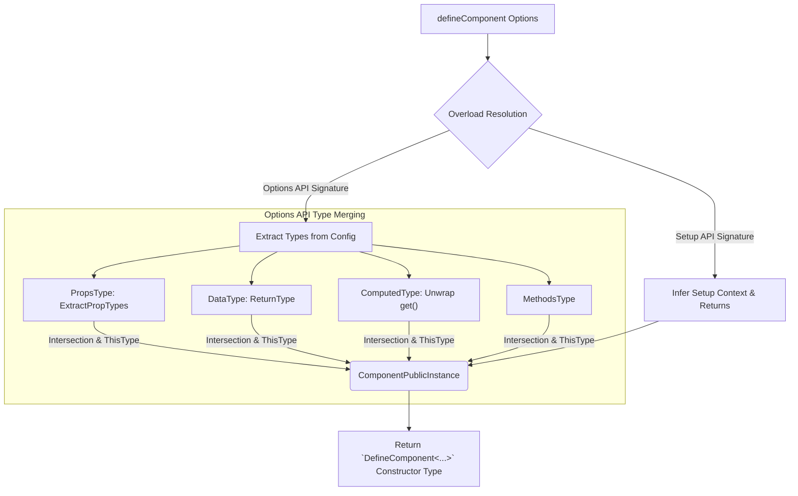

# defineComponent Type Inference

## 1. Концепция и Архитектура (Mental Model)

`defineComponent` — это один из самых парадоксальных методов ядра Vue. В рантайме (если не брать в расчет небольшую нормализацию) этот метод делает ровно ничего: он просто возвращает переданный ему объект. 

Его **истинная суть существует исключительно на уровне компиляции TypeScript**. Это "Type Inference Engine" (движок вывода типов). Его задача — объединить разрозненные куски компонента (Props, Data, Computed, Methods, Setup) в единый, монолитный тип инстанса компонента (`this`), чтобы внутри метода `mounted() { this.foo }` TypeScript точно знал, откуда взялось `foo` и какой у него тип.

## 2. Визуализация (Mermaid)



## 3. Ссылки на исходный код (Source Code References)

- `packages/runtime-core/src/apiDefineComponent.ts` — Все перегрузки (overloads) метода.
- `packages/runtime-core/src/componentPublicInstance.ts` — `ComponentPublicInstance` (тип для `this`).

## 4. Разбор реализации (Code Deep Dive)

Типизация `defineComponent` — это огромный блок кода из десятков перегрузок (function overloads). Это необходимо, потому что компонент может объявляться по-разному (с `setup`, без `setup`, с массивом `props`, с объектом `props`).

```typescript
// Сильно упрощенная суть из apiDefineComponent.ts

// Тип для `this` внутри методов Options API
export type CreateComponentPublicInstance<P, B, D, C, M> = 
  P & // Props
  B & // Setup bindings (вернул setup)
  D & // Data
  C & // Computed
  M   // Methods
  // + глобальные свойства ($el, $emit, etc.)

// Основная перегрузка для Options API
export function defineComponent<
  PropsOptions,
  RawBindings,
  D,
  C extends ComputedOptions,
  M extends MethodOptions
>(
  options: {
    props?: PropsOptions
    setup?: (props: ExtractPropTypes<PropsOptions>) => RawBindings
    data?: (this: CreateComponentPublicInstance<...>) => D
    computed?: C
    methods?: M
  } & ThisType<CreateComponentPublicInstance<PropsOptions, RawBindings, D, C, M>>
): DefineComponent<PropsOptions, RawBindings, D, C, M>
```

**Ключевой хак: `ThisType<T>`**
TS предоставляет встроенную утилиту `ThisType`. Когда объект конфигурации пересекается с `ThisType<T>`, компилятор понимает, что любое использование `this` внутри функций этого объекта (например, в `methods` или `data`) должно ссылаться на тип `T`. Именно так `this.myProp` начинает светиться автокомплитом.

## 5. Оптимизации и Edge Cases (Подводные камни)

1. **Крах рекурсивного вывода:** Объединение Props, Data и Computed в единый тип `this` порождает рекурсивные связи (например, вычисленное свойство использует data, а data инициируется из prop). В сложных компонентах TypeScript мог зацикливаться. Во Vue архитектурно разделен процесс "экстракции" типов в плоские структуры перед их слиянием, чтобы разорвать рекурсию компилятора.
2. **Setup vs Options:** Перегрузки `defineComponent` написаны так, что если вы используете `setup()` вместе с `methods`, тип, возвращаемый из `setup`, перекроет (override) типы из `data` или `props` в случае коллизии имен. Это четко моделирует поведение Vue в рантайме.
3. **Mixins и Extends:** Типизация `mixins` в Vue 3 стала ночным кошмаром. Полный вывод типов из массива миксинов (где каждый имеет свои data и методы) требует сложной рекурсии типов на уровне массивов (tuple destructuring in types). Из-за пределов возможностей TS типизация миксинов ограничена глубиной массива, а сам паттерн объявлен устаревшим в пользу Composition API, который типизируется нативно и без таких хаков.
