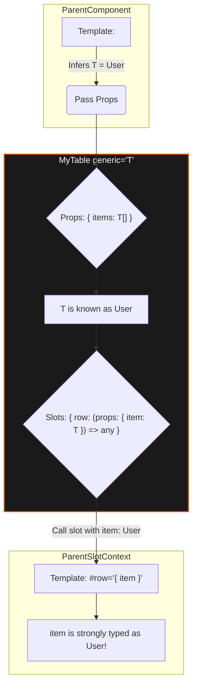

# Generic Slots and Components Inference

## 1. Концепция и Архитектура (Mental Model)

До версии Vue 3.3 компоненты (особенно написанные через `<script setup>`) не могли быть дженериками. Если вы создавали компонент таблицы (Table), который принимал массив элементов типа `T`, вы не могли передать этот тип `T` в `v-slot`, чтобы получить типизированную колонку. Типизация слотов была "слепым пятном".

Введение атрибута `generic="T"` в `<script setup>` и макроса `defineSlots()` изменило архитектуру. Теперь Volar (Language Tools) и ядро Vue способны пробрасывать типы "сверху вниз" (от переданных пропсов) и "снизу вверх" (из внутренностей компонента в `v-slot`). Архитектурно слот — это просто функция, которая принимает аргументы (slot props) и возвращает массив виртуальных узлов (`VNode[]`).

## 2. Визуализация (Mermaid)



## 3. Ссылки на исходный код (Source Code References)

- `packages/runtime-core/src/apiSetupHelpers.ts` — Типы для `defineSlots`.
- `vuejs/language-tools` (пакет `@vue/language-core`) — Трансформация `generic="T"` в виртуальный TSX.

## 4. Разбор реализации (Code Deep Dive)

В рантайме `defineSlots()` не делает абсолютно ничего (компилятор даже вырезает его из итогового кода). Вся магия происходит в типах.

```typescript
// Из runtime-core/src/apiSetupHelpers.ts

// Макрос defineSlots позволяет явно задать сигнатуры функций для слотов
export function defineSlots<
  S extends Record<string, any> = Record<string, any>
>(): StrictUnwrapSlotsType<SlotsType<S>> {
  // Рантайм имплементация — пустая заглушка (вырезается компилятором)
  return null as any
}

// Слоты в TSX моделируются как функции, возвращающие VNode массива
export type SlotsType<T extends Record<string, any> = Record<string, any>> = {
  [K in keyof T]: (
    props: T[K] // Аргументы, передаваемые в <slot v-bind="props">
  ) => VNode[] | undefined
}
```

Когда вы пишете `<script setup generic="T">`, Volar (Language Server) превращает весь блок скрипта в дженерик-функцию:

```typescript
// То, как Volar видит <script setup generic="T">
function __VLS_template<T>() {
  const props = defineProps<{ items: T[] }>()
  const slots = defineSlots<{
    default: (props: { item: T }) => any
  }>()
  // ...
}
```

## 5. Оптимизации и Edge Cases (Подводные камни)

1. **Динамические слоты:** Типизировать `<slot :name="dynamicName">` практически невозможно в строгом TypeScript, так как имя ключа становится `string`, что ломает жесткий маппинг в интерфейсе слотов. Vue позволяет оставить такие слоты как `any`.
2. **Performance Overhead:** Пробрасывание дженериков (Generics) через несколько слоев компонентов (например, Wrapper -> Table -> Row) экспоненциально увеличивает нагрузку на TypeScript Language Service. В больших монорепозиториях злоупотребление сложными дженерик-компонентами приводит к "лагам" автокомплита в IDE.
3. **Отличие от React:** В React слоты (children или рендер-пропсы) являются просто пропсами `props.children`. Во Vue слоты концептуально отделены от пропсов (хранятся в `$slots`), что требует от системы типов Vue поддерживать два параллельных канала передачи данных в компонент, усложняя внутреннюю утилиту `ComponentPublicInstance`.
